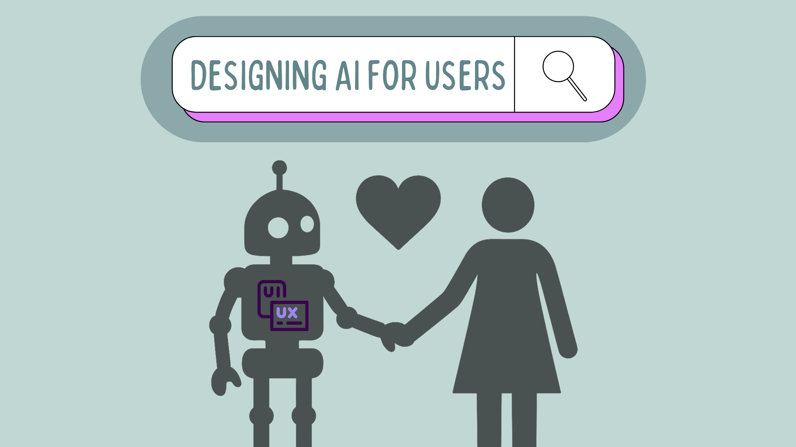

我妈妈在做她惯常的周日仪式，手里有笔、纸、计算器，还有一堆收据。我试过让她用市面上所有的记账应用，但她很传统，总是说同一句话：
> “它们都太复杂了。”

<!--truncate-->

上个月，算到一半，她叹了口气说：
> “我只是希望能看见钱花到哪儿去了。”

于是我打开 [**goose**](http://goose-docs.ai/docs/quickstart)，加入她的笔记，并打开 [**Auto Visualiser**](https://goose-docs.ai/docs/mcp/autovisualiser-mcp)。几秒钟后，她的预算变成了这张彩色的交互图表。她把鼠标悬停在每一块上，分析钱花到了哪里。

我并不是说这是什么开创性的用例。能做这件事的应用很多。让我印象深刻的是它有多简单。我妈妈不需要学任何新东西，也不需要去适应别人的设计。可视化就那样出现了，她立刻就懂了。

重点不是技术在运转。重点是 AI 终于以一种对她说得通的方式出现了。

### **当 AI 开始展示，而不只是说话**

智能体 AI 已经有了巨大进展。智能体能规划、推理和行动，但它们交流时往往仍像终端：一堵墙的文字，没有真正的交互。这正是 [**MCP-UI**](https://mcpui.dev/guide/getting-started) 改变一切的地方。

MCP-UI 给智能体一种视觉语言，*并且*给用户一种在聊天窗口里直接交互的方式。在此之前，和 AI 的对话是一连串提示和回复。现在，用户可以真正通过界面本身与智能体互动。一个按钮可以发起新的提示，用户不用打字。一个下拉菜单可以在后台运行工具调用。一个链接可以立刻为他们打开页面或资源。甚至通知也可以在这个嵌入式 UI 和宿主应用之间传递，让一切保持同步。

这把 AI 聊天变成了一层界面。智能体不再只是描述它能做什么，而是可以呈现真实、可点击的选项，并实时响应。这让 AI 对话感觉流畅而可交互。

与其说“这是你的数据”，智能体可以把它展示出来，让你对它采取行动，并响应你的选择。

### **为什么这对构建者很重要**

作为开发者，我们常常先为模型设计，想的是提示结构或 JSON 格式。但智能体的下一步大跨越，是它们能多好地预判用户想做什么、需要看到什么。

我们已在整个行业看到这种转变。Google 的新 AI Mode 正在把搜索变成由意图驱动的体验。它不再只是把用户送到链接，而是直接在结果里展示票务、座位图和购买按钮。网页正在变得动态，适应使用者想做的事。

MCP-UI 把同样的演进带进智能体世界。它扩展了[模型上下文协议](https://modelcontextprotocol.io/docs/getting-started/intro)，让你的 MCP 服务器可以返回的不只是数据。它可以在智能体的聊天里直接渲染交互组件。无论是图表、按钮、表格还是表单，智能体都可以展示你服务的实时、可用视图，而不是用文字描述它们。

goose 内置的 Auto Visualiser 就是一个实例：它在幕后用 MCP-UI，自动把结构化输出变成交互式可视化。

但潜力远不止于此。当开发者构建自己的 MCP 服务器时，他们完全掌控数据*如何*呈现。他们可以设计反映自己品牌或产品风格的界面，确保用户通过 AI 智能体与其 API 交互时，仍然得到熟悉的体验。想象一个 Shopify MCP 服务器返回看起来像其店面的商品列表，或者一个 Notion MCP 服务器在聊天里用它的块状布局展示内容。

两者指向同一个未来：AI 不只是用文字回复，而是用当下合适的界面来响应。我们得到的不再是固定屏幕，而是动态的、基于意图的体验，实时适应用户的需要。

这才是智能体用户体验真正要做的事：构建会响应用户意图的 AI。

如果你在构建自己的 MCP 服务器，先想想你希望用户拥有什么样的体验。然后用 MCP-UI 做实验，并按你自己使用时会期待的流程来设计。完整步骤见[如何让 MCP 服务器兼容 MCP-UI](https://goose-docs.ai/blog/2025/09/08/turn-any-mcp-server-mcp-ui-compatible)。

---

我有一种感觉，下个月我妈妈坐下对账时，她会问我：
> “你又把那个 goose 带来了？”

<head>
  <meta property="og:title" content="为用户设计 AI，而不只是为 LLM" />
  <meta property="og:type" content="article" />
  <meta property="og:url" content="https://goose-docs.ai/blog/2025/10/14/designing-ai-for-humans" />
  <meta property="og:description" content="用 MCP-UI 构建基于意图的 AI 体验。" />
  <meta property="og:image" content="https://goose-docs.ai/assets/images/design-ai-de5d0af69d8d21111dd271624ac7cab3.png" />
  <meta name="twitter:card" content="summary_large_image" />
  <meta name="twitter:title" content="为用户设计 AI，而不只是为 LLM" />
  <meta name="twitter:description" content="用 MCP-UI 构建基于意图的 AI 体验。" />
  <meta property="twitter:domain" content="goose-docs.ai" />
  <meta name="twitter:image" content="https://goose-docs.ai/assets/images/design-ai-de5d0af69d8d21111dd271624ac7cab3.png" />
</head>
