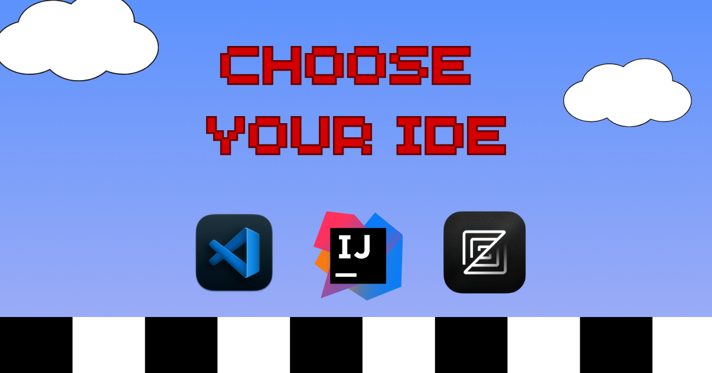

我写代码写得最好的时候，是盘腿坐在床上或沙发上，笔记本放在腿上，旁边有零食，没有额外的屏幕来争注意力。有时我把编辑器和浏览器并排放；有时我让它们全屏，在应用之间切换。我不喜欢用多台显示器，我的开发环境简陋得有点不好意思。

这样的布置让我进入深度心流，这对作为软件工程师保持产出至关重要。它给我专注力，去挖到问题表面之下，追溯根因，并思考每一处修复或改进如何同时影响用户和整个系统。对其他领域来说，短促的多任务可能很有效，但工程里真正的产出，往往来自长时间不被打断的思考。

最近，我的工作流变了。

<!--truncate-->

## 三个应用的问题

既然我经常使用 AI 智能体，我就得在三个应用之间腾挪：编辑器、AI 智能体，以及用来看渲染结果的浏览器。这带来几个打断心流的挑战：

- **屏幕空间变少。** 当我试着在分屏布局里同时看见三个窗口时，每个窗口都变得局促。编辑器缩成窄窄一列，代码很难读。AI 智能体窗口不滚动就显示不全回复。浏览器预览被挤进一个很小的视口，反映不出用户实际会看到的样子。

- **只看智能体的诱惑。** 为了避免局促感，我有时只把 AI 智能体窗口全屏打开，相信它生成的一切，而不切换到编辑器去审阅实际的代码改动或查看 diff。这对实验项目还行，生产系统需要人的监督和仔细的代码审查。

- **别扭的上下文切换。** 我的另一种做法是让 AI 智能体全屏，但确实做该做的事，去审阅它的工作。我会读智能体的建议，切到编辑器看改动，切到浏览器看渲染了什么，再切回智能体，通过迭代提示继续打磨代码（[Continue](https://continue.dev) 的 Patrick Erichsen 称之为 [chiseling](https://patrickerichsen.com/chiseling)）。这种不断的窗口切换打断我的专注，也制造走神的机会（你好，Twitter/X）。

## 常见的变通办法

许多开发者试过解决这个集成挑战：

- **集成在 IDE 里的智能体**，比如 Cursor，把 AI 智能体做进了代码编辑器。但这会造成供应商锁定：你必须用他们特定的智能体，配他们特定的编辑器。如果我更喜欢把 VS Code 当编辑器、把 Claude Code 当智能体，那就没办法。我不能按自己想要的方式混搭工具。

- **终端里的 CLI 智能体**对一些人有效。他们直接在编辑器的终端窗格里运行智能体。[goose](/) 有一个可以这样用的 CLI，但我更喜欢桌面应用的界面，可读性更好，也更容易浏览回复。代价是我本来想避免的不断窗口切换。

- **IDE 扩展和插件**看起来是显而易见的办法，但维护这些集成极其困难。过去一年里，多位维护者为 goose 做了 VS Code 扩展，甚至一个 IntelliJ 插件，但我们每周两次的发布很快就让它们过时。维护这些扩展变成一场社区赢不了的追赶游戏。扩展必须镜像 goose 的功能才能正常工作，所以 goose 的每一次改动都要求更新扩展。维护者跟不上节奏，而为每个编辑器做专门集成，在智能体演进如此之快时根本无法扩展。

## 介绍 Agent Client Protocol

Zed 代码编辑器的创造者 Zed Industries 开发了一个叫 [Agent Client Protocol（ACP）](https://agentclientprotocol.com/overview/introduction) 的方案，解决这些集成挑战。ACP 让你把任何 AI 智能体带进任何支持它的编辑器，而没有供应商锁定。更重要的是，它解决了维护问题，因为 AI 智能体和编辑器通过标准化协议直接通信。

这种标准化通过用 JSON-RPC 定义一种共同语言来实现。每个编辑器和智能体不必建立私有、复杂的握手，ACP 用一串简单、可预测的结构化消息来管理智能体与编辑器的会话：

- **session/initialize：** 你的 AI 智能体告诉编辑器它支持哪些能力（音频、文本提示等）
- **session/new：** 当你开始新会话时，智能体和编辑器建立通信
- **session/prompt：** 当你发送提示时，智能体接收并处理它
- **session/update：** 智能体把回复发回编辑器
- **session/cancel：** 当你取消会话时，智能体停止处理

今天，支持 ACP 的编辑器包括 Zed、Neovim 和 Marimo。支持的智能体包括 Claude Code、Codex CLI、Gemini、StackPack，当然还有 goose。

## 恢复开发者的心流

对像我这样有特定方式进入心流的开发者来说，这意味着我们可以加入 AI 协助，而不必彻底重组工作环境。我可以保持盘腿的姿势、分屏布置和专注的工作流，同时把 goose 直接集成进编辑器。

除了个人工作流偏好，ACP 还降低了创新的门槛，让 AI 智能体和编辑器可以独立演进，同时说同一种语言。它也是 AI 工具走向开放标准这一更广泛运动的一部分。

你可能听说过 [MCP](http://modelcontextprotocol.io)，它标准化 AI 智能体如何连接到数据源和工具。ACP 和 MCP 完美互补：MCP 处理*什么*（智能体能访问哪些数据和工具），ACP 处理*在哪里*（智能体住在你工作流的哪个位置）。它们一起形成一个生态，开发者可以混搭最好的工具，而没有供应商锁定。

goose 团队继续努力让 goose 保持在 AI 智能体领域的前沿，我们对这样一个未来感到兴奋：开放协议让开发者按自己最合适的方式工作。

## 看看 ACP 的实际效果

如果你准备好看看这种设置到底有多快、多简单，请观看下面我用 goose 做 ACP 设置的完整直播录像

<iframe class="aspect-ratio" src="https://www.youtube.com/embed/Hvu5KDTb6JE" title="用 goose 做氛围编程：ACP 简介" frameborder="0" allow="accelerometer; autoplay; clipboard-write; encrypted-media; gyroscope; picture-in-picture" allowfullscreen></iframe>

*准备好把 goose 直接集成进你的编辑器了吗？从我们的 [ACP 设置指南](https://goose-docs.ai/docs/gdk/acp)开始，并在我们的 [Discord 社区](http://discord.gg/n8R5VaWDAn)分享你的体验。*

<head>
  <meta property="og:title" content="Agent Client Protocol（ACP）简介：AI 智能体与编辑器集成的标准" />
  <meta property="og:type" content="article" />
  <meta property="og:url" content="https://goose-docs.ai/blog/2025/10/24/intro-to-agent-client-protocol-acp" />
  <meta property="og:description" content="用 Agent Client Protocol（ACP）补上 AI 智能体与代码编辑器之间别扭的缺口。了解这项新的开放标准为何让 goose 这样的智能体真正与编辑器无关，改善人机协作，并恢复开发者的心流。ACP 与 MCP 等协议一起工作，形成一个开放的 AI 工具生态。" />
  <meta property="og:image" content="https://goose-docs.ai/assets/images/choose-your-ide-c308664c1783e1651d9a4f4d6ff7d731.png" />
  <meta name="twitter:card" content="summary_large_image" />
  <meta property="twitter:domain" content="goose-docs.ai" />
  <meta name="twitter:title" content="Agent Client Protocol（ACP）简介：AI 智能体与编辑器集成的标准" />
  <meta name="twitter:description" content="用 Agent Client Protocol（ACP）补上 AI 智能体与代码编辑器之间别扭的缺口。了解这项新的开放标准为何让 goose 这样的智能体真正与编辑器无关，改善人机协作，并恢复开发者的心流。ACP 与 MCP 等协议一起工作，形成一个开放的 AI 工具生态。" />
  <meta name="twitter:image" content="https://goose-docs.ai/assets/images/choose-your-ide-c308664c1783e1651d9a4f4d6ff7d731.png"/>
</head>
