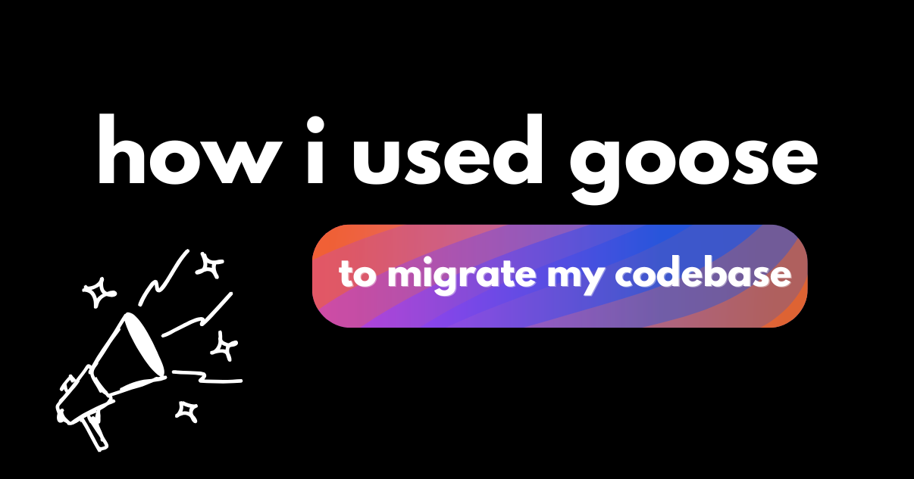

“把我的应用从 x 语言迁到 y 语言。”你按下回车，看着 AI 智能体空转，最终你听过的每一个成功故事都像一场精心编排的谎言。

大多数失败与智能体的能力关系较小，与糟糕的提示和上下文策略关系更大。想想看：如果有人把你丢进一个复杂、不熟悉的代码库，说“把这个迁了”，没有计划你会迷路。你需要探索代码，问关于结构的问题，并把工作拆成可管理的步骤。

你的 AI 智能体需要同样的做法：有引导的探索、有策略的问题，以及拆开的任务。

<!--truncate-->

我最近用 [goose](/) 把这种方法付诸实践，把一个拆在两个仓库里的遗留 LLM 额度配置系统（React/Vite 前端和 Node/Express 后端）迁进统一的 Next.js 框架。

## 我为什么需要重构

我最初做这个应用，是为了在波士顿的一次聚会上分发 LLM API 额度。它是一个快速原型，却意外被采用，暴露了根本的架构问题。（而且我有闪亮玩具综合征，所以很难回到这个应用去改进它。）我想做以下改进：

- 基于邮件的配置
- 按活动动态分配额度
- 分析基础设施
- 管理面板

我上了一场直播来对付这次巨大的重构，但几秒钟后我意识到，现实中我不可能在一小时内全部做完。我先专注于整合碎片化的代码库。两个仓库（React/Vite 前端、Express 后端）需要变成一个单体的 Next.js 应用。但只告诉 goose “转成 Next.js”，没有恰当的上下文构建是不行的。

## 我的提示策略

### 建立共享的心智模型

在我指示 goose 写任何代码之前，我优先用下面这条提示帮助它系统地理解代码库：

> 你能摸清这里找到的两个项目的情况，以及它们如何通信吗？

goose 使用[分析工具](/docs/mcp/developer-mcp#developer-extension-tools)生成了一份高层架构流。（分析工具是[开发者扩展](/docs/mcp/developer-mcp)的一部分，那是内置于 goose 的一个 [MCP 服务器](https://modelcontextprotocol.io/docs/learn/server-concepts)。）

```
User Browser
    ↓
[goose-access-gateway] (React SPA)
    ↓ (HTTPS REST API)
[goose-hacknight-backend] (Express API)
    ↓ (HTTPS REST API)
[OpenRouter API] (Third-party service)
```

它也分享了各种端点以及如何运行这些仓库。这份映射有双重用途：建立智能体的上下文基础，并刷新我自己对一个八个月前实现的心智模型。

### 界定范围

地形画好之后，我需要防止范围蔓延。我有意把智能体的注意力集中在前端，以避免整个代码库里混乱、不受控的改动。

> 告诉我运行前端项目的命令。

是的，我本可以在 package.json 里找到这些命令，但让 goose 来做是有目的的：它把 goose 锚定在实际的项目设置上，并防止它幻觉出命令或端口。

:::tip 专业提示
我总是让 goose 告诉我要运行什么命令（比如 npm run dev），而不是让它自己执行。长时间运行或阻塞的命令会停住 goose 的进程。
:::

### 验证驱动的开发

AI 辅助编码的一个主要陷阱是，智能体无法在语法正确之外验证自己的代码。

为了应对这一点，我启用了 [Chrome Dev Tools 扩展](/docs/mcp/chrome-devtools-mcp)，赋予智能体浏览器级别的检查能力：DOM 操作验证、CSS 属性验证和性能分析。这个扩展给了 goose “眼睛”，这意味着我可以给出当时最有野心的提示：

> 我现在在 localhost:8080 上跑着前端。我想拿这个 UI 设计，稍微从头开始。我需要全新的逻辑，尤其是后端。我们能创建一个新目录并创建一个 Next.js 项目吗？现在先只做前端，但不要加任何 API 调用之类的东西。我们只想保留前端页面的设计。请把它重做出来。用 Chrome Dev Tools 扩展看看 UI 长什么样，这样你可以照着复制，并用 to do 扩展帮你做计划。如果有交互式命令，或者你可以运行安装之类的，只要告诉我去做……并给我需要运行的细节。

这是一条很大的提示，让我们拆开每一部分完成了什么：

- **隔离：** 创建一个新目录
- **范围：** 只做前端，但不要加任何 API 调用
- **验证：** 用 Chrome Dev Tools 扩展看看 UI 长什么样
- **规划：** 用 to do 扩展帮你做计划
- **交互：** 只要告诉我去做……并给我需要运行的细节

:::note
回头看，关于阻塞命令的指令本应写进[持久上下文文件](/docs/guides/context-engineering/using-goosehints)（[AGENTS.md](https://agents.md/) 或 [goosehints](/docs/guides/context-engineering/using-goosehints)），而不是写在行内提示里。
:::

但是，我非常高兴 goose 生成了这个应用像素级精确的重现。

### 任务拆解

智能体成功、完美地重现 UI，很大程度上归功于 [Todo 扩展](/docs/mcp/todo-mcp)，一个内置于 goose 的 MCP 服务器。我发现这个扩展有助于防止范围漂移，也就是智能体在完成一个目标后自主扩张到相邻功能。

待办清单包括这样的项：

- 从旧项目复制 logo 资源
- 创建玻璃拟态卡片组件
- 加上带淡入动画的 logo
- 验证主题切换能用

当我在本地运行应用时，我确实遇到了 Tailwind CSS v4/v3 的语法错误，但 goose 用 Chrome Dev Tools 扩展和 Todo 扩展很快修好了。

### 自动化版本控制

因为我的 UI 像素级精确，我有足够信心引入一些后端逻辑，但我知道引入这种复杂度需要细粒度的版本控制。当智能体做了十几处改动时，很容易在历史里埋下不想要的代码。手工跟踪并还原这些改动很乏味。

为了解决这个问题，我在 .goosehints 文件里加了一条持久指令，建立自动提交策略：

> 每次你做出改动，都用 GitHub CLI 或 GitHub MCP Server 做一次提交。

### 模式复制

最后一步是加上通过邮件发送 API 密钥的后端逻辑。我没有让 goose 从零发明，而是让它从一个已知能工作的系统学习：另一个有类似配置逻辑的应用。

我给了 goose 下面这条提示：

> 有一个配方食谱。人们要提交，就得开一个 PR，然后它会给他们发一封带 API 密钥的邮件。你能找到发送 API 密钥的逻辑吗？

它分析完那段代码后，我给了最后的指令：

> 用你从配方项目逻辑里学到的东西，在 goose-credits 里实现这一点……用 SendGrid API 把 API 密钥发到他们的邮箱。

这种“复制并改编”的策略极其有效。goose 成功实现了必要的 API 路由，并清楚指出我需要提供的环境变量。我手工加入了那些变量。出于安全，我没有把它们给 goose。

## 教训

我分享了自己和 goose（使用 Claude Sonnet 4.5）那场混乱、乏味的对话，这样读者可以有把握地为复杂任务丢掉一次提示，并与智能体增量地工作。和写代码一样，与智能体协作需要耐心，但它不必让人紧张。

我希望这说清了如何与智能体交谈，并完成迁移这类复杂任务。如果你想看实际效果，你很幸运；下面是我实时推进这个项目的直播回放。

<iframe class="aspect-ratio" src="https://www.youtube.com/embed/zGyXfA3kKTk" title="如何用 AI 智能体成功迁移你的应用" frameborder="0" allow="accelerometer; autoplay; clipboard-write; encrypted-media; gyroscope; picture-in-picture" allowfullscreen></iframe>

*准备好用 goose 尝试 AI 辅助迁移了吗？从我们的[快速入门指南](/docs/quickstart)开始，并在我们的 [Discord 社区](http://discord.gg/n8R5VaWDAn)分享你的体验。*


<head>
  <meta property="og:title" content="如何用 AI 智能体成功迁移你的应用" />
  <meta property="og:type" content="article" />
  <meta property="og:url" content="https://goose-docs.ai/blog/2025/11/17/migrate-app-with-ai-agent" />
  <meta property="og:description" content="一套逐步的提示策略，用于 AI 辅助的代码迁移，并附上来自一次 Next.js 重构的真实例子" />
  <meta property="og:image" content="https://goose-docs.ai/assets/images/migrate-app-ai-agent-e8e3dcddf74909b6f84f85c8c776aaed.png" />
  <meta name="twitter:card" content="summary_large_image" />
  <meta property="twitter:domain" content="goose-docs.ai" />
  <meta name="twitter:title" content="如何用 AI 智能体成功迁移你的应用" />
  <meta name="twitter:description" content="一套逐步的提示策略，用于 AI 辅助的代码迁移，并附上来自一次 Next.js 重构的真实例子" />
  <meta name="twitter:image" content="https://goose-docs.ai/assets/images/migrate-app-ai-agent-e8e3dcddf74909b6f84f85c8c776aaed.png"/>
</head>
