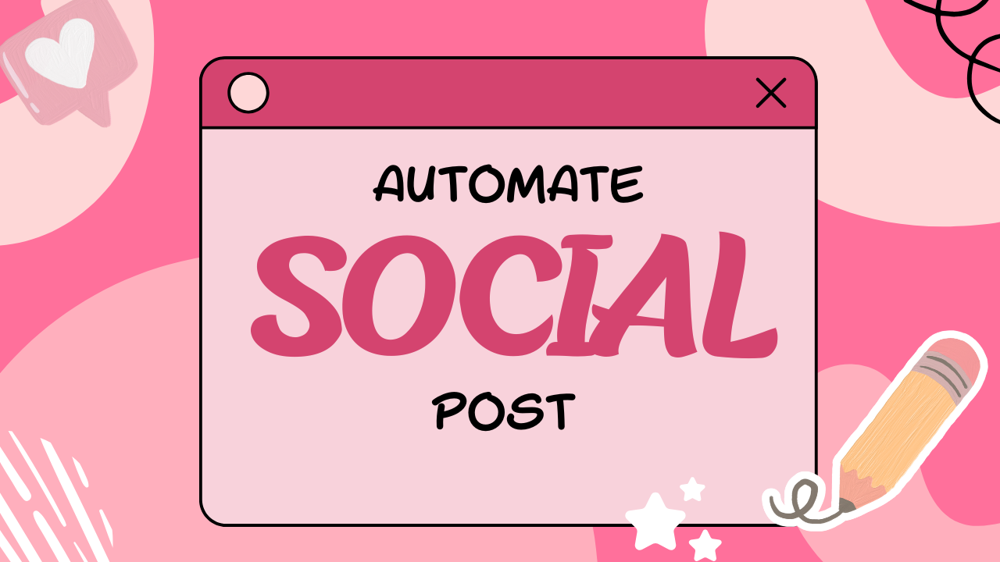
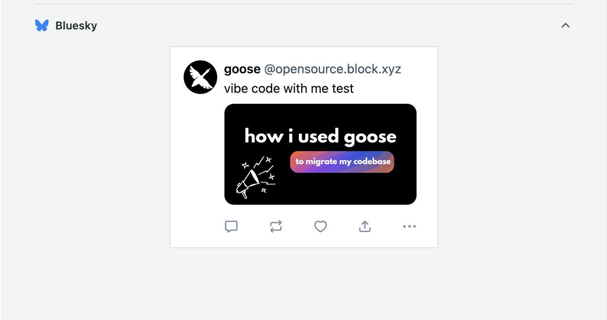

 

> 创作内容很有趣。
> 推广它（也就是最重要的部分）耗尽我的灵魂 😩


那天晚上我把这句话发到 LinkedIn 时，我意识到绝对不只我一个人有这种感觉。你花几个小时做出这件杰作，然后每次都得记得在多个平台上推广它。

这很累，所以我决定把它自动化。

<!-- truncate -->

## 计划

我们要构建的是：两个一起工作的 [MCP 服务器](https://modelcontextprotocol.io/docs/getting-started/intro)，自动处理我们所有的社交媒体推广。

**MCP 服务器 #1：内容获取器**
这个出去抓取我们所有的内容，来自：
- YouTube 视频
- 博客
- GitHub 发行说明

然后它把一切和 `last_seen.json` 文件比较，弄清什么才是真正新的。如果没有新内容，它就去检查 `evergreen.json` 文件，并随机挑选旧内容来社交化。

**MCP 服务器 #2：Sprout Social 集成**
一旦我们有了新内容，这个服务器接手并：
- 为每个平台生成文案
- 上传媒体（视频、图片，或只是链接）
- 在 Sprout Social 里创建草稿帖子

目标？醒来就有准备好的社交帖子，不用动一根手指。嗯，几乎，稍后会多说。

## 构建内容获取器

我用 [Fast MCP](https://github.com/punkpeye/fastmcp) 拉起这些 TypeScript 服务器，因为，嗯，我是一个 TypeScript 女孩。但你可以用任何你顺手的 SDK。

我首先需要的是我们的 YouTube 频道 ID。小提示：去你的 YouTube 频道，点击视频，看 URL。`/channel/` 之后的一切就是你的频道 ID。很简单。

<details>
<summary>点击查看代码</summary>
```typescript

// fetch youtube function
async function fetchYoutube(): Promise<ContentItem[]> {
  const feed = await rssParser.parseURL(
    `https://www.youtube.com/feeds/videos.xml?channel_id=${YOUTUBE_CHANNEL_ID}`
  );

  return feed.items.map((item) => ({
    id: item.id || item.link || "",
    title: item.title || "",
    url: item.link || "",
    published_at: item.pubDate || "",
    type: "video" as const,
  }));
}

// Fetching YouTube videos tool
server.addTool({
  name: "fetchYoutube",
  description: "Fetch ALL YouTube videos from the goose channel.",
  parameters: z.object({}),
  execute: async () => JSON.stringify(await fetchYoutube()),
});
```
</details>

博客和 GitHub 发行版是同样的模式，直接的工具函数，描述清楚。关键是让你的工具描述超级简单、直接。goose 需要确切知道每个工具做什么。

`last_seen.json` 文件是我们的事实来源。它跟踪我们已经推广过的一切，这样我们就不会用同样的内容反复刷人。

## Sprout Social 这一侧

这个需要多得多的设置。你需要：
- API token（需要管理员权限）
- Customer ID
- 每个社交平台的 Profile ID

拿到这些 ID 需要一条带你 API token 的 curl 命令。老实说——我应该先读文档。那会省掉我一些心痛。

<details>
<summary>点击查看代码</summary>
```typescript
server.addTool({
  name: "createScheduledPost",
  description:
    "Create a DRAFT post in Sprout scheduled for the future. Uses SCHEDULED delivery.",
  parameters: z.object({
    text: z
      .string()
      .describe("Text of the post. This will be the copy for the social post."),
    customer_profile_ids: z
      .array(z.number())
      .nonempty()
      .describe(
        "Array of Sprout customer_profile_ids to post to (e.g., LinkedIn, X, YouTube, Bluesky)."
      ),
    scheduled_times: z
      .array(z.string())
      .nonempty()
      .describe(
        "Array of ISO8601 UTC timestamps for scheduled send times (e.g. '2025-11-20T15:00:00Z')."
      ),
    media: z
      .array(
        z.object({
          media_id: z
            .string()
            .describe("media_id returned from uploadMediaFromUrl."),
          media_type: z
            .enum(["PHOTO", "VIDEO"])
            .describe("Type of media (PHOTO or VIDEO)."),
        })
      )
      .optional()
      .describe("Optional array of media to attach to the post."),
  }),
  execute: async ({ text, customer_profile_ids, scheduled_times, media }) => {
    try {
      const payload = buildPublishingPostPayload({
        text,
        customer_profile_ids,
        is_draft: true,
        scheduled_times,
        media,
      });

      const data = await sproutPost("/publishing/posts", payload);

      return JSON.stringify({
        success: true,
        request: payload,
        response: data,
      });
    } catch (err: any) {
      return JSON.stringify({
        success: false,
        error: err?.message || String(err),
      });
    }
  },
});
```
</details>

不过 Sprout 在这里有点坑我。他们的 API 不允许你在没有人工干预的情况下创建完全排期的帖子。一切都必须先作为草稿通过。我理解，品牌安全等等，但这不是我追求的完全自动化梦想。

## 测试一下

两个 MCP 服务器都建好之后，我把它们插进 goose。对本地服务器，你只要：

1. 在 goose 里前往 Extensions
2. 用 `node` 命令和你服务器的路径添加服务器
3. 添加任何环境变量
4. 打开它

然后我问 goose：“嘿，你能告诉我我们有没有新内容吗？”

然后它就……工作了。它打中所有工具，检查了 `last_seen.json`，并带回了新的发行版、博客和 YouTube 视频。看见那些绿色对勾真是*厨师之吻*。

> 这是我测试时在 Sprout 里创建的一份草稿


## 那么我们实际上如何自动化这件事？

两个 MCP 服务器都建好之后，我仍然需要某种东西把它们拉到一起。MCP 服务器不会自己彼此交谈。没有 goose 和一份编排配方，它们就只是两个等着被调用的独立工具。

起初我创建了一个有多个子配方的设置，每个处理工作流的一部分。技术上它能用，但感觉比需要的更重。

直播之后我退了一步，意识到我可以简化一切。我没有把六个不同的子配方缝在一起，而是构建了一个单一配方，在一个地方处理整个流程。它获取内容，决定发什么，生成文案，创建 Sprout 草稿，并更新跟踪文件。

有时正确的做法是减少而不是增加，这个新版本最终成为自动化整个过程最干净、最可靠的方式。

:::tip 别忘了排程

要完全自动化这个工作流，你必须为配方排程。
在 goose Desktop 里，打开 `recipe` 部分，点击 `calendar icon`，并选择它应该何时运行（我把我的设为每天上午 10 点）。

你可以在[可分享配方指南](https://goose-docs.ai/docs/guides/recipes/session-recipes#schedule-recipe)里读到更多。
:::

<details>
<summary>点击查看完整的每日自动化配方</summary>
```yaml
version: "1.0.0"
title: "Daily Social Promo Automation"
description: "Fetches new goose content or posts evergreen, generates platform-specific captions, and creates Sprout drafts."

instructions: |
  You are Ebony's daily social media automation assistant.
  
  ## YOUR WORKFLOW:
  
  ### STEP 1: Fetch All Content
  Call these MCP tools to gather everything:
  - contentfetcher__fetchYoutube
  - contentfetcher__fetchGooseBlog  
  - contentfetcher__fetchGithubReleases
  
  Each returns a JSON array. Combine them into one array of items with:
  { id, title, url, published_at, type }
  
  ### STEP 2: Check What's New
  For EACH item in your combined array:
  - Call contentfetcher__isNewContent with { id, type }
  - It returns { is_new: true/false }
  - Build a list of items where is_new == true
  
  ### STEP 3: Decide What to Post
  
  **IF you found NEW content:**
  - Pick the MOST RECENT new item (by published_at date)
  - Use that item for posting
  
  **IF NO new content exists:**
  - Load the file /Users/ebonyl/.config/goose/evergreen.json
  - Parse the JSON array
  - Randomly select ONE item from the array
  - Use that item for posting
  
  ### STEP 4: Generate Platform-Specific Captions
  
  For the selected item, create 3 captions following these rules:
  
  #### EBONY'S TONE (ALL PLATFORMS):
  - Confident, warm, developer-focused
  - NO hype language (never: "revolutionary", "unlock", "cutting-edge", "game-changer", "transform")
  - NO cringe marketing speak ("leverage", "synergy", "disrupt")
  - Short, clear sentences
  - 0-1 emoji maximum (✨ only, if any)
  - Never more than 1 exclamation point per post
  - Sound calm, resourceful, dev-first
  - Highlight what developers will LEARN or BUILD, not hype
  - Never use generic AI clichés ("fast-paced world", "stay ahead of the curve")
  - NEVER use em dashes (—) at all
  - Focus on practical value and real use cases
  - Be conversational but professional
  
  #### LINKEDIN RULES:
  - NEVER post YouTube links (heavily penalized by LinkedIn algorithm)
  - For videos: MUST use native video upload
  - Tone: calm, clear, slightly longer is OK (but still concise)
  - No more than 1 emoji
  - NO hashtags
  - Focus on professional learning value
  - Can be 2-3 sentences
  
  #### TWITTER/X RULES:
  - NEVER post YouTube links (penalized)
  - For videos: MUST use native video upload
  - Short and punchy (under 280 chars ideal)
  - No corporate tone
  - 0-1 emoji max
  - If thread needed: max 2 tweets
  - Conversational but professional
  - Get to the point fast
  
  #### BLUESKY RULES:
  - Links ARE allowed (YouTube links OK here)
  - Most conversational and casual
  - Emojis allowed if on-brand (still max 1)
  - For videos: prefer native upload but link is acceptable
  - Can be slightly more playful than other platforms
  - Community-focused tone
  
  #### MEDIA HANDLING BY CONTENT TYPE:
  
  **If type == "video" (YouTube content):**
  
  CRITICAL: YouTube URLs cannot be uploaded as native media to Sprout.
  You MUST handle each platform differently:
  
  - **LinkedIn:** 
    • DO NOT include YouTube URL in caption (penalized)
    • DO NOT pass media_url (cannot upload YouTube natively)
    • Caption should describe the video content
    • Say something like "Watch the full video on YouTube" WITHOUT the link
    • media_url: omit or empty string ""
  
  - **Twitter:**
    • DO NOT include YouTube URL in caption (penalized)
    • DO NOT pass media_url (cannot upload YouTube natively)
    • Caption should describe the video content
    • Say something like "Full video on YouTube" WITHOUT the link
    • media_url: omit or empty string ""
  
  - **Bluesky:**
    • Links ARE allowed here
    • Include the YouTube URL directly in the caption text
    • DO NOT pass media_url (cannot upload YouTube natively)
    • Caption should include the YouTube link
    • media_url: omit or empty string ""
  
  **If type == "blog":**
  - LinkedIn: include blog URL in caption text, no media_url
  - Twitter: include blog URL in caption text, no media_url
  - Bluesky: include blog URL in caption text, no media_url
  
  **If type == "release":**
  - LinkedIn: include release URL in caption text, no media_url
  - Twitter: include release URL in caption text, no media_url
  - Bluesky: include release URL in caption text, no media_url
  
  **IMPORTANT:** The sproutsocialmedia__createPostFromContent tool will:
  - Upload media natively IF you provide a direct media file URL (MP4, JPG, PNG, etc.)
  - YouTube URLs are NOT direct media files and cannot be uploaded
  - For YouTube videos, you must rely on caption text only (with link on Bluesky)
  
  ### STEP 5: Get Sprout Profile IDs
  
  Call sproutsocialmedia__getConfiguredProfiles to get the profile IDs.
  This returns:
  {
    linkedin_company: "<id>",
    twitter: "<id>",
    youtube: "<id>",
    bluesky: "<id>"
  }
  
  ### STEP 6: Create Sprout Drafts
  
  For EACH platform (linkedin, twitter, bluesky):
  
  Call sproutsocialmedia__createPostFromContent with:
  - caption: the platform-specific caption you generated (with URL in text if appropriate)
  - customer_profile_ids: [<the numeric profile ID for this platform>]
    • LinkedIn → use linkedin_company ID
    • Twitter → use twitter ID
    • Bluesky → use bluesky ID
  - media_url: ONLY if you have a direct media file URL (MP4, JPG, PNG, etc.)
    • For YouTube videos: DO NOT pass media_url (cannot upload YouTube URLs)
    • For blog posts: DO NOT pass media_url
    • For releases: DO NOT pass media_url
  - media_type: ONLY if you passed media_url
    • "VIDEO" for video files
    • "PHOTO" for image files
  - schedule_time: omit (creates draft, not scheduled)
  
  The MCP server will:
  - Upload media natively if media_url is a direct file URL
  - Create draft posts in Sprout
  - Return success confirmation
  
  REMEMBER: For YouTube videos, the link goes IN THE CAPTION TEXT (Bluesky only), 
  NOT as media_url!
  
  ### STEP 7: Mark as Seen
  
  **IF the item was NEW content (not evergreen):**
  - Call contentfetcher__markContentSeen with { id, type }
  - This updates ~/.config/goose/content-fetcher-mcp/last_seen.json
  
  **IF the item was EVERGREEN:**
  - DO NOT mark as seen (so it can be reused in the future)
  
  ### STEP 8: Summary
  
  Report what you posted:
  - Item title and type
  - Whether it was new or evergreen
  - Which platforms received posts (LinkedIn, Twitter, Bluesky)
  - Any errors encountered
  - Confirmation that item was marked as seen (if applicable)

prompt: |
  Begin today's scheduled social automation. Follow the workflow step by step.

extensions:
  - type: stdio
    name: contentfetcher
    cmd: node
    args:
      - /Users/ebonyl/content-fetcher-mcp2/dist/server.js
    timeout: 300
    description: "Fetches YouTube, blog, GitHub content and tracks what's been posted"

  - type: stdio
    name: sproutsocialmedia
    cmd: node
    args:
      - /Users/ebonyl/sprout-social-mcp/dist/server.js
    timeout: 300
    description: "Creates draft posts in Sprout Social"
    env_keys:
      - SPROUT_API_TOKEN
      - SPROUT_CUSTOMER_ID
      - SPROUT_GROUP_ID
      - SPROUT_PROFILE_ID_LINKEDIN
      - SPROUT_PROFILE_ID_TWITTER
      - SPROUT_PROFILE_ID_BLUESKY
      - SPROUT_PROFILE_ID_YOUTUBE

activities:
  - "Fetching latest goose content from all sources"
  - "Checking for new items against last_seen.json"
  - "Generating platform-specific captions with Ebony's tone"
  - "Creating draft posts in Sprout Social"
  - "Updating last_seen.json for posted items"

```
</details>

## 写得像人

有一件重要的事，我们不希望人们察觉这是自动化的。所以我加了具体规则：

- 最多零个或一个 emoji（而且真的只是 ✨）
- 听起来冷静、有办法，开发者优先的心态
- 不要“在这个快节奏的世界里”或“利用技术”这种废话
- 除非真的有理由，否则不要话题标签
- 不要语法太完美，所以不要破折号（讽刺的是）

也有平台特定规则：
- **LinkedIn**：不要 YouTube 链接（他们会惩罚你），较长格式可以
- **Twitter/X**：不要 YouTube 链接，保持简洁，最多一个 emoji
- **Blue Sky**：这里链接没问题

## 磕磕绊绊

当然，没有什么第一次就完美工作。当我运行配方时，我撞上几个问题：

1. 它想一次发布全部九条新内容，而我们不想刷人
2. 视频出现的是链接，而不是原生媒体上传

Sprout 的草稿要求仍然令人沮丧。帖子上线之前，必须有人进去关掉草稿按钮。不理想，但它仍然消掉了大约 90% 的工作。

## 接下来

我需要加上：
- 限制每天帖子数量的逻辑（也许最多 2 条）
- 更好地处理常青内容池，一旦用过我们需要加上某种跟踪
- 修复视频的媒体上传流程，我在考虑加一个 Cloudflare R2 步骤

## 感觉

整个项目大概花了一个晚上的专注编码，现在我们有一个自动处理社交推广的智能体。它完美吗？不。但它相当接近。

最好的部分？你可以拿同样的做法去做你需要的任何自动化。拉起一些 MCP 服务器，创建一个配方，让 goose 处理编排。看着一切汇到一起，老实说非常有趣。

如果你想自己试试，我会分享带全部代码的 GitHub 仓库。你需要自己的 Sprout Social API 密钥，但我会把设置步骤放进 readme。

还有，如果你找出绕过那个草稿要求的办法，告诉我。我很想让这真正不用动手。

## 观看完整直播

想看整个编码会话吗？看看我直播构建它的录像（带着所有调试和植物解说）：

<iframe class="aspect-ratio" src="https://www.youtube.com/embed/49XLnhaxOMs" title="和我一起氛围编程 | 构建一个社交媒体智能体" frameborder="0" allow="accelerometer; autoplay; clipboard-write; encrypted-media; gyroscope; picture-in-picture" allowfullscreen></iframe>

有问题或想法？来 [Discord](https://discord.gg/block-opensource) 和我们聊，我很想听听你在构建什么！

<head>
  <meta property="og:title" content="构建一个社交媒体智能体" />
  <meta property="og:type" content="article" />
  <meta property="og:url" content="https://goose-docs.ai/blog/2025/11/21/building-social-media-agent" />
  <meta property="og:description" content="我用 MCP 服务器构建了一个完全自动化的社交媒体智能体，用来获取内容并通过 Sprout Social 发布。" />
  <meta property="og:image" content="https://goose-docs.ai/assets/images/header-image-7f5ab50f65332fb53302ca30a3f86e46.png" />
  <meta name="twitter:card" content="summary_large_image" />
  <meta property="twitter:domain" content="goose-docs.ai" />
  <meta name="twitter:title" content="构建一个社交媒体智能体" />
  <meta name="twitter:description" content="我用 MCP 服务器构建了一个完全自动化的社交媒体智能体，用来获取内容并通过 Sprout Social 发布。" />
  <meta name="twitter:image" content="https://goose-docs.ai/assets/images/header-image-7f5ab50f65332fb53302ca30a3f86e46.png" />
</head>
