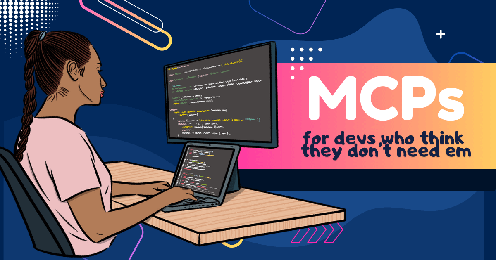

 

最近，我看到更多开发者开始对 MCP 侧目。Darren Shepherd 有一条[推文](https://x.com/ibuildthecloud/status/1990221860018204721)总结得很好：

> “大多数开发者是通过编程智能体（Cursor、VSCode）认识 MCP 的，而大多数开发者在这个用例里很难从 MCP 得到价值……所以他们拒绝 MCP，因为他们有 CLI 和脚本可用，那些对他们好得多。”

公平。大多数开发者是通过某种和代码聊天的体验认识 MCP 的，有时它并不比打开终端、用你知道的工具感觉更好。但事情是这样……

<!-- truncate -->

**MCP 不是只为开发者构建的。**

它们不只是给 IDE 副驾驶或代码伙伴用的。在 Block，我们在*一切*上使用 MCP，从财务到设计到法务到工程。[我做过一整场演讲](https://youtu.be/IDWqWdLESgY?si=Mjoi-MGEPW9sxvmT)，讲不同团队如何使用 goose 这个 AI 智能体。重点是 MCP 是一个协议。你在它之上构建的东西可以服务各种各样的工作流。

但我理解……让我们谈谈那些*确实*值得你花时间的、面向开发者的那些。

## GitHub：不只是 CLI

如果你的第一反应是“我有 CLI，为什么要用 [GitHub MCP](/docs/mcp/github-mcp)？”我听见你了。GitHub 的 MCP 现在有点臃肿。（他们知道。他们在处理。）

但同时：**你想得太本地了。**

你想象的是一个独立开发者的设置，你在终端里用 GitHub CLI 做自己的事。老实说，如果你做的只是开一个 PR 或查看 issue，你大概就该用 CLI。

但 CLI 从来不是为了跨工具协调。它是为本地、线性的命令构建的。但如果你的 GitHub 交互完全发生在*别的地方*呢？

当工作触及多个系统，比如 GitHub、Slack 和 Jira，而你不必自己把它们缝起来时，MCP 会发光。

下面是我们团队的一个真实例子：

> Slack 帖子。实时的真实开发者。
>
> **开发者 1：** 我觉得 xyz 有个 bug
>
> **开发者 2：** 让我看看……是的，我觉得你是对的。
>
> **开发者 3：** `@goose` 这里有 bug 吗？
>
> **goose：** 有。在这几行……[代码片段]
>
> **开发者 3：** 好，`@goose`，用这些细节开一个 issue。你会建议什么解决方案？
>
> **goose：** 这里有 3 个建议：[带理由的代码片段]
>
> **开发者 1：** 我喜欢方案 1
>
> **开发者 2：** 我也是
>
> **开发者 3：** `@goose`，实现方案 1
>
> **goose：** 完成。这是 PR。

这一切都发生在 *Slack* 里。没有人打开浏览器或终端。没有人切换上下文。问题跟踪、分流、讨论修复、实现代码，全在一个帖子里，跨度 5 分钟。

我们也有团队给 Linear 或 Jira 工单打标签，让 goose 完整实现它们。有一个团队让 goose 在单个冲刺里做了相当于 **15 个工程日**的工作。团队真的把任务做完了，不得不从未来的冲刺里拉任务。两次！

所以是的，GitHub CLI 很好。但 MCP 打开的是这样的工作流之门：GitHub 不是开发工作发生的唯一地方。这个转变值得注意。

## Context7：不糟糕的文档

开发者会撞上的另一个痛点：文档。

你在用一个新库。或者集成一个 API。或者和一个开源工具较劲。

[Context7 MCP](/docs/mcp/context7-mcp) 把最新文档、代码示例和指南直接拉进你的 AI 智能体的脑子。你只要问问题，并得到这样的答案：

* “我如何用 Square SDK 创建一笔支付？”
* “Firebase 的认证流程是什么？”
* “这个库可以 tree-shaking 吗？”

它不依赖两年前过时的 LLM 训练数据。它*此刻*抓取事实来源。给它更新的……跟我说……上下文。

开发者的“心流”是真实的，每一次打断都偷走宝贵的专注时间。这个 MCP 帮你弄清新库、排查集成，并在不离开 IDE 的情况下脱困。

## Repomix：不读完也了解整个代码库

想象你加入一个新项目，或想为一个开源项目做贡献，但它是一个又大又复杂的仓库。

你不必花几个小时戳来戳去，试图在脑子里画架构图，只要问你的智能体：

> “goose，把这个项目打包。”

它运行 [repomix](/docs/mcp/repomix-mcp)，把整个代码库压缩成一个为 AI 优化的文件。从那里，你的对话可能是这样：

* “认证逻辑在哪？”
* “给我看看 API 调用如何工作。”
* “什么在用 `UserContext`？”
* “架构是什么？”
* “还有哪些 TODO？”

你得到带上下文的直接答案、代码片段、摘要和建议。就像和一个已经什么都知道的资深开发者一起入职。当然，你可以 grep 并自己拼起来。但 repomix 给你整张图——结构、指标、模式——被压缩并且可查询。

它甚至能用于远程的公开 GitHub 仓库，所以你不必克隆任何东西就能开始探索。

这大概是我最喜欢的开发者 MCP。对新项目、代码审查和重构来说，它节省大量时间。

## Chrome DevTools MCP：边写代码边做 Web 测试

[Chrome DevTools MCP](/docs/mcp/chrome-devtools-mcp) 是前端开发者的必备。你在构建一个新表单 / 小组件 / 页面 / 随便什么。你不必打开浏览器、打字、点来点去，只要告诉智能体：

> “在 localhost:3000 上测试我的登录表单。试试有效和无效的登录。告诉我发生了什么。”

Chrome 打开，测试运行，截图被捕获，网络流量被记录，控制台错误被记下。全部由智能体完成。

这对想在把工作扔过围栏之前真正测试自己工作的前端开发者来说，是金子。

---

你能用 CLI 和 API 把这一切写成脚本吗？当然，如果你想花周末写胶水代码。但既然 MCP 开箱就给你这种能力……而且在任何 MCP 客户端里？！你为什么要那样做？

所以，MCP 没有被过度炒作。它们是你把 AI 插进你使用的一切的方式：Slack、GitHub、Jira、Chrome、文档、代码库——并让这些东西以新的方式*一起*工作。

最近，Anthropic 指出了[真正的问题](https://www.anthropic.com/engineering/advanced-tool-use)：大多数开发设置天真地加载工具，膨胀上下文，并让模型困惑。坏的不是协议。是大多数人（和智能体）还没弄清如何用好它。幸运的是，goose 已经弄清了——它[默认管理 MCP](/docs/mcp/extension-manager-mcp)，按你的需要启用和禁用。

但我扯远了。

走出 IDE，那时你才真正开始看见魔法。

附言：MCP 一岁生日快乐！🎉

<head>
  <meta property="og:title" content="给那些觉得自己不需要 MCP 的开发者的 MCP" />
  <meta property="og:type" content="article" />
  <meta property="og:url" content="https://goose-docs.ai/blog/2025/11/26/mcp-for-devs" />
  <meta property="og:description" content="如果你觉得 MCP 被过度炒作，这是你错过的东西" />
  <meta property="og:image" content="https://goose-docs.ai/assets/images/mcp-for-devs-0cbea02edffded1a26cec5f19a2a61b1.png" />
  <meta name="twitter:card" content="summary_large_image" />
  <meta property="twitter:domain" content="goose-docs.ai" />
  <meta name="twitter:title" content="给那些觉得自己不需要 MCP 的开发者的 MCP" />
  <meta name="twitter:description" content="如果你觉得 MCP 被过度炒作，这是你错过的东西" />
  <meta name="twitter:image" content="https://goose-docs.ai/assets/images/mcp-for-devs-0cbea02edffded1a26cec5f19a2a61b1.png" />
</head>
