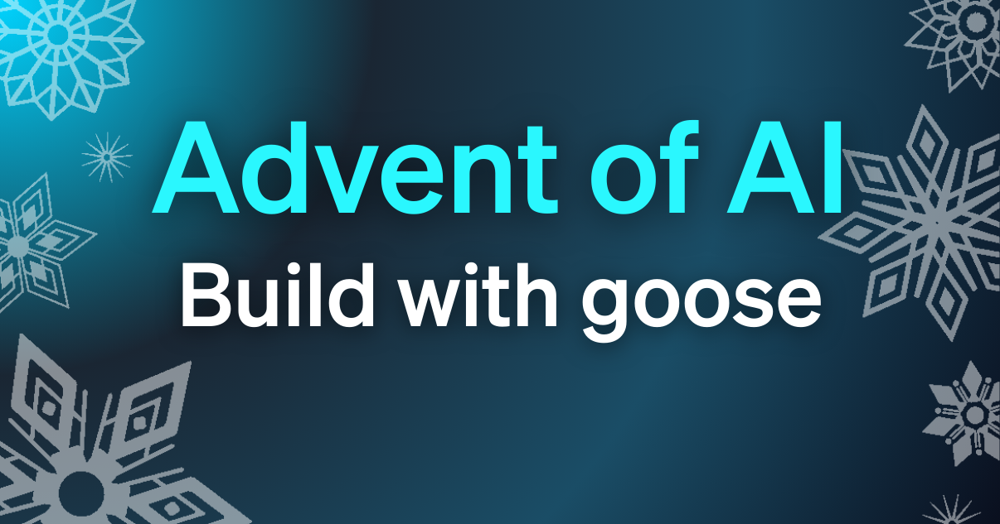

你已经听到这股热潮：AI 正在重塑我们的工作。也许你摆弄过 ChatGPT，或者公司在推动你“升级”。但在炒作和无尽教程之间，一个挥之不去的问题仍然在：你如何从理论走到真正做出东西？

答案是练习。不只是按步骤走，而是去创造、解决问题，并在做中学。

所以我们推出 [Advent of AI](https://adventofai.dev)，一个从 12 月 1 日开始、为期 17 天的挑战系列。无论你是迈出第一步的初学者，还是在探索 AI 智能体的资深开发者，这都适合你。每个工作日，你都会得到一个新的动手项目，旨在把你从 AI 的旁观者变成有把握的构建者。

<!-- truncate -->

## 你的任务

走进一个热闹的冬日嘉年华，担任首席 AI 工程师。系统出故障时，大家都会来找你，而且故障来得很快。每一天，嘉年华社区都会带来新的挑战：

**第 1 天：** 为 Zelda 夫人做一个 AI 占卜生成器，在她的应用崩溃时应付越来越多的人群。

**第 6 天：** 用 CI/CD 流水线搭建自动化的 GitHub issue 分流，管理嘉年华不堪重负的缺陷跟踪器。

**第 11 天：** 做一个自动海报生成器，把 Elena 从每天 8 小时的 Photoshop 工作中解放出来。

**第 14 天：** 建立一个 AI 人格委员会，辩论并投票选出完美的嘉年华吉祥物。

**第 17 天：** 用 MCP-UI 部署一个跨平台心愿单应用，让摊主确切知道访客想要什么。

你将掌握核心 AI 工程技能，例如用 goose 构建手势控制界面、数据可视化、多智能体系统和生产部署。这些基础技能会让你准备好与任何 AI 智能体共事。完成全部 17 天，你就会有一份完整的作品集，展示从基础自动化到精密多智能体系统的一切。

## 面向所有技能水平

**给初学者：** 每个挑战都包含清晰的指引和资源，帮你起步。你会以实用的、基于项目的方式从零学习核心概念。

**给进阶构建者：** 想要额外考验？每个主挑战都包含奖励目标，推动你走得更远：为性能做优化、加入复杂功能，或与高级工具集成。

## 如何进行

1. **每日挑战：** 每个工作日带来一个由故事驱动的新问题
2. **你的创造性解法：** 没有唯一“正确”的答案——我们想看到你独特的做法
3. **社区分享：** 加入我们 Discord 上的 #adventofai 频道，分享并协作
4. **解法视频：** 我们会在每个挑战的第二天，把我们的做法发到 YouTube

## 准备好开始构建了吗？

1. 在 [adventofai.dev](https://adventofai.dev) 注册，接收每日通知
2. 按[快速入门指南](/docs/quickstart)安装 goose
3. 在 [Discord](https://discord.gg/block-opensource) 加入社区

第一个挑战于 12 月 1 日东部时间中午 12 点解锁。冬日嘉年华需要你的技能。让我们一起做出了不起的东西。

<head>
  <meta property="og:title" content="宣布 Advent of AI" />
  <meta property="og:type" content="article" />
  <meta property="og:url" content="https://goose-docs.ai/blog/2025/11/30/announcing-advent-of-ai" />
  <meta property="og:description" content="我们正在推出一份 AI 工程挑战的降临节日历，帮助你用 goose 构建可落地的项目。" />
  <meta property="og:image" content="https://goose-docs.ai/assets/images/advent-of-ai-header-7076e6e92caf243b488ff6ea0082c48e.png" />
  <meta name="twitter:card" content="summary_large_image" />
  <meta property="twitter:domain" content="goose-docs.ai" />
  <meta name="twitter:title" content="宣布 Advent of AI" />
  <meta name="twitter:description" content="我们正在推出一份 AI 工程挑战的降临节日历，帮助你用 goose 构建可落地的项目。" />
  <meta name="twitter:image" content="https://goose-docs.ai/assets/images/advent-of-ai-header-7076e6e92caf243b488ff6ea0082c48e.png" />
</head>
