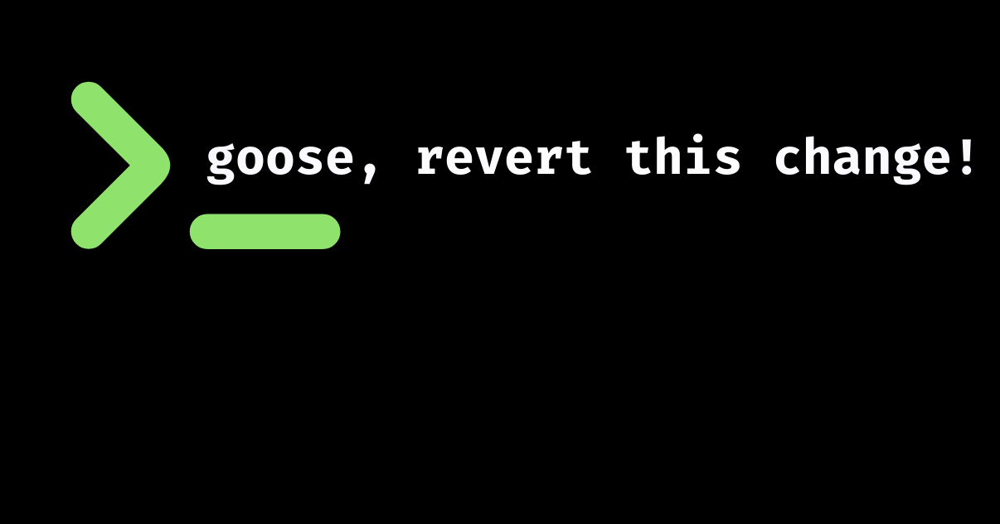

AI 智能体常被形容成聪明、过分热心的实习生。它们急着帮忙，但这股热情有时会带来你从没要求过的改动。这是设计使然：驱动智能体的大语言模型被训练成乐于助人。但在代码里，不受约束的热心会造成混乱。即便指令清楚、计划周密，你仍可能听到：“让我把这个也改一下……”这种修改要么没必要，更糟的是，从未拿出来给你审阅。

当然，你可以翻遍 `git diff` 找出问题并还原。但在一个触及几十个文件的多步过程里，把一处小小的多余改动理清楚，会变成一场手工噩梦。我曾经花几个小时在 70 个文件里翻找，只为撤销一处“热心”的调整。让智能体自己还原往往没用，因为对话记忆并不是代码库的快照。

<!-- truncate -->

这个问题有一个经典的工程解法。我们尽早、频繁地提交，以建立检查点，从而轻松回滚，并保持干净的协作。那么，为什么不把同样的纪律用在 AI 智能体上？下面是我用 [goose](/) 确保我们在为代码库创建快照的工作流：

### 1. 配好版本控制

我配置了 [GitHub CLI](https://cli.github.com/)（`gh`）。我发现 goose 和它配合得很好。[GitHub MCP Server](/docs/mcp/github-mcp) 是一个不错的替代方案。

### 2. 先开分支

始终从新的功能分支开始。绝不要让智能体直接提交到 main。

### 3. 在上下文文件里定下规则

这是关键。我在 [`.goosehints`](/docs/guides/context-engineering/using-goosehints) 或 [`AGENTS.md`](/docs/guides/context-engineering/using-goosehints#custom-context-files) 文件里放一条关键指令：

> “每次做出改动，都用清晰的信息做一次提交。”

这做了两件事：它自动建立检查点，这样我就不必盯着整个会话；它也在时间线上留下精确快照，把 git 历史变成整段协作的撤销栈。

### 4. 有把握地协作

现在我可以让 goose 去构建、修复或重构。如果它跑偏了，或者做了一个我不喜欢的设计选择，我可以立刻查看 git 日志，或者直接说：

> *“还原到提交 abc123。”*

## 结果
然后，当我对最终改动满意时，就可以把代码推到远程。把这项基本的软件实践接进来之后，焦虑换成了知情。goose 可以继续聪明地帮忙，而我仍然掌握控制权。

用 [goose](/) 试试这个方法，帮你做下一个项目。未来的你（以及你的 git 历史）会感谢你。

<head>
  <meta property="og:title" content="如何阻止 AI 智能体做出你不想要的改动" />
  <meta property="og:type" content="article" />
  <meta property="og:url" content="https://goose-docs.ai/blog/2025/12/10/stop-ai-agent-unwanted-changes" />
  <meta property="og:description" content="AI 智能体常被形容成聪明、过分热心的实习生。了解如何用简单的版本控制实践把它们管住。" />
  <meta property="og:image" content="https://goose-docs.ai/assets/images/header-image-ce224702149226ea0924fac736eef2fa.png" />
  <meta name="twitter:card" content="summary_large_image" />
  <meta property="twitter:domain" content="goose-docs.ai" />
  <meta name="twitter:title" content="如何阻止 AI 智能体做出你不想要的改动" />
  <meta name="twitter:description" content="AI 智能体常被形容成聪明、过分热心的实习生。了解如何用简单的版本控制实践把它们管住。" />
  <meta name="twitter:image" content="https://goose-docs.ai/assets/images/header-image-ce224702149226ea0924fac736eef2fa.png" />
</head>
