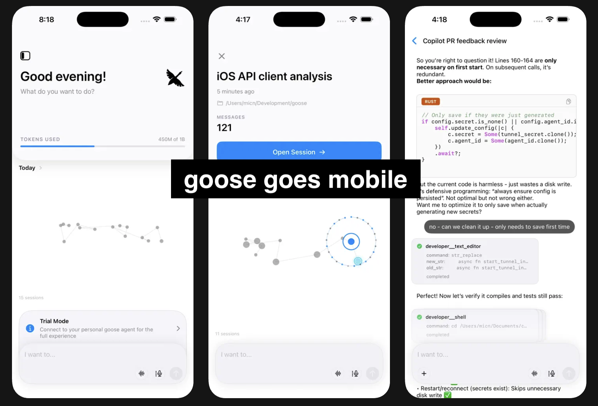

# 使用 goose 的两种新方式

我们很高兴宣布与 goose 交互的两种新方式：用于移动访问的<a href="https://apps.apple.com/app/goose-ai/id6752889295">原生 iOS 应用</a>，以及原生终端集成。两者都让你在如何使用、在哪里使用 AI 智能体上更灵活。

<!-- truncate -->

## goose iOS 应用

goose 现已在 App Store 上架！iOS 应用通过安全隧道连接到你的桌面 goose 实例，让你随时随地与智能体交互。

### 移动端入门

1. **安装应用** - 从 [App Store 下载 goose](https://apps.apple.com/app/goose-ai/id6752889295)
2. **启用远程访问** - 在 goose 桌面应用中，打开 `Settings`，点击 `Session`，然后在 `Mobile App` 部分点击 `Start Tunnel`
3. **扫描二维码** - 用 iOS 应用扫描桌面应用中显示的二维码
4. **开始工作** - 你已连接！移动应用现在通过隧道连到你的 goose 桌面实例

详细步骤见[移动访问指南](/docs/experimental/remote-access/mobile-access)。

这意味着你能获得桌面 goose 配置的全部能力——所有扩展和配置——都可以从手机访问。无论你在火车上、去买咖啡，还是只是离开了工位，仍然可以让 goose 帮忙处理任务，或查看长时间运行的事情。把一个想法抛给它去干活，稍后再接回来。

goose iOS 应用也可以在 macOS（Apple Silicon Mac）上原生运行，给你另一种从另一台设备访问 goose 实例的轻量选择。

## 原生终端支持

在另一端，有一种全新的方式，让你在自己喜欢的终端里原生使用 goose。
不必切换到另一个终端、应用或 TUI，你可以就在当前终端里使用 goose。
如何设置见[终端集成指南](/docs/guides/terminal-integration)。

设置好之后，你可以在终端的任何地方调用 `@goose`。它会自动为你管理会话，并与你正在做的工作保持上下文——即便 goose 当时没在运行。当你问它什么时，它会立刻加入，并对你最近的工作有完整了解。

## 按你的方式使用 goose

这两种新模式——移动端和原生终端——与桌面应用一起工作，让你无论偏好哪种工作方式，都能无缝访问 goose。
来自原生终端、CLI、桌面、IDE，以及现在的移动端的 goose 会话，都是同一组会话，现在可以从任何地方访问。

- **移动端**让你随时随地访问 goose 会话和任务。在桌面上开始一件事，用手机查看，稍后再接回来。
- **终端**集成意味着你在 shell 里工作时，goose 永远只隔一个 `@goose`——不需要切换上下文。

你怎么使用 goose 并不重要。会话是你的，你可以在任何地方使用和复用它们：桌面、终端或移动端（而且都在你的机器上）。

试试看，并在我们的 [Discord](https://discord.gg/n8R5VaWDAn) 里告诉我们你的想法！

<head>
  <meta property="og:title" content="goose 移动访问与原生终端支持" />
  <meta property="og:type" content="article" />
  <meta property="og:url" content="https://goose-docs.ai/blog/2025/12/19/goose-mobile-terminal" />
  <meta property="og:description" content="使用 goose 的两种新方式" />
  <meta property="og:image" content="https://goose-docs.ai/blog/2025/12/19/goose-mobile-terminal/mobile_shots.png" />
  <meta name="twitter:card" content="summary_large_image" />
  <meta property="twitter:domain" content="goose-docs.ai" />
  <meta name="twitter:title" content="goose 移动访问与原生终端支持" />
  <meta name="twitter:description" content="使用 goose 的两种新方式" />
  <meta name="twitter:image" content="https://goose-docs.ai/blog/2025/12/19/goose-mobile-terminal/mobile_shots.png" />
</head>
