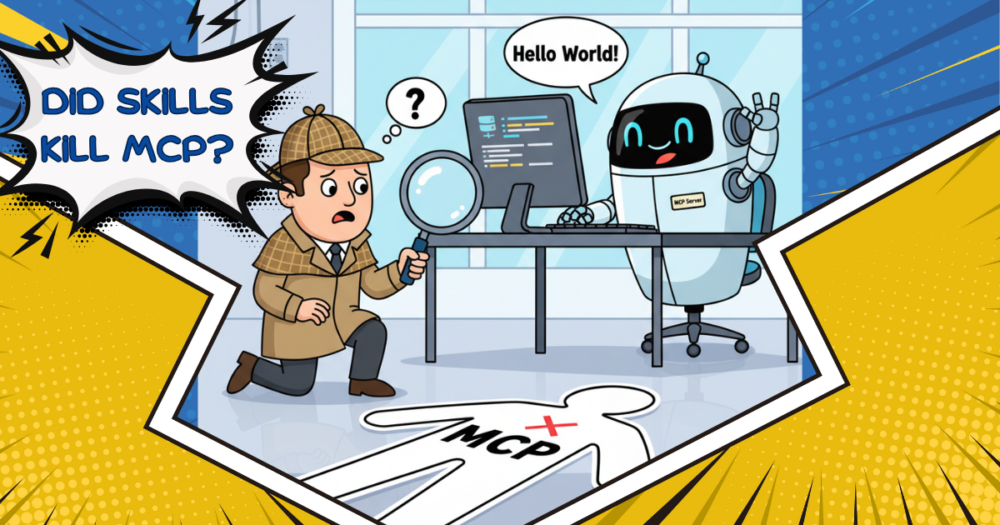

每次 AI 里出现一个热门新进展，Tech Twitter™ 就会宣布一个牺牲品。

本周的头条观点是 **“Skills 刚刚杀死了 MCP”**

听起来很大胆。听起来很自信。它也是错的。

<!-- truncate -->

说 skills 杀死了 MCP，大约和说 GitHub Actions 杀死了 Bash 一样准确。当然，那不是真的。Bash 仍然非常活跃，事实上，它在做实际的工作。GitHub Actions 改变的是表达，不是执行。它们给了我们一种更好的方式来描述工作流。一种更干净、更可分享的方式来说：“我们就是这样构建、测试和部署的。”在底层，同样的 shell 命令仍在运行。YAML 组织了执行，它并没有取代执行。

这基本上就是 [Skills](/docs/guides/context-engineering/using-skills/) 和 MCP 之间的关系。

一旦你这样看，"Skills 杀死了 MCP" 这个观点就会自己塌掉。

MCP 是**能力**所在的地方。它让 AI 智能体真正能做事，而不只是谈论它们。当智能体能运行 shell 命令、编辑文件、调用 API、查询数据库、从驱动器读取、存储或检索记忆，或拉取实时数据时，那就是 MCP 在工作。MCP 服务器是代码。它们作为服务运行，并暴露可调用的工具。如果智能体需要以任何有意义的方式与真实世界交互，几乎一定涉及 MCP。

例如，如果智能体需要查询 GitHub API、发送 Slack 消息，或获取生产指标，那就需要真实的集成、真实的权限和真实的执行。单靠指令做不到这一点。

Skills 处在不同的一层。Skills 关乎流程和知识。它们是编码了工作应如何完成的 markdown 文件。它们捕捉团队约定、工作流和领域专长。一个 Skill 可能会描述部署应如何发生、代码审查如何处理，或事件如何分流。这是被写明的机构知识。

例如，下面是一个教智能体如何与 Square 账号集成的示例 Skill：

```md
---
name: square-integration
description: How to integrate with our Square account
---

# Square Integration

## Authentication
- Test key: Use `SQUARE_TEST_KEY` from `.env.test`
- Production key: In 1Password under "Square Production"

## Common Operations

### Create a customer
const customer = await squareup.customers.create({
  email: user.email,
  metadata: { userId: user.id }
});


### Handle webhooks
Always verify webhook signatures. See `src/webhooks/square.js` for our handler pattern.

## Error Handling
- `card_declined`: Show user-friendly message, suggest different payment method
- `rate_limit`: Implement exponential backoff
- `invalid_request`: Log full error, likely a bug in our code
```

Skills 可以包含看起来可执行的东西。我觉得困惑有一部分来自这里。一个 Skill 可能会展示代码片段、引用脚本，甚至打包模板或脚本之类的支持文件。这会让人觉得 Skill 本身在干活。

但它没有。

即便 Skill 文件夹里包含可运行的文件，执行它们的也不是 Skill。智能体通过调用别处提供的工具来执行这些文件，比如通过 [Developer MCP Server](/docs/mcp/developer-mcp) 暴露的 shell 工具。Skill 把指导和资产打包在一起，但运行代码、访问网络或修改系统的能力来自工具，而这些工具可以通过 MCP 暴露。

这正是 GitHub Actions 的工作方式。工作流文件可以引用脚本、命令和可复用的 action。它看起来可以很强大。但 YAML 并不执行任何东西。执行的是 runner。没有 runner，工作流就只是一份计划。

Skills 描述工作流。MCP 提供 runner。

所以说 Skills 取代 MCP 说不通。没有 MCP 的 Skills 是写得很好的指令。没有 Skills 的 MCP 是没有指引的原始力量。一个告诉智能体应该发生什么。另一个让任何事情有可能发生。

简单说，MCP 给智能体能力。Skills 教智能体如何把这些能力用好。Bash 仍然在运行命令。GitHub Actions 仍然在定义工作流。同一套系统，不同的层，没有谋杀。

如果说有什么的话，两者并存是个好迹象。这意味着生态在成熟。我们不再争论智能体该不该有工具或指令。我们在构建默认你两者都需要的系统。

这是进步，不是替换。


<head>
  <meta property="og:title" content="Skills 杀死了 MCP 吗？" />
  <meta property="og:type" content="article" />
  <meta property="og:url" content="https://goose-docs.ai/blog/2025/12/22/agent-skills-vs-mcp" />
  <meta property="og:description" content="Agent Skills 与 MCP 概览" />
  <meta property="og:image" content="https://goose-docs.ai/assets/images/skills-vs-mcp-f2d83cbf65b3ddb4f9294470ab653355.png" />
  <meta name="twitter:card" content="summary_large_image" />
  <meta property="twitter:domain" content="goose-docs.ai" />
  <meta name="twitter:title" content="Skills 杀死了 MCP 吗？" />
  <meta name="twitter:description" content="Agent Skills 与 MCP 概览" />
  <meta name="twitter:image" content="https://goose-docs.ai/assets/images/skills-vs-mcp-f2d83cbf65b3ddb4f9294470ab653355.png" />
</head>
