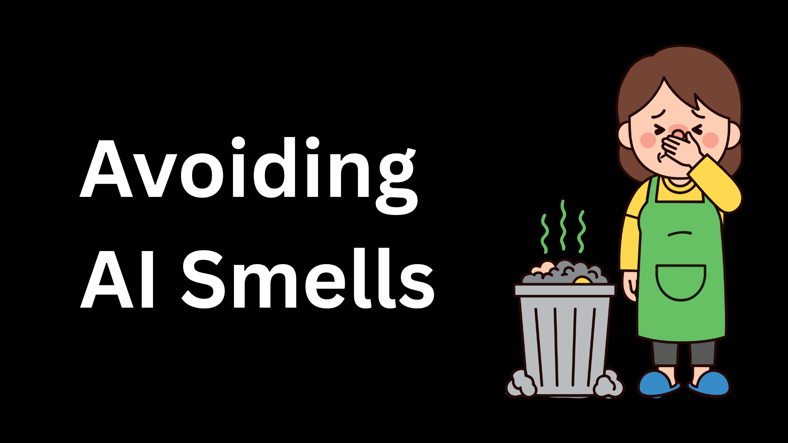
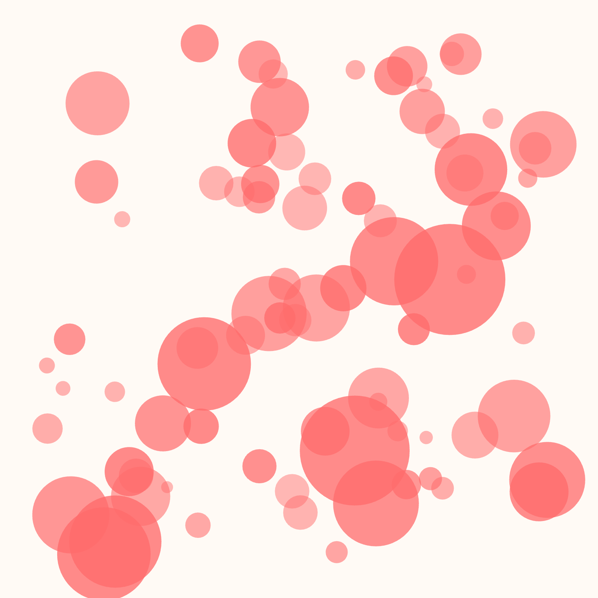
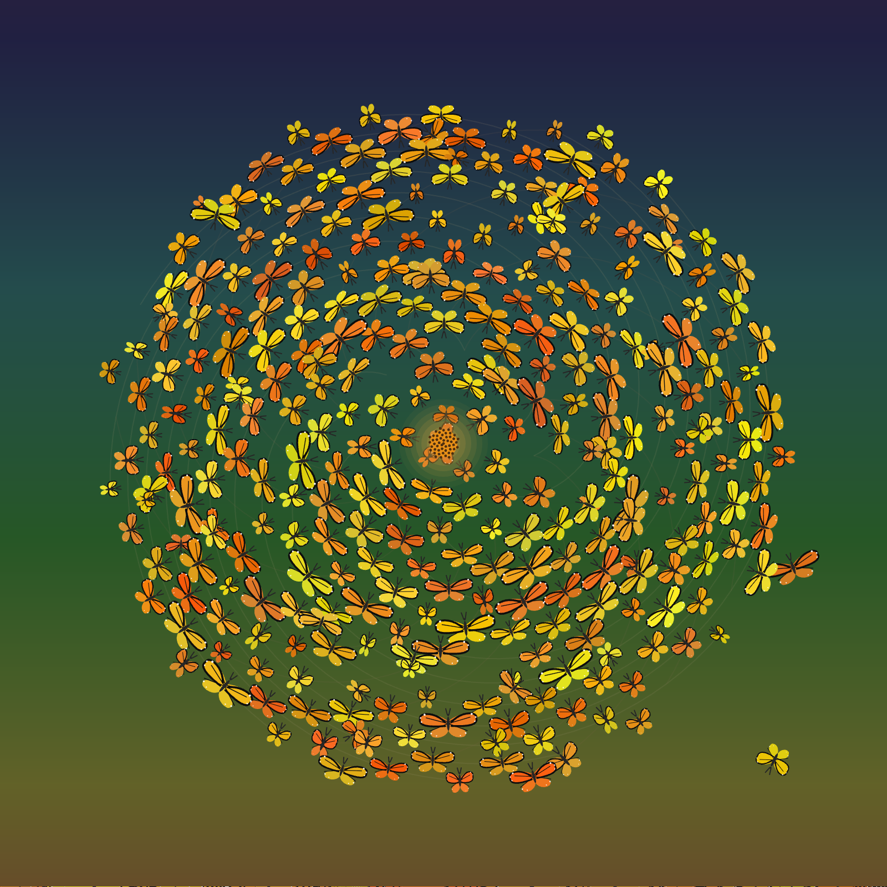

你能自动化品味吗？短答案是不能，你不能自动化品味，但我确实让我的设计偏好变得可读。

对那些对我的实验感兴趣的人，我会分享更长的答案：我想参加 [Genuary](https://genuary.art/)，那是每年一月人们每天创作一件创意编程作品的挑战。

我这里的目标不是把创造力“外包”出去。相反，我想把 Genuary 当作沙箱，来学习智能体工程工作流。这些工作流正在成为开发者与技术共事的标准方式。为了保持技能锋利，我用 [goose](/) 以每天一小段的方式试验这些工作流。

<!--truncate-->

通过构建一个由 goose 处理执行的系统，我可以并排测试不同架构。这个实验让我判断智能体工作流的哪些部分真正增加价值，哪些部分我应该丢掉。我花了几个小时专注在基础设施上，为自己买下整整一个月的工作流数据。

:::tip
[Skills](/docs/guides/context-engineering/using-skills) 是可复用的指令和资源集合，教 goose 如何执行特定任务。
:::

## 灵感

我必须大力感谢我的朋友 [Andrew Zigler](https://www.linkedin.com/posts/andrewzigler_genuary4-genuary2026-activity-7413652312495149056-5jA-)。我看见他在 Genuary 上势不可挡，就去问他是怎么做的。他分享了自己的作品，并提到他在用一个 “harness”。

我承认，整个十二月我都看见人们用这个词，但我其实不知道它是什么意思。Andrew 解释说：harness 就是你为模型构建的工具箱。它是一组确定性脚本，包住 LLM，让它能可靠地与你的环境交互。他用这种方法解决了另一个挑战，构建了一个可以迭代、提交并自我验证的系统。

他说明，如果你预先花时间做规格并建立约束，然后你就委托。一旦你有带良好日志的确定性工具，智能体就极其擅长循环，直到命中目标。

我的做法通常很普通，而且我严重依赖提示，但既然 Andrew 得到了这么好的结果，我愿意试验。

## Harness 与 Skills

受那次对话启发，我构建了同一工作流的两个版本，看它们如何处理同样的每日 Genuary 提示。

- **做法 1：Harness + [配方](/docs/tutorials/recipes-tutorial)**：它在 `/genuary` 里。跟随 Zig 的做法，我写了一个 shell 脚本作为 harness。它处理脚手架，创建文件夹并呈现每日提示，这样 goose 就不必猜该去哪里。配方大约 300 行，完全自包含。
- **做法 2：Skills + 配方**：它在 `/genuary-skills` 里。这个配方精简得多，因为它把“怎么做”委托给一个 skill。skill 包含设计哲学、参考和示例。我想看看，当智能体必须在一个包里“发现”指令，而不是跟随一份扁平脚本时，工作会如何变化。

我用一次专注的会话构建了整个系统：[配方](https://github.com/blackgirlbytes/genuary2026/blob/main/genuary/genuary.yaml)、[skills](https://github.com/blackgirlbytes/genuary2026/blob/main/genuary-skills/.goose/skills/genuary/SKILL.md)、harness 脚本、模板和 [GitHub Actions](https://github.com/blackgirlbytes/genuary2026/tree/main/.github/workflows)。（这发生在我十二月假期的安静时刻，一岁的孩子睡在我腿上。）这是用短期努力换长期杠杆。从那一刻起，系统做每日的工作。

## 关于品味

自动化很顺，但当我审阅输出时，我注意到一切看起来可疑地相似。

那时我开始想关于你无法教智能体“品味”的讨论。我想我如何发展品味。老实说，我发展品味的方式是：

- 看见什么很酷，然后模仿它。
- 知道什么被用滥了，因为你见得太多。
- 关注有“好品味”的人，并吸收他们的模式。

显然，我拿这个问题去找了 goose：

> “我注意到它总是画鲑鱼色的圆……我知道我们说了要有创意……有什么办法确保它跳出框框去想”



goose 说它在跟随一份检索到的 p5.js 模板，里面包含一个 `fill(255, 100, 100)`（鲑鱼色！）值和一个椭圆示例。由于 LLM 会重度锚定在具体示例上，智能体跟随的是代码，而不是我“有创意”的指令。

我从模板里去掉了鲑鱼色的圆，然后更进一步：我问如何彻底禁止常见的 AI 生成俗套。goose 搜索了讨论，拉取了示例，并产出了一份喊着“AI 生成”的被禁模式清单。

### 被禁的俗套

| 类别 | 被禁模式 |
| :---- | :---- |
| 色彩之罪 | 鲑鱼色或珊瑚粉，青绿与橙色的组合，紫-粉-蓝渐变。 |
| 构图之罪 | 单个居中的形状，毫无变化的完美对称，普通的螺旋。 |
| 黄金法则 | 如果它看起来像 AI 生成的输出，就不要做。 |

### 被鼓励的模式

| 类别 | 被鼓励的模式 |
| :---- | :---- |
| 色彩之胜 | 色相会移动的 HSB 模式，互补色板，随时间演化的渐变。 |
| 构图之胜 | 有涌现行为的粒子系统，带透明度的分层深度，数百个元素相互作用。 |
| 运动之胜 | 基于噪声的流场，群集 / 蜂群，有机生长模式，带变化的呼吸。 |
| 灵感来源 | 自然现象：椋鸟的蜂拥、萤火虫、极光、烟、水。 |
| 黄金法则 | 如果它激发喜悦，并且有人会想分享它，你就在正确的轨道上。 |

goose 通过模式识别确定了这份清单。所以也许，智能体可以用模式来反映我的品味，不是因为它们理解美，而是因为我在明确教它们我个人会回应什么。

我给 Andrew 看了三天里我最喜欢的输出：蝴蝶把自己排成斐波那契序列。



他的回应是一种肯定：

> “哇，那是惊人的斐波那契……我真的很好奇你的美学提示。我的更偏向像素艺术和数学化的色彩操作，因为我就是这样调教它的……我喜欢你的更柔和，并且试着看起来不像电脑做的……简直像手机壁纸 lol……你到底是怎么在蝴蝶上得到那种很酷的细线艺术的？它看起来像一张底图。太酷了。它画了 SVG 吗？那些是从哪来的？”

因为我明确告诉 goose 去看“自然现象”和“有机生长”，它用贝塞尔曲线画翅膀，并根据螺旋位置移动颜色来制造深度，用从暖琥珀到蓝的渐变，而不是生硬的黑。

## 扩展视觉反馈回路

两种工作流都使用 [Chrome DevTools MCP 服务器](/docs/mcp/chrome-devtools-mcp)，这样 goose 能看见输出并迭代。这造成了冲突：多个实例不能使用同一个 Chrome 配置文件。我不想要手工步骤，所以我问智能体能否并行运行 Chrome DevTools。解决方案是分配独立的用户数据目录。

```yaml
# genuary recipe example
- type: stdio
  name: Chrome Dev Tools
  cmd: npx
  args:
    - -y
    - chrome-devtools-mcp@latest
    - --userDataDir
    - /tmp/genuary-harness-chrome-profile
```

## 我学到了什么

我把执行自动化，这样我就能研究品味、约束设计和反馈回路。

两种做法的行为非常不同。基于 harness 的工作流更可靠、更高效，但它产生更可预测的结果。它忠实地跟随指令，并为一致性做优化。

基于 skills 的做法更乱。它浮现更多惊喜，做出更奇怪的连接，并需要更多编辑介入。但输出感觉更像协作，而不是流水线。

这对我强化的是，“AI 对人类”的框架太简单了。自动化擅长处理重复和速度。品味仍然活在设定约束、策展，以及决定什么永远不该发生之中。我最终没有自动化品味。结果是一个系统，让我的偏好变得足够可读，能够被反射回我。

## 看代码

代码和完整记录在[我的 Genuary 2026 仓库](https://github.com/blackgirlbytes/genuary2026)里。每一天的文件夹包含完整的对话历史，包括提案、迭代，以及我和智能体之间的来回。你也可以在 [Genuary 2026 站点](https://genuary2026.vercel.app/)上查看作品。

<head>
  <meta property="og:title" content="我如何把我的设计品味教给智能体" />
  <meta property="og:type" content="article" />
  <meta property="og:url" content="https://goose-docs.ai/blog/2026/01/04/how-i-taught-my-agent-my-design-taste" />
  <meta property="og:description" content="我用 Agent Skills 和配方把执行自动化，这样我就能研究品味、约束设计、反馈回路，并避开 AI 的味道。" />
  <meta property="og:image" content="https://goose-docs.ai/assets/images/automate-taste-9a928fdbc3c8e4d335dba61401ede6bc.png" />
  <meta name="twitter:card" content="summary_large_image" />
  <meta property="twitter:domain" content="goose-docs.ai" />
  <meta name="twitter:title" content="我如何把我的设计品味教给智能体" />
  <meta name="twitter:description" content="我用 Agent Skills 和配方把执行自动化，这样我就能研究品味、约束设计、反馈回路，并避开 AI 的味道。" />
  <meta name="twitter:image" content="https://goose-docs.ai/assets/images/automate-taste-9a928fdbc3c8e4d335dba61401ede6bc.png" />
</head>
