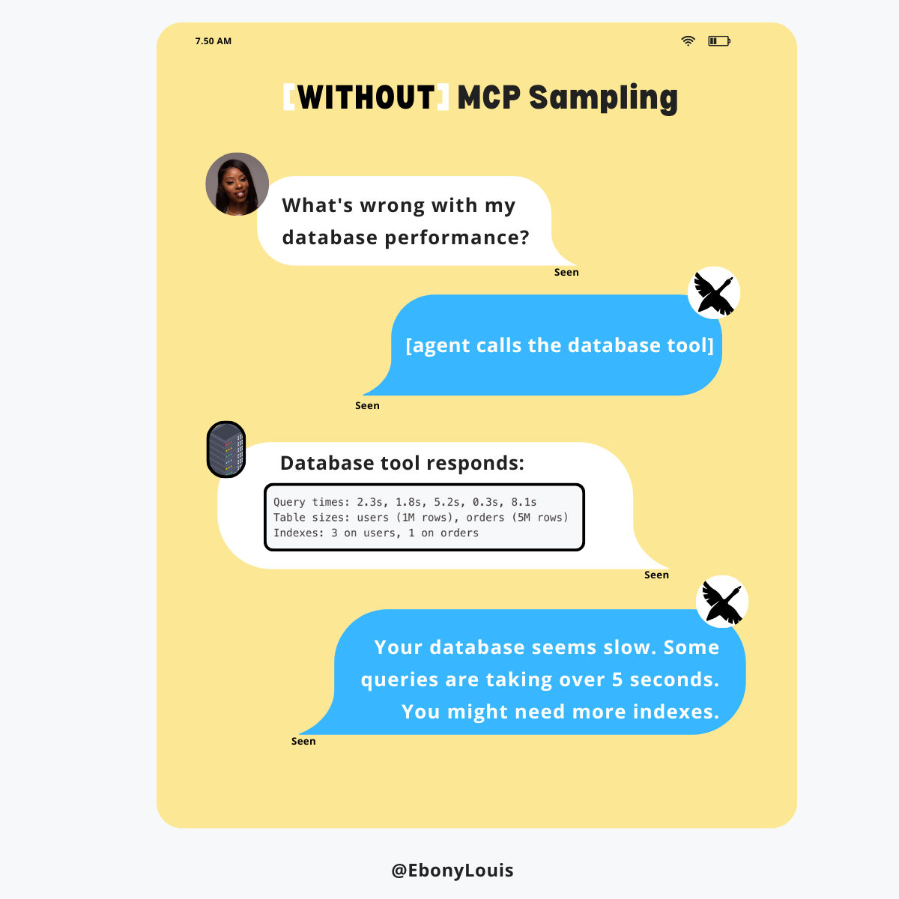
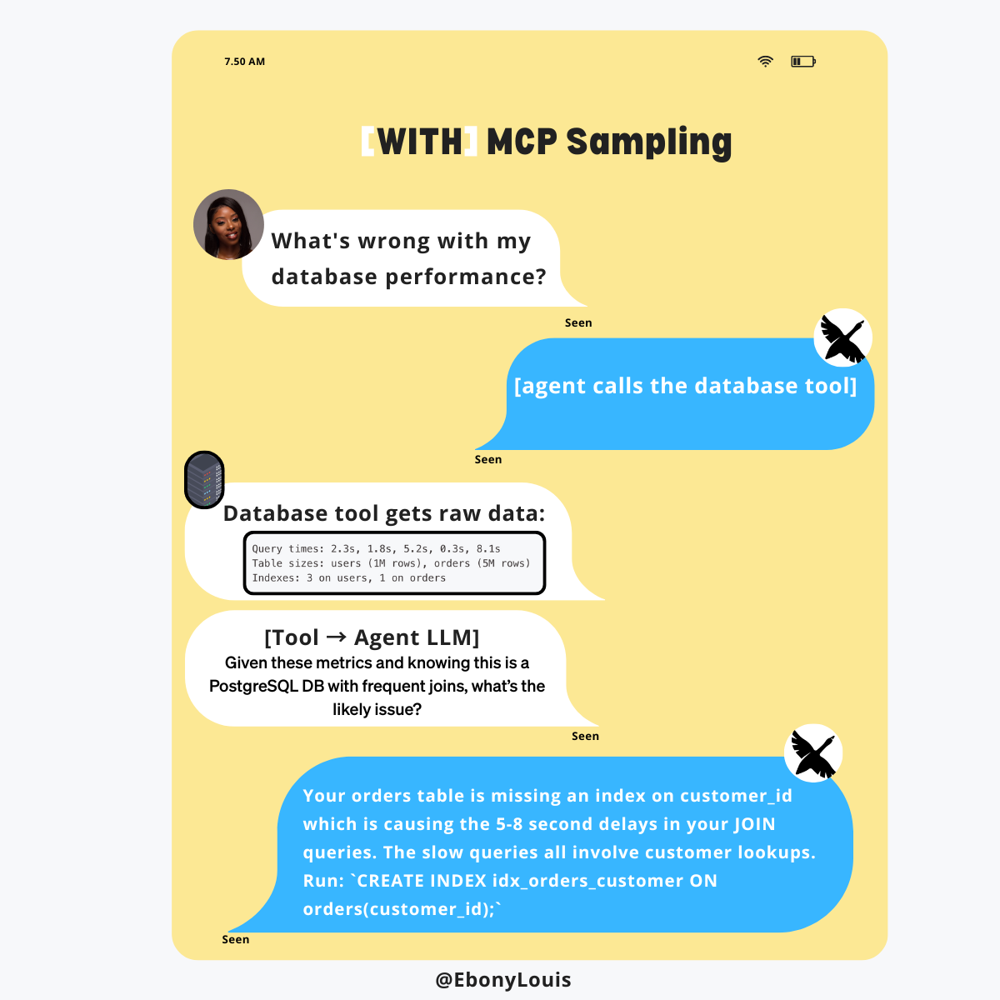

:::note
本文描述的是一项历史上的 MCP 功能。[Sampling 已在 2026-07-28 MCP 规范中被弃用](https://modelcontextprotocol.io/specification/2026-07-28/deprecated)，goose 不再支持它。需要模型推理的 MCP 服务器应直接与 LLM 提供商 API 集成。
:::

我第一次听说 MCP sampling 时的问题是：

> *“我不能只写更好的工具描述，并告诉工具它是专家吗？”*

<!--truncate-->

因为老实说，那正是我已经在做的事。

如果一个工具的行为不符合我的预期，我就会改措辞。增加细节。澄清意图。说得更明确。当然，这有一点帮助。

但还是有什么地方不对。

工具仍然并没有真正在*思考*。它们获取数据、返回文本，把所有重活推理都留给我的 LLM。那时我意识到，问题不在我的描述。问题在于系统在底层实际如何工作。

这就是 MCP sampling 进来的地方。
它不是魔法功能，而是一种不同的方式，用来组织工具和 LLM 实际如何协作。

## 真正改变我理解的东西

一旦我意识到问题不在工具描述，而在系统本身如何被组织，我就需要一种更清楚的方式来理解这个差别。

下面这个区分让它对我说通了：

> 工具描述影响工具如何被使用
> Sampling 改变工具如何参与推理

这听起来可能仍然有点抽象，所以我在下面把它画了出来。

没有 sampling 时，工具大多像一个信使。它获取数据、返回内容，所有真正的推理都发生在顶层的 LLM 里。

有了 sampling，行为就变了。工具收集数据，然后用你已经在 goose 里配置好的同一个 LLM，从它自己的上下文提出一个有针对性的问题，再返回任何东西。它不再只是把信息向上传递，而是在为思考做贡献。

还是同一个模型、同一个智能体，但行为完全变了。

## Council of Mine 放在哪里

看到流程变化，帮助我在概念上理解了 sampling。[Council of Mine](https://github.com/block/mcp-council-of-mine) 帮助我从体感上理解它。

它本身不是 MCP sampling。它是 sampling 存在之后，什么变得可能的一个例子。

Council of Mine 不是向 LLM 发一次请求，而是有意地、反复地使用 sampling。每个视角都是与同一个 LLM 的一次独立对话，由不同的观点来框定。这些回复随后被比较、辩论，并综合成最终答案。

服务器负责编排。LLM 负责推理。Sampling 让这种来回成为可能。

让我真正明白的，是看着一个问题变成多个独立视角，然后看到这些视角如何塑造最终输出。它把 sampling 从一个抽象想法变成了具体的东西。

## 我落到的结论

好的工具描述仍然重要。这并不是它们的替代品。

但单靠它们，到不了真正的智能体行为。描述塑造的是表层行为。Sampling 改变的是推理本身如何被组织。

这个区分是我缺失的那一块。一旦我真的能看见这个流程，其他一切就开始更说得通了。

<head>
  <meta property="og:title" content="为什么工具描述还不够" />
  <meta property="og:type" content="article" />
  <meta property="og:url" content="https://goose-docs.ai/blog/2026/01/15/why-tool-descriptions-arent-enough" />
  <meta property="og:description" content="我以为更好的工具描述能解决一切。并没有。这是最终让 MCP sampling 对我说通的东西。" />
  <meta property="og:image" content="https://goose-docs.ai/assets/images/blogbanner-97fb5e20248b53e838888082ac9f5860.png" />
  <meta name="twitter:card" content="summary_large_image" />
  <meta property="twitter:domain" content="goose-docs.ai" />
  <meta name="twitter:title" content="为什么工具描述还不够" />
  <meta name="twitter:description" content="我以为更好的工具描述能解决一切。并没有。这是最终让 MCP sampling 对我说通的东西。" />
  <meta name="twitter:image" content="https://goose-docs.ai/assets/images/blogbanner-97fb5e20248b53e838888082ac9f5860.png" />
</head>
