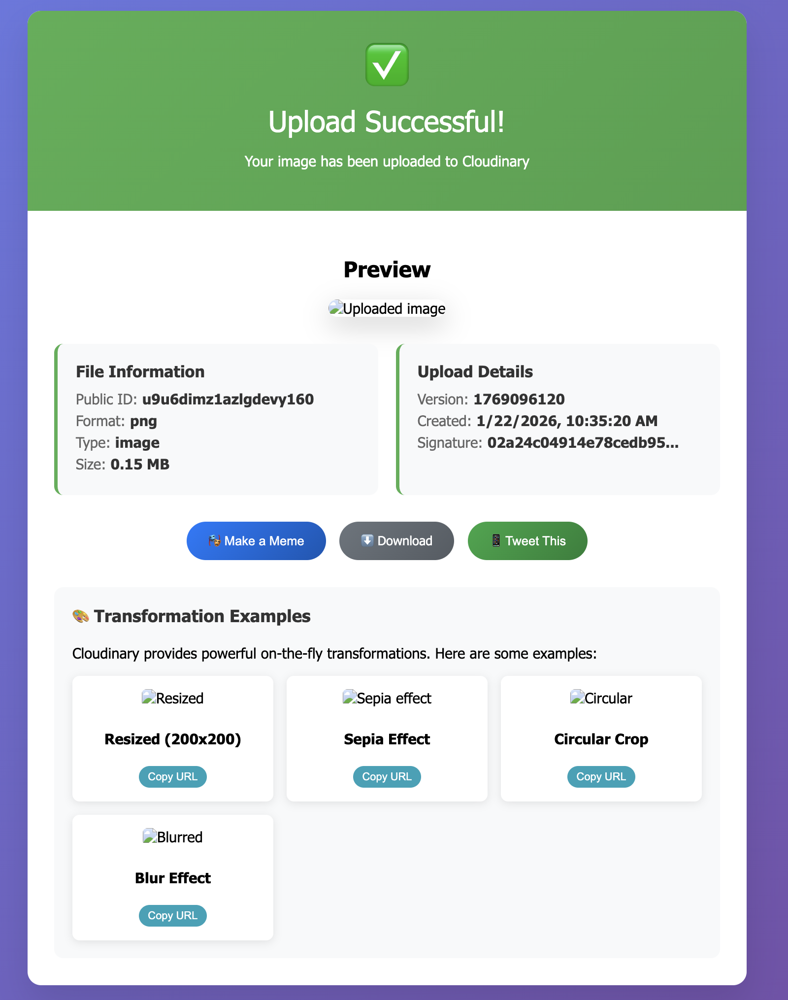

MCP-UI 很好玩。它粗糙。它早期。正如我在上一篇里说的，在一个生态仍在成形时，这么贴近边缘去构建，有一种真正让人上瘾的东西。

但 [MCP Apps](https://blog.modelcontextprotocol.io/posts/2025-11-21-mcp-apps/) 感觉不同。

不是“闪亮新功能”那种不同。更是“这是生态在成熟”那种不同。

<!--truncate-->

我最近把我现有项目之一，我的 Cloudinary MCP-UI 服务器，迁到了一个 MCP App。我想走过那个过程在实践中实际是什么样：什么变了，什么让我惊讶，什么坏了，以及为什么这次改变的意义超出新语法。

### 起点：一个真实的 MCP-UI 服务器

如果你看过我早先关于把 MCP 服务器变成交互体验的文章，你已经见过这个项目。

我的 Cloudinary MCP 服务器在上传之后，直接在我的智能体窗口里返回丰富的交互 UI。我得到的不是一块 JSON，而是我真的能交互的东西：

- 图片和视频预览
- 可复制的 URL
- 下载按钮
- 变换示例
- “做个梗图”和“发这条推文”的动作

{/* Video Player */}
<div style={{ width: '100%', maxWidth: '800px', margin: '0 auto' }}>
  <video 
    controls 
    width="100%" 
    height="400px"
    playsInline
  >
    <source src={require('@site/static/videos/cloudinary2.mp4').default} type="video/mp4" />
    Your browser does not support the video tag.
  </video>
</div>


到这一步，一切已经能用。体验用起来感觉很好。它看起来就是我想要的样子。

所以自然的问题是：
**如果我已经有了我想要的 UI 体验……为什么还要改变任何东西？**


## 我为什么决定再进一步

短答案：可移植性。

MCP-UI 尽管强大，它仍然非常**特定于宿主**。它在 goose 里工作得很美，但一直坐在每个人脑后的问题是：

> 当我想让同样的 UI 在别的地方工作时会发生什么？
> 比如在 ChatGPT Apps 里？或者完全另一个智能体宿主里？

现在，MCP-UI 和特定客户端如何渲染 UI 紧耦合。对实验来说这没问题，但它确实给这些体验能有多可复用加了天花板。

这就是 MCP Apps 旨在解决的缺口。


## MCP Apps 实际改变了什么

视觉上，几乎什么都没变。UI 看起来一样。交互感觉一样。如果你只是在用这个工具，你不会知道有什么移动了。

差别是架构上的。

用 MCP-UI 时，心智模型很简单：一个工具运行，内联返回 UI，宿主渲染返回的任何东西。用 MCP Apps 时，那个模型变了。现在工具运行，返回一个指向 UI 的指针，宿主明确地把那个 UI 当作资源取回，并更像一个真实 Web 应用那样渲染它。

MCP Apps 不再把 UI 只当作另一块输出，而是把它当作自己的一等资源。

这个转变听起来微妙，但它改变了什么是可能的。它意味着同一个 UI 可以在不同宿主之间旅行，而不是和某一个客户端紧耦合。它让工具做什么和界面如何交付之间的边界更清楚。它引入了真正的安全模型，而不是依赖尽力而为的约定。它推动生态走向共享模式，而不是每个项目发明自己的消息协议。

最终结果是，MCP Apps 感觉更不像一个碰巧在一个地方能用的聪明黑客技巧，而更像生态可以长期真正在其上构建的基础设施。

## 我如何着手迁移

我没有就地迁移现有服务器。

相反，我把两个版本并排放：

```yaml
src/
  index.mcp-ui.ts   # original working version
  index.mcp-app.ts  # new MCP Apps version
```
这不是因为 git 处理不了回退——这纯粹是工作流选择。

我想能够：
- 背靠背运行两种实现
- 比较行为，而不只是代码
- 现场演示两个版本
- 在我实验时保留一个能用的参考

这让差别容易理解得多，尤其是在我仍在形成自己对 MCP Apps 的心智模型时。

## 模式转变：UI 不再是内联的

这是一切终于对我说通的时刻。

用 MCP Apps 时，UI 不再是你的服务器*返回*的东西，而开始是你的服务器*提供*的东西。这听起来是个小区分，但在架构上是大转变。

你的服务器不再把 UI 直接附在工具响应上，而是承担一个略有不同的角色：

- 它把 UI 存在一个 `ui://` URI 下
- 它通过资源处理器暴露那个 UI
- 宿主像获取一个真实 Web 应用那样获取它

一旦我理解了这一点，其他一切就开始更说得通。

你不再只是“把 UI 和响应一起发回去”。
你在构建更接近一个微型 UI 服务器的东西，你的智能体知道如何与它交谈。

而这个转变正是 MCP Apps 正在形式化的东西。

## 从 MCP-UI 迁到 MCP Apps 的 4 个关键变化

这不是重写。这是结构转变。

下面是实际改变了什么、在实践中意味着什么，以及我必须在自己代码里碰什么。

### 1. UI 变成资源，而不是工具响应的一部分

用 MCP-UI 时，UI 是工具响应的一部分。我用 `createUIResource(...)` 并直接在 `content[]` 里返回它。

用 MCP Apps 时，这个模式翻过来。

我现在不返回 UI，而是：

- 把生成的 HTML 存在一个 `ui://` URI 下
- 用 `_meta.ui.resourceUri` 返回一个指向那个 UI 的指针
- 让宿主（比如 goose）回来单独获取它

在我的服务器里是这样：

```ts
private uiByUri = new Map<string, string>();

const uri = `ui://cloudinary-upload/${result.public_id}`;
this.uiByUri.set(uri, this.createUploadResultUI(result));

return {
  content: [
    { type: "text", text: "Upload successful!" }
  ],
  _meta: {
    ui: { resourceUri: uri }
  }
};
```
我现在不是把 UI 直接装在响应里发出去，而是实际上在说：

> “UI 住在这边。你准备好了就来取。”

这一个转变就是 MCP Apps 的核心。

### 2. 你的服务器必须支持资源发现

一旦 UI 变成资源，宿主就需要一种方式真正**找到它**并**获取它**。

这意味着你的服务器必须明确选择支持资源。

第一个变化就发生在你创建服务器的时候：

```ts
this.server = new Server(
  { name: "cloudinary-server", version: "1.2.0" },
  {
    capabilities: {
      tools: {},
      resources: {}, // 👈 This is required for MCP Apps
    },
  }
);

```
如果你忘了这个，你的资源处理器甚至不会被考虑。宿主不会请求资源，因为你的服务器从未声明它支持它们。

之后，你实现两个必需的处理器：

- `ListResourcesRequestSchema` → 告诉宿主存在哪些 UI 资源
- `ReadResourceRequestSchema` → 当宿主请求时返回实际的 HTML

而且你的资源必须返回这个 `MIME` 类型：

```ts 
text/html;profile=mcp-app
```
这是告诉任何宿主的信号：
> “这不只是文本。这是一个 MCP App。”

在我的 cloudinary 服务器里是这样：

```ts 
capabilities: { tools: {}, resources: {} }

this.server.setRequestHandler(ListResourcesRequestSchema, async () => ({
  resources: Array.from(this.uiByUri.keys()).map((uri) => ({
    uri,
    name: "Cloudinary UI",
    mimeType: "text/html;profile=mcp-app", // This is what makes your UI discoverable across hosts.
  })),
}));

this.server.setRequestHandler(ReadResourceRequestSchema, async (req) => ({
  contents: [{
    uri: req.params.uri,
    mimeType: "text/html;profile=mcp-app", 
    text: this.uiByUri.get(req.params.uri)!,
  }],
}));

```
声明 `resources: {}` 并实现这些处理器的组合，才把你的 MCP 服务器变成真正能把 UI 当作应用来提供的东西，而不只是返回一块块内容。

### 3. CSP 变成你的责任

这个让我措手不及。

当我第一次把 Cloudinary MCP App 接到 goose 时，一切看起来完美……除了图片。
布局？没问题。按钮？能用。UI？漂亮。
但每张图片都是坏的。

> 

起初我以为 Cloudinary 出了问题。但我直接在浏览器里打开那些 URL 时，它们完美工作。

真正的问题是 CSP（内容安全策略）。

MCP Apps 跑在沙箱 iframe 里，安全比 MCP-UI 严格得多。默认情况下，外部资源被阻止。这意味着没有外部图片、没有外部字体、没有外部脚本，除非你明确允许。

因为我的 UI 从这里加载资源：

```yaml
https://res.cloudinary.com
```

我必须告诉宿主这个域名是安全的。

在我实际的服务器代码里是这样：

```ts
return {
  contents: [{
    uri,
    mimeType: "text/html;profile=mcp-app",
    text: html,
    _meta: {
      ui: {
        csp: {
          resourceDomains: ["https://res.cloudinary.com"],
          connectDomains: ["https://res.cloudinary.com"]
        }
      }
    }
  }]
};
```
我一加上那个，所有图片立刻加载了。MCP Apps 不只是运送更漂亮的 UI。它在为 UI 执行引入真正的安全边界。

### 4. UI 通信变得标准化

你在写代码时很容易错过这个变化，但在架构上它是最大的转变之一。

用 MCP-UI 时，我的 UI 用自定义消息类型和宿主交谈，比如：

```js
type: "prompt"
type: "ui-size-change"
type: "link"
```
它能用，但它不是标准。

MCP Apps 用标准化的 `JSON-RPC` 方法取代它：

- `ui/initialize`
- `ui/message`
- `ui/notifications/size-changed`
- `ui/notifications/host-context-changed`

现在有一份共享契约，规定 UI 和宿主如何通信，而不是发送消息并希望宿主理解。

在我的代码里实际是这样。

之前（MCP-UI）：
我的“做个梗图”按钮发送一个自定义提示事件：
```ts
function makeMeme() {
  window.parent.postMessage({
    type: "prompt",
    payload: {
      prompt: "Create a funny meme caption for this image."
    }
  }, "*");
}
```
之后（MCP Apps）：
完全同一个按钮现在用 JSON-RPC 调用一个真正的方法：

```ts
async function makeMeme() {
  window.parent.postMessage({
    jsonrpc: "2.0",
    id: Date.now(),
    method: "ui/message",
    params: {
      content: {
        type: "text",
        text: "Create a funny meme caption for the image I just uploaded. Make it humorous and engaging, following popular meme formats."
      }
    }
  }, "*");
}
```

这感觉像一次小重构，但它实际上是生态层面的大转变。UI 行为不再和一个 SDK 或一个宿主紧耦合，我们现在得到：

- 共享原语
- 共享预期
- 跨宿主的真正互操作性

这是那种不会戏剧性地影响你日常 UI 代码、但会根本改变这个生态如何成长的变化。它让 MCP Apps 感觉更不像聪明的集成，而更像我们可以真正一起在其上构建的共享基础设施。

## 自己试试

如果你好奇自己构建 MCP Apps，请跟随指南[构建 MCP Apps](https://goose-docs.ai/docs/tutorials/building-mcp-apps/)。

如果你已经有一个 MCP-UI 服务器，试着只把一个工具转成 MCP App。那通常是一切开始真正说通的时刻。

提醒一下，MCP Apps 在 CSP 限制下沙箱运行，所以值得理解资源发现、MIME 类型和安全策略如何配合。[MCP Apps 规范](https://github.com/modelcontextprotocol/ext-apps) 是你想深入时的很好参考。


<head>
  <meta property="og:title" content="从 MCP-UI 到 MCP Apps：演进中的交互式智能体 UI" />
  <meta property="og:type" content="article" />
  <meta property="og:url" content="https://goose-docs.ai/blog/2026/01/22/mcp-ui-to-mcp-apps" />
  <meta property="og:description" content="我把一个真实的 MCP-UI 服务器迁到了 MCP Apps。这是实际改变了什么、坏了什么，以及这次转变为什么重要。" />
  <meta property="og:image" content="https://goose-docs.ai/assets/images/blogbanner-1d2185a745552379fe543020a901e8cc.png" />
  <meta name="twitter:card" content="summary_large_image" />
  <meta property="twitter:domain" content="goose-docs.ai" />
  <meta name="twitter:title" content="从 MCP-UI 到 MCP Apps：演进中的交互式智能体 UI" />
  <meta name="twitter:description" content="我把一个真实的 MCP-UI 服务器迁到了 MCP Apps。这是实际改变了什么、坏了什么，以及这次转变为什么重要。" />
  <meta name="twitter:image" content="https://goose-docs.ai/assets/images/blogbanner-1d2185a745552379fe543020a901e8cc.png" />
</head>
