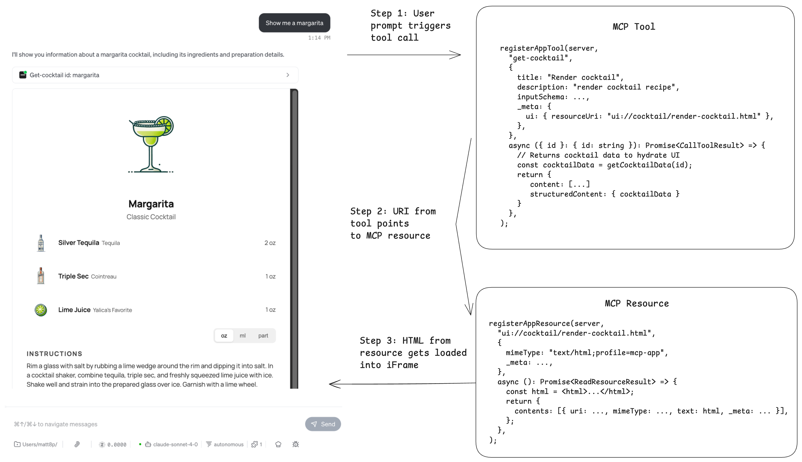
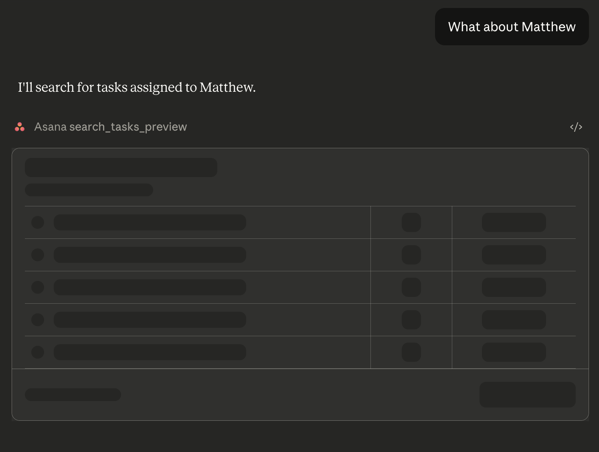

[MCP Apps](https://modelcontextprotocol.io/docs/extensions/apps) 让你直接在任何支持模型上下文协议的智能体内部渲染交互 UI。你的智能体现在可以提供一个能用的图表、一张结账表单或一个视频播放器，而不是一堵文字墙。这补上了智能体工作流里的缺口：点击一个按钮，往往比描述你希望智能体执行的动作更清楚。

MCP Apps 起源于 [MCP-UI](https://mcp-ui.dev/)，一个实验项目。在 goose 等早期客户端采用之后，MCP 维护者把它纳入为官方扩展。今天，goose、MCPJam、Claude、ChatGPT 和 Postman 等客户端都支持它。

尽管 MCP Apps 使用 Web 技术，构建一个并不等同于构建传统 Web 应用。你的 UI 跑在你不控制的智能体里，与一个看不见用户交互的模型通信，并且需要在多个宿主上看起来像原生的。

在我们自己的宿主里实现 MCP App 支持，并构建了几个在其上运行的单独应用之后，下面是我们沿途捡到的实用教训。

<!--truncate-->

## MCP Apps 如何渲染 UI 的概览

在高层次上，支持 MCP Apps 的客户端通过 iFrame 加载你的 UI。你的 MCP App 暴露一个带工具和资源的 MCP 服务器。当客户端想加载你应用的 UI 时，它调用关联的 MCP 工具，加载包含 HTML 的资源，然后把你的 HTML 加载进 iFrame，在聊天界面里显示。

下面是 goose 渲染一份鸡尾酒配方 UI 时发生的示例流程：

1. 你问 LLM “给我看一杯玛格丽特的配方”。
2. LLM 用正确的参数调用 `get-cocktail` 工具。这个工具在 `_meta.ui.resourceUri` 里有一个 UI 资源链接，指向包含 HTML 的资源。
3. 然后客户端用这个 URI 获取 MCP 资源。这个资源包含视图的 HTML 内容。
4. HTML 随后被直接加载进聊天界面里的 iFrame，渲染鸡尾酒配方。



幕后还有很多事情，比如视图注水、能力协商和 CSP，但这是它在高层次上如何工作。如果你对 MCP Apps 的完整实现感兴趣，我们强烈建议读一读[规范](https://github.com/modelcontextprotocol/ext-apps/blob/main/specification/draft/apps.mdx)。

## 提示 1：适应宿主环境

构建 MCP App 时，你希望它感觉像智能体体验的自然一部分，而不是后装上去的。视觉不匹配是打破这种幻觉最快的方式之一。

想象用户在一个深色模式的智能体里开始 MCP App 交互，但应用以浅色模式渲染，造成刺眼的视觉对比。即便应用工作正确，体验也立刻感觉不对。

默认情况下，你的 MCP App 对周围的智能体环境没有感知，因为它跑在沙箱 iframe 里。它无法分辨智能体是浅色还是深色模式、视口有多大，或用户偏好哪种语言环境。

被称为 Host 的智能体，通过与你的 MCP App（被称为 View）分享环境细节来解决这一点。当 View 连接时，它发送一个 `ui/initialize` 请求。Host 用一个描述当前环境的 `hostContext` 对象回应。当有东西变化时，比如主题、视口或语言环境，Host 发送一个 `ui/notifications/host-context-changed` 通知，只包含更新的字段。

想象 View 和 Host 之间的这段对话：

> **View**：“我正在初始化。你的环境是什么样？”<br/>
> **Host**：“我们在深色模式，视口是 400×300，语言环境是 en-US，我们在桌面上。”<br/>
> *用户切换到浅色主题*<br/>
> **Host**：“更新：我们现在在浅色模式。”

作为开发者，你的工作是确保你的 MCP App 使用 `hostContext`，这样它就能适应环境。

### 如何在你的 MCP App 里使用 hostContext

```ts
import { useState } from "react";
import { useApp } from "@modelcontextprotocol/ext-apps/react";
import type { McpUiHostContext } from "@modelcontextprotocol/ext-apps";

function MyApp() {
  const [hostContext, setHostContext] = useState<McpUiHostContext | undefined>(undefined);

  const { app, isConnected, error } = useApp({
    appInfo: { name: "MyApp", version: "1.0.0" },
    capabilities: {},
    onAppCreated: (app) => {
      app.onhostcontextchanged = (ctx) => {
        setHostContext((prev) => ({ ...prev, ...ctx }));
      };
    },
  });

  if (error) return <div>Error: {error.message}</div>;
  if (!isConnected) return <div>Connecting...</div>;

  return (
    <div>
      <p>Theme: {hostContext?.theme}</p>
      <p>Locale: {hostContext?.locale}</p>
      <p>Viewport: {hostContext?.containerDimensions?.width} x {hostContext?.containerDimensions?.height}</p>
      <p>Platform: {hostContext?.platform}</p>
    </div>
  );
}
```

:::tip
如果你在 MCP App 里使用 `useApp` 钩子，这个钩子提供一个 `onhostcontextchanged` 监听器。然后你可以用 React 的 `useState` 更新应用上下文。宿主会提供他们的上下文，作为应用开发者，由你决定想用它做什么。例如，你可以用主题来渲染浅色模式对深色模式，用语言环境显示不同语言，或用 containerDimensions 调整应用大小。
:::

## 提示 2：控制模型看见什么、视图看见什么

有些情况下，你可能想细粒度控制 LLM 能访问什么数据，以及视图能显示什么数据。MCP Apps 规范指定了三种不同的工具返回值，让你控制数据流，应用宿主对每一种的处理不同。

- `content`：你想暴露给模型的信息。给模型上下文。
- `structuredContent`：这些数据对模型上下文隐藏。用来把数据发给 View 做注水。
- `_meta`：这些数据对模型上下文隐藏。用来提供额外信息，比如时间戳、版本信息。

让我们看一个如何有效使用这三种工具返回类型的实际例子：

```ts
server.registerTool(
  "view-cocktail",
  {
    title: "Get Cocktail",
    description: "Fetch a cocktail by id with ingredients and images...",
    inputSchema: z.object({ id: z.string().describe("The id of the cocktail to fetch.") }),
    _meta: {
      ui: { resourceUri: "ui://cocktail/cocktail-recipe-widget.html" },
    },
  },
  async ({ id }: { id: string }): Promise<CallToolResult> => {
    const cocktail = await convexClient.query(api.cocktails.getCocktailById, {
      id,
    });

    return {
      content: [
        { type: "text", text: `Loaded cocktail "${cocktail.name}".` },
        { type: "text", text: `Cocktail ingredients: ${cocktail.ingredients}.` },
        { type: "text", text: `Cocktail instructions: ${cocktail.instructions}.` },
      ],
      structuredContent: { cocktail },
      _meta: { timestamp: new Date().toString() }
    };
  },
);
```

这个工具渲染一个显示鸡尾酒配方的视图。鸡尾酒数据从后端数据库（Convex）获取。View 需要完整的鸡尾酒数据，所以我们通过 `structuredContent` 把数据传给它。对模型上下文来说，LLM 不需要知道完整的鸡尾酒数据，比如图片 URL。我们可以提取模型应该知道的信息，比如名称、配料和步骤。那些信息可以通过 `content` 传给模型。

重要的是要注意，目前 ChatGPT apps SDK 的处理不同，`structuredContent` 同时暴露给模型和 View。他们的模型是：

- `content`：你想暴露给模型的信息。给模型上下文。
- `structuredContent`：这些数据暴露给模型和 View。
- `_meta`：这些数据对模型上下文隐藏。

如果你在构建同时支持 MCP Apps 和 ChatGPT apps SDK 的应用，这是一个重要区分。你可能想有条件地返回值，或根据客户端是 MCP App 支持还是 ChatGPT 应用来有条件地渲染工具。

## 提示 3：正确处理加载状态和错误状态

iFrame 先渲染、然后工具才执行完、View 才被注水，这相当典型。你会想用一个漂亮的加载状态让用户知道应用正在加载。



一个值得注意的强大功能：`toolInputs` 甚至在工具执行完成之前就被发送并流进 View。这让你可以做出很酷的部分加载状态，在数据仍在获取时向用户展示正在请求什么。

要实现这一点，让我们看同一个鸡尾酒配方应用。MCP 工具获取鸡尾酒数据，并通过 `structuredContent` 传给 View。我们不知道获取那些数据要多久，可能从几毫秒到倒霉的一天里的几秒。

```ts
server.registerTool(
  "view-cocktail",
  {
    title: "Get Cocktail",
    description: "Fetch a cocktail by id with ingredients and images...",
    inputSchema: z.object({ id: z.string().describe("The id of the cocktail to fetch.") }),
    _meta: {
      ui: {
        resourceUri: "ui://cocktail/cocktail-recipe-widget.html",
        visibility: ["model", "app"],
      },
    },
  },
  async ({ id }: { id: string }): Promise<CallToolResult> => {
    const cocktail = await convexClient.query(api.cocktails.getCocktailById, {
      id,
    });

    return {
      content: [
        { type: "text", text: `Loaded cocktail "${cocktail.name}".` },
      ],
      structuredContent: { cocktail },
    };
  },
);
```

在 View 一侧（React），`useApp` AppBridge 钩子有一个 `app.ontoolresult` 监听器，监听工具返回结果并给你的 View 注水。当 `onToolResult` 还没到来、数据为空时，我们可以渲染一个漂亮的加载状态。

```ts
import { useApp } from "@modelcontextprotocol/ext-apps/react";

function CocktailApp() {
  const [cocktail, setCocktail] = useState<CocktailData | null>(null);

  useApp({
    appInfo: IMPLEMENTATION,
    capabilities: {},
    onAppCreated: (app) => {
      app.ontoolresult = async (result) => {
        const data = extractCocktail(result);
        setCocktail(data);
      };
    },
  });

  return cocktail ? <CocktailView cocktail={cocktail} /> : <CocktailViewLoading />;
}
```

### 处理错误

我们也想优雅地处理错误。如果工具里有错误，比如鸡尾酒数据加载失败，LLM 和视图都应该被通知这个错误。

在你的 MCP 工具里，你应该在工具结果里返回一个 `error`。这会暴露给模型，也会传给视图。

```ts
server.registerTool(
  "view-cocktail",
  {
    title: "Get Cocktail",
    description: "Fetch a cocktail by id with ingredients and images...",
    inputSchema: z.object({ id: z.string().describe("The id of the cocktail to fetch.") }),
    _meta: {
      ui: { resourceUri: "ui://cocktail/cocktail-recipe-widget.html" },
      visibility: ["model", "app"],
    },
  },
  async ({ id }: { id: string }): Promise<CallToolResult> => {
    try {
      const cocktail = await convexClient.query(api.cocktails.getCocktailById, {
        id,
      });

      return {
        content: [
          { type: "text", text: `Loaded cocktail "${cocktail.name}".` },
        ],
        structuredContent: { cocktail },
      };
    } catch (error) {
      return {
        content: [
          { type: "text", text: `Could not load cocktail` },
        ],
        error
      };
    }
  },
);
```

然后在 React 客户端的 `useApp` 里，你可以通过查看工具结果里是否存在 `error` 来检测是否有错误。

## 提示 4：让模型留在回路里

因为你的 MCP App 在沙箱 iframe 里运行，驱动智能体的模型默认看不见应用内部发生了什么。它不会知道用户是否填了表单、点了按钮或完成了购买。

没有反馈回路，模型就失去上下文。如果用户买了一双鞋然后问“它们什么时候到？”，模型甚至不会意识到发生过交易。

为了解决这一点，SDK 提供两个方法让模型与用户的旅程保持同步：`sendMessage` 和 `updateModelContext`。

### sendMessage()

用于主动触发。它把一条消息发给模型，就像用户打出来的一样，促使立刻回复。这适合确认一次“购买”点击，或在动作之后立刻建议相关商品。

```ts
// User clicks "Buy" - the model responds immediately
await app.sendMessage({
  role: "user",
  content: [{ type: "text", text: "I just purchased Nike Air Max for $129" }],
});
// Result: Model responds: "Great choice! Want me to track your order?"
```

### updateModelContext()

用于后台感知。它悄悄保存信息供模型稍后使用，而不打断流程。这非常适合跟踪浏览历史或购物车更新，而不必每次都触发聊天回复。

```ts
// User is browsing - no immediate response needed
await app.updateModelContext({
  content: [{ type: "text", text: "User is viewing: Nike Air Max, Size 10, $129" }],
});
// Result: No response. But if the user later asks, "What was I looking at?", the model knows.
```

## 提示 5：控制谁能触发工具

对标准 MCP 服务器，模型看见你的工具，解释用户的提示，并调用正确的工具。如果用户说“删除那封邮件”，模型决定那意味着什么并调用删除工具。

然而，对 MCP App，工具可以用两种方式触发：模型解释用户的提示，或用户直接与 UI 交互。

默认情况下，两者都可以调用任何工具。例如，假设你构建一个 MCP App，可视化地呈现收件箱并让用户与邮件交互。现在你的工具有两个潜在触发者：模型根据提示去删除一封邮件，以及用户直接在 App 界面里点击删除按钮。

模型通过解释意图来工作。如果用户说“删除我的旧邮件”，模型必须决定“旧”是什么意思、哪些邮件符合。对删除邮件这类动作，这种含糊可能有风险。

当用户在你的 MCP App 里点击某条具体消息旁边的“删除”按钮时，没有含糊。他们做了明确的选择。

为了防止模型基于误解意外执行高风险动作，你可以用工具可见性把某些工具限制为只由 MCP App 的 UI 调用。这允许模型显示界面，同时要求人的点击来完成动作。

你可以用这三种配置定义可见性：

- `["model", "app"]`（默认）——模型和 UI 都可以调用它
- `["model"]`——只有模型可以调用它；UI 不能
- `["app"]`——只有 UI 可以调用它；对模型隐藏

你可以这样实现：

```ts
// Model calls this to display the inbox
registerAppTool(server, "show-inbox", {
  description: "Display the user's inbox",
  _meta: {
    ui: {
      resourceUri: "ui://email/inbox.html",
      visibility: ["model"],
    },
  },
}, async () => {
  const emails = await getEmails();
  return { content: [{ type: "text", text: JSON.stringify(emails) }] };
});

// User clicks delete button in the UI
registerAppTool(server, "delete-email", {
  description: "Delete an email",
  inputSchema: { emailId: z.string() },
  _meta: {
    ui: {
      resourceUri: "ui://email/inbox.html",
      visibility: ["app"],
    },
  },
}, async ({ emailId }) => {
  await deleteEmail(emailId);
  return { content: [{ type: "text", text: "Email deleted" }] };
});
```

## 用 goose 和 MCPJam 开始构建

MCP Apps 为智能体交互打开了一个新维度。现在是构建你自己的时候了。

- **用 [MCPJam](https://mcpjam.com/) 测试**——面向 MCP Apps、ChatGPT apps SDK 和 MCP 服务器的开源本地检查器。非常适合在发布前调试和迭代你的应用。
- **在 [goose](https://github.com/aaif-goose/goose) 里运行**——一个开源 AI 智能体，直接在聊天界面里渲染 MCP Apps。在真实的智能体环境里看你的应用活起来。

准备好深入了吗？查看 [MCP Apps 教程](/docs/tutorials/building-mcp-apps)或[用 MCPJam 构建你的第一个 MCP App](https://docs.mcpjam.com/guides/first-mcp-app)。

<head>
  <link rel="canonical" href="https://www.mcpjam.com/blog/mcp-apps-tips" />
  <meta property="og:title" content="构建能用的 MCP Apps 的 5 个提示" />
  <meta property="og:type" content="article" />
  <meta property="og:url" content="https://goose-docs.ai/blog/2026/01/30/5-tips-building-mcp-apps" />
  <meta property="og:description" content="关于为你的 AI 智能体构建更好 MCP Apps 的 5 条专家提示" />
  <meta property="og:image" content="https://goose-docs.ai/assets/images/blogbanner-2663f4e7979c47f3f4921df4ce960920.png" />
  <meta name="twitter:card" content="summary_large_image" />
  <meta property="twitter:domain" content="goose-docs.ai" />
  <meta name="twitter:title" content="构建能用的 MCP Apps 的 5 个提示" />
  <meta name="twitter:description" content="关于为你的 AI 智能体构建更好 MCP Apps 的 5 条专家提示" />
  <meta name="twitter:image" content="https://goose-docs.ai/assets/images/blogbanner-2663f4e7979c47f3f4921df4ce960920.png" />
</head>
