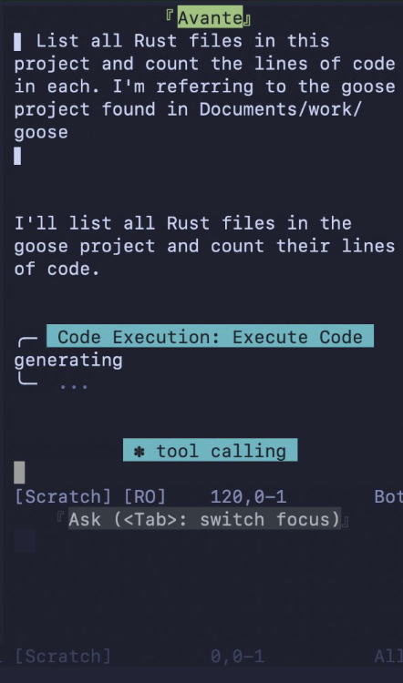

智能体从根本上改变了我们编程的方式。它们让开发者通过去掉传统开发工作流的中间环节而更快前进。这意味着在专门工具之间切换的时间更少，对其他团队的依赖也更少。既然智能体能执行复杂任务，开发者面临一个新挑战：在长会话中有效地使用它们。

最大的挑战是上下文腐烂。因为智能体的记忆有限，跑得太久的会话会让它们“忘记”更早的指令。这导致不可靠的输出、挫败感，以及代码库里微妙但严重的错误。一个有希望的解决方案是 Code Mode。

<!-- truncate -->

Code Mode 不向 LLM 描述几十个独立工具，而是允许智能体编写以编程方式调用这些工具的代码，减少模型必须一次持有的上下文量。虽然许多开发者第一次听说 Code Mode 是通过 [Cloudflare 的博客](https://blog.cloudflare.com/code-mode/)，但更少的人理解它在实践中如何工作。

我已经用了几个月 Code Mode，最近做了一个小实验。我让 goose 修它自己的一个 bug：Gemini 模型在 CLI 里处理不了图片，但在桌面应用里可以，然后开一个 PR。修复涉及分析模型配置、追踪图片输入在流水线中的处理，并在重复运行中验证行为。我把同一任务跑了两次：一次启用 Code Mode，一次不用。

下面是我从日常使用和实验中学到的。

## 1. Code Mode 不是 MCP 杀手

事实上，它在底层使用 MCP。MCP 是让 AI 智能体连接到外部工具和数据源的标准。当你在智能体里安装一个 MCP 服务器时，那个 MCP 服务器把它的能力暴露为 MCP 工具。例如，goose 的主要 MCP 服务器，叫 `developer` 扩展，暴露 `shell` 这样的工具，让 goose 能运行命令，以及 `text_editor`，让 goose 能查看和编辑文件。

Code Mode 把你的 MCP 工具包装成 JavaScript 模块，允许智能体把多次工具调用组合成一步。Code Mode 是智能体如何更高效地与 MCP 工具交互的一种模式。

## 2. goose 支持 Code Mode

Code Mode 支持在 2025 年 12 月随 goose v1.17.0 落地。它作为一个叫 “Code Mode” 的平台扩展发布，你可以在桌面应用或 CLI 里启用。

启用方法：

- **桌面应用：** 点击扩展图标，打开 “Code Mode”
- **CLI：** 运行 `goose configure` 并启用 Code Mode 扩展

自最初实现以来，我们加了这么多改进！

## 3. Code Mode 让你的上下文窗口保持干净

每次你安装一个 MCP 服务器（在 goose 生态里叫“扩展”），它都会给智能体的记忆增加大量数据。每个工具都带一份工具定义，描述工具做什么、接受哪些参数、返回什么。这帮助智能体理解如何使用工具。

这些定义消耗智能体上下文窗口里的空间。例如，如果单个定义占 500 个 token，一个扩展有五个工具，那就是还没开始就没了 2,500 个 token。如果你用多个扩展，你很容易把这个数字翻倍，甚至变成十倍。

没有 Code Mode 时，你的上下文窗口可能是这样：

```
[System prompt: ~1,000 tokens]
[Tool: developer__shell - 500 tokens]
[Tool: developer__text_editor - 600 tokens]
[Tool: developer__analyze - 400 tokens]
[Tool: slack__send_message - 450 tokens]
[Tool: slack__list_channels - 400 tokens]
[Tool: googledrive__search - 500 tokens]
[Tool: googledrive__download - 450 tokens]
... and so on for every tool in every extension
```

随着会话推进，有用的上下文被你甚至没用的工具定义挤出去：你正在讨论的代码、你正在解决的问题，或你之前给的指令。这导致性能下降和记忆丧失。虽然我过去建议禁用不用的 MCP 服务器，Code Mode 提供了更好的修复。它使用三个工具，帮助智能体按需发现需要什么工具，而不是预先加载每一个工具定义：

1. `search_modules` - 找到可用的扩展
2. `read_module` - 了解一个扩展提供哪些工具
3. `execute_code` - 运行使用这些工具的 JavaScript

我想看看这有多真实，所以做了一个实验：我让 goose 解决一个用户的 bug 并提交 PR，分别有和没有 code mode。对同一任务，Code Mode 少用了 30% 的 token。

| 指标 | 有 Code Mode | 没有 Code Mode |
|--------|----------------|-------------------|
| 总 token | 23,339 | 33,648 |
| 输入 token | 23,128 | 33,560 |

## 4. Code Mode 把操作批进一次工具调用

token 节省不只来自预先加载更少的工具定义。Code Mode 也通过一种叫批处理的方法处理对话的“活动”一侧。

当你让智能体做某事时，它通常把你的请求拆成单独的步骤，每一步需要一次单独的工具调用。你可以在聊天里看到这些调用，随着智能体执行任务而出现。例如，如果你让 goose “检查当前分支，给我看 diff，并运行测试”，它可能会运行四条单独的命令：

```
▶ developer__shell → git branch --show-current

▶ developer__shell → git status

▶ developer__shell → git diff

▶ developer__shell → cargo test
```

每一次调用都给 goose 必须跟踪的对话历史加一层。批处理把这些合成一次执行。当你打开 Code Mode 并给出同样的提示时，你只会看到一次工具调用：

```
▶ Code Execution: Execute Code
  generating...
```

在那一次执行里，它把所有命令批进一段脚本：

```javascript
import { shell } from "developer";

const branch = shell({ command: "git branch --show-current" });
const status = shell({ command: "git status" });
const diff = shell({ command: "git diff" });
const tests = shell({ command: "cargo test" });
```

作为用户，你看到同样的结果，但智能体只需要记住一次交互，而不是四次。通过减少这些往返，Code Mode 让对话历史保持简洁，这样智能体可以保持对手头任务的专注。

## 5. Code Mode 做出更聪明的工具选择

当智能体能访问几十个工具时，它有时会做出对你的环境在技术上错误的“合乎逻辑”的选择。这是因为在标准设置里，智能体根据简短的文字描述从一份扁平列表里挑工具。当智能体挑了一个听起来对、但缺少必要上下文的工具时，这会浪费大量时间和 token。

我在实验中亲眼看到了这一点。我启用了一个叫 agent-task-queue 的扩展，它被设计来带超时地运行后台任务。

当我让 goose 为我的 PR 跑测试时，它看了可用工具，看见了 agent-task-queue。LLM 推理说测试套件是“长时间运行的任务”，所以那个扩展完美匹配。它选择了专门工具，而不是通用的 shell。

然而，工具调用立刻失败了：

```
FAILED exit=127 0.0s
/bin/sh: cargo: command not found
```

我的环境没有被配置成用那个特定扩展来跑我的工具链。goose 基于描述做了一个合理的选择，但对我的实际设置来说是错误的工具。

在 Code Mode 会话里，这个错误从未发生。Code Mode 通过要求明确的 import 语句，改变智能体与其能力交互的方式。

goose 不是浏览一份名字菜单，而必须有意地选择它在用哪个模块。它选择从 developer 模块导入：

```javascript
import { shell } from "developer";

const test = shell({ command: "cargo test -p goose --lib formats::google" });
```

通过明确导入 developer，Code Mode 确保测试在我实际的 shell 环境里运行。

## 6. Code Mode 可以跨编辑器移植

goose 不只是一个智能体；它也是一个 [ACP（Agent Client Protocol）](/docs/gdk/acp) 服务器。这意味着你可以把它连到任何支持 ACP 的编辑器，比如 Zed 或 Neovim。而且，你在 goose 里用的任何 MCP 服务器在那里也能用。

我想自己试试，所以我设置 Neovim 连接到 **启用了 Code Mode 的** goose。下面是我用的配置：

```lua
{
  "yetone/avante.nvim",
  build = "make",
  event = "VeryLazy",
  opts = {
    provider = "goose",
    acp_providers = {
      ["goose"] = {
        command = "goose",
        args = { "acp", "--with-builtin", "code_execution,developer" },
      },
    },
  },
  dependencies = {
    "nvim-lua/plenary.nvim",
    "MunifTanjim/nui.nvim",
  },
}
```

关键的一行是我在编辑器配置里直接启用 Code Mode 的那一行：

```lua
args = { "acp", "--with-builtin", "code_execution,developer" },
```

为了测试，我让 goose 列出我的 Rust 文件并统计代码行数。我没有在 Neovim 缓冲区里看到一长串单独的 shell 命令，而是看到一次单独的工具调用：Code Execution。它的工作方式和在桌面应用里完全一样。这种可移植性意味着你可以构建一个强大、高效的智能体工作流，并把它带到你最舒服的任何环境。



## 7. Code Mode 在不同 LLM 上表现不同

我用 Claude Opus 4.5 跑实验。结果可能因你使用的模型而异。

Code Mode 要求 LLM 做并非所有模型都同样擅长的事：

- **写出有效的 JavaScript** - 模型必须生成语法正确的代码。代码生成能力更强的模型会产生更少错误。
- **遵循导入模式** - Code Mode 期望 LLM 从模块导入工具，比如 `import { shell } from "developer"`。有些模型可能会不导入就直接调用工具，那会失败。
- **使用发现工具** - 写代码之前，LLM 应该调用 `search_modules` 和 `read_module` 来了解有哪些工具。有些模型跳过这一步去猜，导致幻觉出的工具名。
- **优雅地处理错误** - 当代码执行失败时，模型需要读错误、理解哪里错了，并再试一次。有些模型比其他模型更擅长这个反馈回路。

如果 Code Mode 对你效果不好，试试换模型。擅长代码生成和遵循指令的模型，通常会比为其他任务优化的模型在 Code Mode 上表现更好。

## 8. Code Mode 不是给每个任务的

Code Mode 增加开销。在执行任何事之前，LLM 必须：

1. 调用 `search_modules` 找到可用扩展
2. 调用 `read_module` 了解一个扩展提供哪些工具
3. 写 JavaScript 代码
4. 调用 `execute_code` 来运行它

对简单的单工具任务，这个开销不值得。如果你只需要运行一条 shell 命令或查看一个文件，常规工具调用更快。

根据我的实验，下面是 Code Mode 说得通的时候：

| 使用 Code Mode 的时候 | 跳过 Code Mode 的时候 |
|--------------------|---------------------|
| 你启用了多个扩展 | 你只有 1–2 个扩展 |
| 你的任务涉及多步编排 | 你的任务是一次工具调用 |
| 你想要更长的会话而不发生上下文腐烂 | 速度比上下文寿命更重要 |
| 你在多个编辑器之间工作 | 你在做一次性的快速任务 |

## 试试看

如果你想试验 Code Mode，这里有一些资源：

**文档：**
- [ACP 客户端设置](/docs/gdk/acp)
- [扩展指南](/docs/getting-started/using-extensions)

**先前的文章：**
- Alex Hancock 的 [goose 中的 Code Mode MCP](/blog/2025/12/15/code-mode-mcp)
- 我写的 [Code Mode 不会取代 MCP](/blog/2025/12/21/code-mode-doesnt-replace-mcp)

**社区：**
- 加入我们的 [Discord](https://discord.gg/n8R5VaWDAn) 分享你学到的东西
- 如果有什么不如预期，在 [GitHub](https://github.com/aaif-goose/goose) 上提交 issue

跑你自己的实验，并告诉我们你发现了什么。

<head>
  <meta property="og:title" content="关于 Code Mode 你不知道的 8 件事" />
  <meta property="og:type" content="article" />
  <meta property="og:url" content="https://goose-docs.ai/blog/2026/02/06/8-things-you-didnt-know-about-code-mode" />
  <meta property="og:description" content="了解 Code mode 如何减少 AI 智能体中的上下文腐烂和 token 用量，让它们在长时间运行的会话中更高效。" />
  <meta property="og:image" content="https://goose-docs.ai/assets/images/header-image-bf242a438cd67caab097fab1d8bd31c5.png" />
  <meta name="twitter:card" content="summary_large_image" />
  <meta property="twitter:domain" content="goose-docs.ai" />
  <meta name="twitter:title" content="关于 Code Mode 你不知道的 8 件事" />
  <meta name="twitter:description" content="了解 Code mode 如何减少 AI 智能体中的上下文腐烂和 token 用量，让它们在长时间运行的会话中更高效。" />
  <meta name="twitter:image" content="https://goose-docs.ai/assets/images/header-image-bf242a438cd67caab097fab1d8bd31c5.png" />
  <meta name="keywords" content="goose, MCP, 模型上下文协议, Code Mode, AI 智能体, 上下文腐烂, token 用量, JavaScript, 开发者工具, ACP, Neovim" />
</head>
