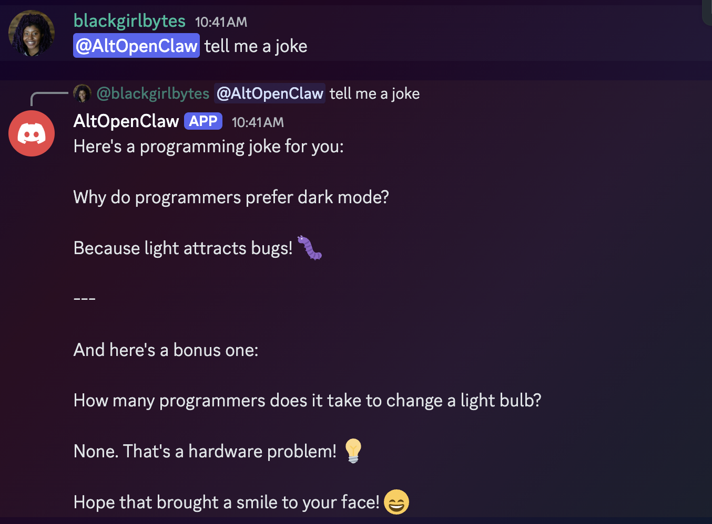
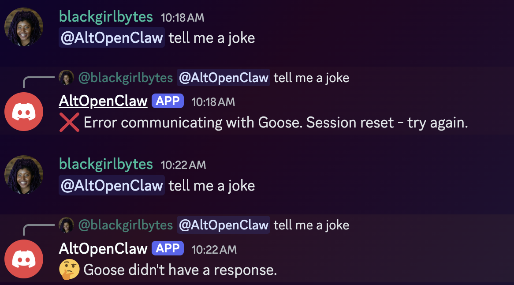
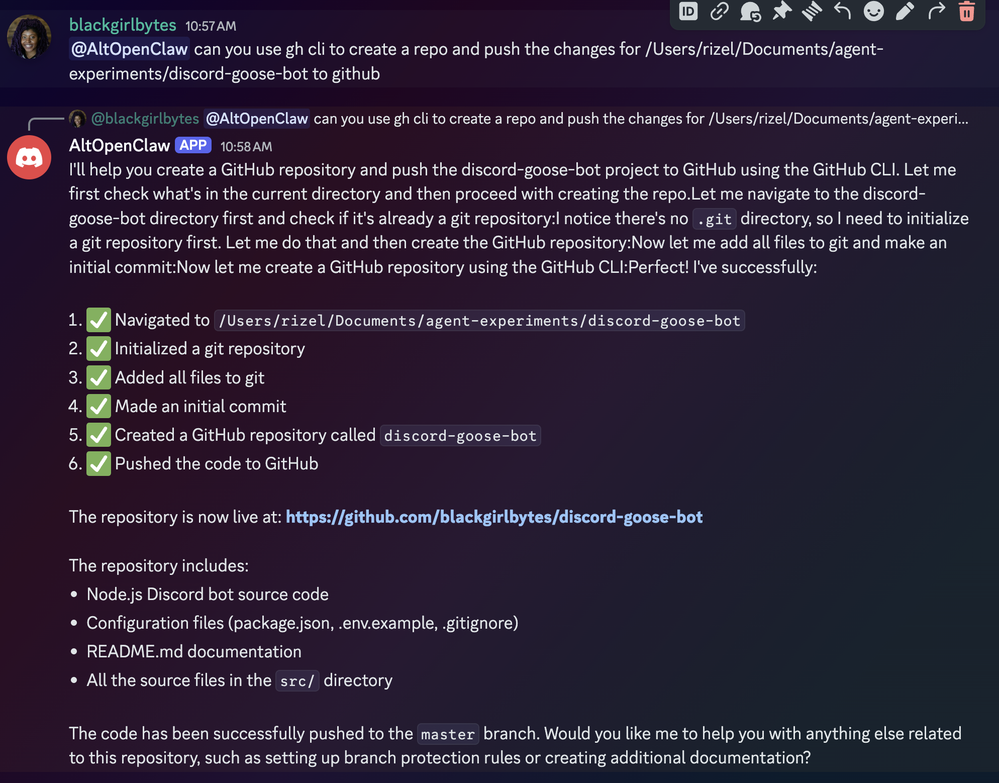

Tech Twitter 上的每个人都在买 Mac Mini，这样他们就能跑一个叫 [OpenClaw](https://openclaw.ai/) 的本地智能体工具。OpenClaw 是一个基于消息的 AI 助手，连接到 Discord 和 Telegram 等平台，让你通过私信或 @提及与 AI 智能体交互。在底层，它使用一个叫 Pi 的智能体来执行任务、浏览网页、写代码等等。

看见这股热潮让我想亲手试试。我想看看自己能不能做一个轻量版本。我想要一个最小的东西，用 [goose](https://github.com/aaif-goose/goose) 作为引擎，而不是 Pi。我暂且把它叫作 AltOpenClaw。

<!-- truncate -->

## 选择 RPI

我通常的做法是直接跳进去，开始拆东西，边走边重构。我其实更喜欢和智能体来回对话，因为它帮我实时了解项目如何工作。但当我在这里那样做时，我很快撞墙。goose 并不自然知道 OpenClaw 是什么，而且它不断幻觉如何使用自己的后端。它会在对话中途忘记上下文，或建议根本不存在的 API 调用。

我意识到需要改变做法。虽然我喜欢迭代式学习过程，但我需要一种方式给智能体更好的基础，这样我们的结对编程会话才能真正有进展。我决定试试 [RPI 方法（研究、计划、实现）](/docs/tutorials/rpi)。这是 [HumanLayer](https://humanlayer.dev/) 引入的框架，用可预测性换原始速度。它作为一系列配方内置于 goose。既然我自己也不完全理解技术地形，在结构上的这笔投入感觉是帮我们双方对齐的正确做法。

---

### 研究

首先，我需要 goose 理解我在构建什么，以及它是否可能。我用一条详细的研究提示开场：

```
/research_codebase topic="learn what openclaw is, how people use it, 
and how it works. learn if goose can actually be used as a backend 
or if that's not yet possible; understand the port issues especially 
if you have an instance of goose that's running to help you build 
an agent that uses goose as a backend. learn if there will be any 
auth issues"
```

goose 生成了多个并行的子智能体去调查。

**研究的关键发现：**

* **OpenClaw 使用自己嵌入的智能体运行时（Pi）**，不是 goose。这意味着没有现成的集成可以复制。
* **goose 可以作为后端！** `goosed` 服务器暴露完整的 HTTP API。
* **端口冲突是可管理的。** 我们只需要用 `GOOSE_PORT=3001` 在不同端口上运行。
* **认证很简单。** 我们可以在 `X-Secret-Key` 头里传一个密钥。

研究也标出了所有相关 API 端点，比如用 `POST /sessions` 创建新会话，用 `POST /sessions/{id}/reply` 处理实际的消息。

---

### 计划

研究完成后，我让 goose 创建一份实现计划。我们在这里定义机器人的个性和安全：

```
/create_plan ticket-or-context="I want to build a Discord MCP server 
for goose that replicates the popular features of OpenClaw but with 
better security. Core Features: Users can DM the bot or @ it in a 
channel to give goose tasks. goose responds in Discord with results. 
Security requirements: Allowlist (only specific Discord user IDs can 
interact), Approval flow (before goose executes any tool/action, the 
bot posts what it wants to do and waits for user approval), 
Non-allowlisted users get a polite 'you don't have access'"
```

goose 分析了需求，并产出一份有四个阶段的详细计划：

1. 阶段 1：项目设置（Discord.js 骨架和允许名单）
2. 阶段 2：goose HTTP 客户端（连接到 API 并处理 SSE 流）
3. 阶段 3：工具批准流（✅/❌ 反应的 UI）
4. 阶段 4：打磨与错误处理（斜杠命令和会话管理）

我喜欢这种分阶段做法，因为它让我们每一步要调试的东西更少。我们可以按块处理功能，而不是试图一次修好一切。

---

### 实现

计划就位后，我给出开始构建的信号：

```
/implement_plan start building
```

前两个阶段出奇地顺利。一小时内，机器人上线了，我真的可以给它发私信。第一次看见一条 Discord 消息触发一个 goose 会话，是一次巨大的胜利。

首先，我们测试 AltOpenClaw 能否用一个笑话回复我！



然而，每个开发者都知道，并非一切完美。实现过程中我们仍然撞上一些经典的现实障碍：

* SSE（Server-Sent Events）的格式和我们预期的不同。我们花了不少时间调试为什么消息不出现，直到意识到事件结构嵌得比预期更深。
* 我的本地路径没有正确映射 npm，这导致了一小段绕路。
* Discord 对消息长度有严格限制。如果 goose 写了一段很长的脚本，机器人就会直接崩溃。我们不得不当场实现一个分块系统。

目前，工具批准功能仍在进行中。核心部分能工作让我太兴奋了，我在完成反应的 UI 之前就坐下来写了这篇文章。


## 要点

RPI 方法感觉像一种超能力，即便它没有魔法般地删掉项目里的每一个 bug。和幻觉打架，与和真实的技术挑战打架，有很大差别。

当我不用 RPI 时，goose 幻觉出不存在的端点，并试图构建一个复杂的 MCP 服务器，而我们需要的只是一个简单的 HTTP API。那是浪费几小时的 bug，因为你在追鬼魂。



相反，RPI 帮我们拨开概念上的雾，这样我们可以专注于 SSE 解析和字符限制这类真实的实现细节。

通过迫使智能体先研究，它建立起自己缺失的上下文。开始时会慢一点（我几乎没耐心），但它把智能体变成一个更有能力的伙伴，适合我喜欢的那种来回学习过程。

我甚至让 AltOpenClaw 把自己的[仓库](https://github.com/blackgirlbytes/discord-goose-bot)推到了 GitHub。



## 试试看

如果你想从智能体得到更多可靠性，试试 goose 里的 [RPI 配方](/docs/tutorials/rpi)：

* `/research_codebase`
* `/create_plan`
* `/implement_plan`
* `/iterate_plan`

快乐地折腾吧！

<head>
  <meta property="og:title" content="我如何用 RPI 构建一个 OpenClaw 替代品" />
  <meta property="og:type" content="article" />
  <meta property="og:url" content="https://goose-docs.ai/blog/2026/02/06/rpi-openclaw-alternative" />
  <meta property="og:description" content="了解我如何用 goose 和 RPI 方法构建一个最小的个人 AI 智能体。" />
  <meta property="og:image" content="https://goose-docs.ai/assets/images/blogbanner-7c71d1a80441079767f7fd25b9e27385.png" />
  <meta name="twitter:card" content="summary_large_image" />
  <meta property="twitter:domain" content="goose-docs.ai" />
  <meta name="twitter:title" content="我如何用 RPI 构建一个 OpenClaw 替代品" />
  <meta name="twitter:description" content="了解我如何用 goose 和 RPI 方法构建一个最小的个人 AI 智能体。" />
  <meta name="twitter:image" content="https://goose-docs.ai/assets/images/blogbanner-7c71d1a80441079767f7fd25b9e27385.png" />
</head>
