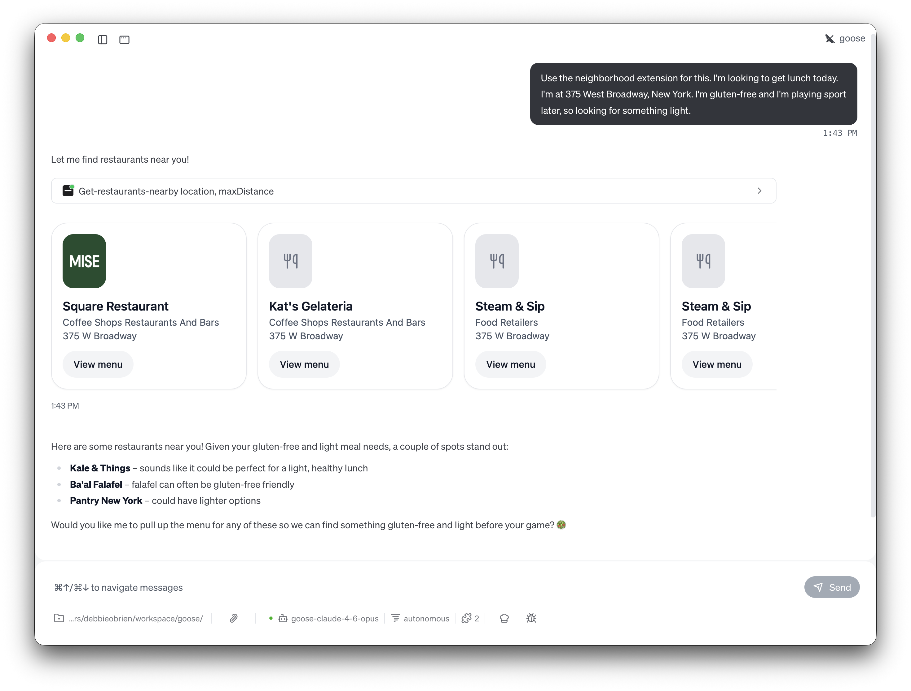
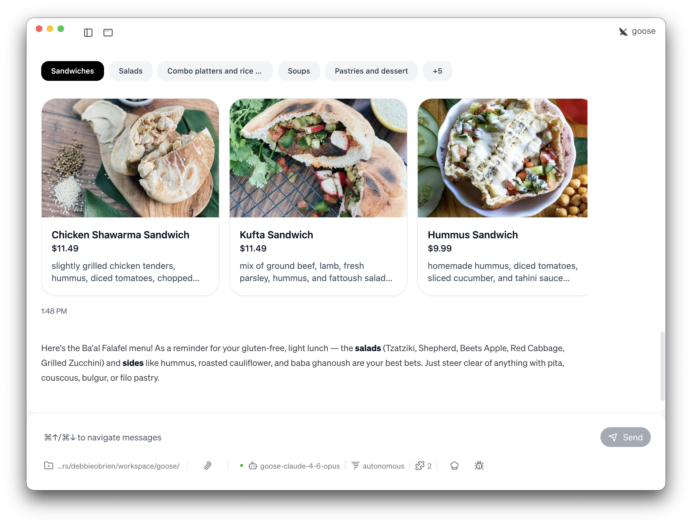
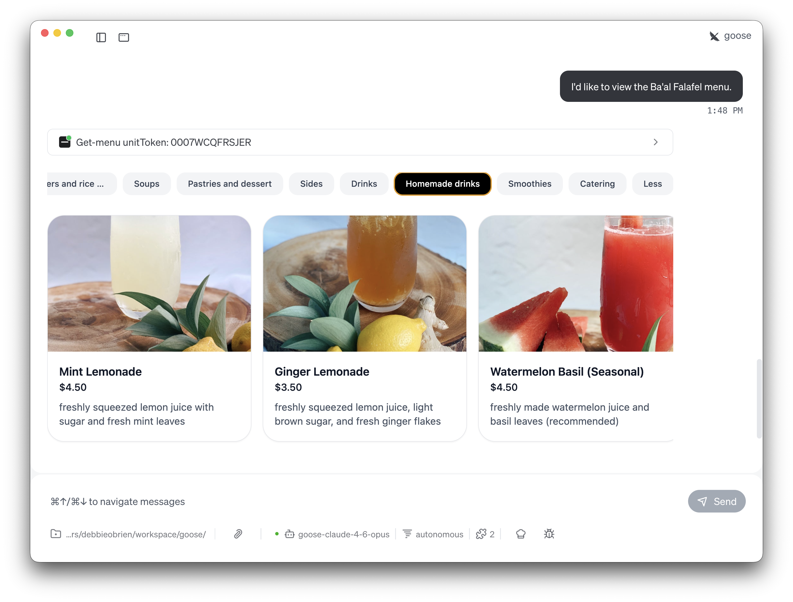
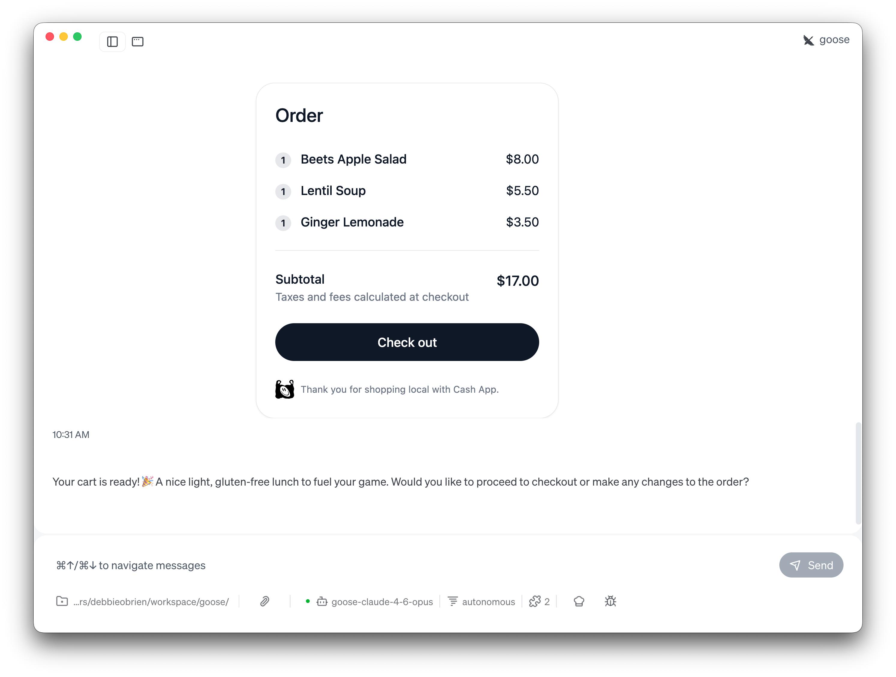

如果你和我一样，决定午餐吃什么比它该有的难度更大。再加上饮食限制（我有乳糜泻，所以必须吃无麸质），突然找一家餐厅就变成一整项研究。搜索菜单，交叉核对评论，检查那一份三明治到底有没有麸质……这很累。

如果你的 AI 智能体能替你处理这一切呢？

<!-- truncate -->

有了 goose 里的 [Neighborhood 扩展](/docs/mcp/neighborhood-mcp)，事情正是这样。你告诉 goose 你在哪里、你需要什么，它就找到附近的餐厅，给你看带照片的交互式菜单，把菜加进购物车，并一路把你带到结账，全程不离开聊天。你走出 goose 的唯一时刻，是点一下“支付”。

让我带你走过它如何工作。

## 设置 Neighborhood 扩展

首先：你需要安装这个扩展。在 goose Desktop 里，点击 **Extensions**，然后 **Browse Extensions**，搜索 “Neighborhood”。

你会马上看到它：*发现附近的餐厅，浏览菜单，并通过自然对话下外卖订单。* 卖家目前位于美国，但即使你在美国以外，也值得试一试，只为看看这种体验。

安装之后，确保扩展在当前聊天会话里已启用。你可以点击聊天里的扩展图标，打开 Neighborhood 来检查。

:::tip 快速安装
在 goose Desktop 里[直接安装 Neighborhood 扩展](goose://extension?type=streamable_http&url=https%3A%2F%2Fconnect.squareup.com%2Fv2%2Fmcp%2Fneighborhood&id=neighborhood&name=Neighborhood&description=Discover%20nearby%20restaurants%2C%20browse%20menus%2C%20and%20place%20takeout%20orders%20through%20natural%20conversation.)，或在 CLI 里用 `goose configure` 添加一个远程扩展（Streamable HTTP），端点为 `https://connect.squareup.com/v2/mcp/neighborhood`。
:::

## 找到真正适合你的餐厅

有趣的地方在这里。你不必打开外卖应用、在几百个选项里滚动，只要告诉 goose 你需要什么：

```bash
I'm looking to get lunch today. I'm at 375 West Broadway, New York. I'm gluten-free and I'm playing sport later, so looking for something light. Use the neighborhood extension to find options for me.
```

就这样。一条提示。goose 拿走你的位置、饮食需求，甚至你稍后要运动这件事，并用这一切找到合适的餐厅。

在幕后，goose 用你的地址和最大距离调用 Neighborhood MCP 服务器的 `get-restaurants-nearby` 工具，作为回报得到一份 JSON 格式的餐厅列表。但你看到的比原始 JSON 好看得多。



交互式餐厅卡片直接出现在聊天里，成为一个可以用箭头滚动的轮播，展示 Square Restaurant、Kat's Gelateria、Steam & Sip 等等，每一家都有类别、地址和一个 **View menu** 按钮。没有浏览器标签。没有切换应用。全都在那里。

goose 不只是列出餐厅。它会考虑你的处境。鉴于我的无麸质和清淡餐需求，goose 突出了几个显眼的地方：**Kale & Things** 作为清淡健康午餐的完美选择，**Ba'al Falafel** 因为炸豆丸饼常常对无麸质友好，以及 **Pantry New York** 的更清淡选项。它甚至问我是否想拉出菜单，这样我们可以在比赛前找到无麸质又清淡的东西。这种上下文推理，正是它和普通外卖应用感觉如此不同的地方。

## 就在聊天里浏览带图片的菜单

这是真正让我震惊的部分。

当你让 goose 打开一家餐厅的菜单，或点击查看菜单按钮时，它给你的不只是一份文本列表。得益于 [MCP Apps](/blog/2026/01/06/mcp-apps)，你得到一份直接在聊天里渲染的完整交互菜单，带有分类标签、食物照片、价格和描述。

```bash
I'd like to view the Ba'al Falafel menu.
```



三明治。沙拉。套餐和米饭。汤。糕点和甜点。配菜。饮料。自制饮料。冰沙。餐饮。全都在，而且都可以浏览。你可以点过分类标签，滚动菜品，并在下单前确切看到你在点什么。

我可以点击 **Salads** 看 Couscous Salad、Red Cabbage Salad 和 Beets Apple Salad，再翻到 **Homemade drinks** 看 Mint Lemonade、Ginger Lemonade 和 Watermelon Basil，全程不离开聊天窗口。



这不是一份被剥光的文本菜单。这是由在 goose 内部渲染的 MCP App 驱动的真实、视觉、交互体验。

与此同时，goose 也在帮我做决定。它提醒我，对于无麸质、清淡的午餐，**沙拉**（Tzatziki、Shepherd、Beets Apple、Red Cabbage、Grilled Zucchini）和鹰嘴豆泥、烤花椰菜、baba ghanoush 这类**配菜**是最好的选择。它甚至警告我避开任何带皮塔饼、库斯库斯、布格麦或菲洛酥皮的东西。有帮助，也诚实。

## 组建订单

浏览完菜单并做出选择后，我只要告诉 goose 我想要什么：

```
Let's add the Beets Apple Salad, Lentil Soup, and a Ginger Lemonade.
```

goose 把一切加进购物车，并在聊天里把它渲染成另一个交互式 MCP App：



就是它，我的 Beets Apple Salad（8.00 美元）、Lentil Soup（5.50 美元）和 Ginger Lemonade（3.50 美元）。小计：17.00 美元。还有一个大大的 **Check out** 按钮准备好了。

goose 甚至确认：*“你的购物车准备好了！🎉 一份清淡、无麸质的午餐，为你的比赛补充能量。”*

如果我想改，加一道菜、去掉一样、换一杯饮料，我只要用自然语言问 goose，它就会更新购物车。不必摆弄加减按钮。

## 结账，你离开 goose 的唯一时刻

当你点击 **Check out** 时，你会被带到由 Cash App 驱动的支付页面。这是发生在 goose 之外的一步，而且理由充分：支付需要安全，并被直接处理。

从那里你可以看到取餐时间，输入电话号码，用 Google Pay 或信用卡支付，加小费，兑换优惠券，甚至留一句备注（比如“请确保无麸质！”）。然后你下单，去取午餐。

整个流程，从“我饿了”到“订单已下”，始于一条提示。

## 为什么这重要

这不只是一个酷演示。它是 AI 智能体如何改变日常任务的一瞥。

想想这里发生了什么：

- **一条提示**取代了打开应用、搜索餐厅、按饮食需求过滤、读评论、浏览菜单和加入购物车
- **感知上下文的推荐**意味着 goose 把我的无麸质饮食*和*晚上的运动计划都考虑进去，而不必我去搜“我位置附近的无麸质运动前餐”
- **交互式 MCP Apps**直接在聊天里渲染带照片的丰富视觉菜单，不需要浏览器


Neighborhood 扩展是 MCP 服务器超越文本时能做什么的完美例子。通过把工具调用和用于丰富 UI 的 MCP Apps 结合起来，体验更不像在和聊天机器人说话，而更像有一个真正了解这个街区的个人助理。

## 自己试试

准备好用 goose 订午餐了吗？开始方法如下：

1. **安装 Neighborhood 扩展**，goose Desktop 的[一键安装](goose://extension?type=streamable_http&url=https%3A%2F%2Fconnect.squareup.com%2Fv2%2Fmcp%2Fneighborhood&id=neighborhood&name=Neighborhood&description=Discover%20nearby%20restaurants%2C%20browse%20menus%2C%20and%20place%20takeout%20orders%20through%20natural%20conversation.)，或在 CLI 里通过 `goose configure` 添加
2. **告诉 goose 你在哪里、你想吃什么**，包括饮食需求、你稍后要做什么，或任何其他上下文
3. **浏览菜单**，点过交互式餐厅卡片和菜单标签
4. **组建订单**，用白话告诉 goose 你想要什么
5. **结账**，点击按钮并完成支付

更多细节见 [Neighborhood 扩展文档](/docs/mcp/neighborhood-mcp)，并试着把它和日历等其他 goose 扩展组合，得到更强的工作流。

## 观看完整演示

看整个流程的实际效果：

<iframe
  class="aspect-ratio"
  src="https://www.youtube.com/embed/DG1HUFsekyc"
  title="用 Neighborhood 扩展和 goose 一起订午餐"
  frameBorder="0"
  allow="accelerometer; autoplay; clipboard-write; encrypted-media; gyroscope; picture-in-picture"
  allowFullScreen
></iframe>

<head>
  <meta property="og:title" content="不用离开 AI 智能体就能订午餐" />
  <meta property="og:type" content="article" />
  <meta property="og:url" content="https://goose-docs.ai/blog/2026/02/25/order-lunch-with-goose" />
  <meta property="og:description" content="在 goose 里使用 Neighborhood 扩展，发现附近的餐厅，浏览交互式菜单，并下外卖订单，全部来自一条简单的聊天提示。" />
  <meta property="og:image" content="https://goose-docs.ai/assets/images/banner-2d9dbe53ddf9f459a8c5f6615af8333b.png" />
  <meta name="twitter:card" content="summary_large_image" />
  <meta property="twitter:domain" content="goose-docs.ai" />
  <meta name="twitter:title" content="不用离开 AI 智能体就能订午餐" />
  <meta name="twitter:description" content="在 goose 里使用 Neighborhood 扩展，发现附近的餐厅，浏览交互式菜单，并下外卖订单，全部来自一条简单的聊天提示。" />
  <meta name="twitter:image" content="https://goose-docs.ai/assets/images/banner-2d9dbe53ddf9f459a8c5f6615af8333b.png" />
</head>
