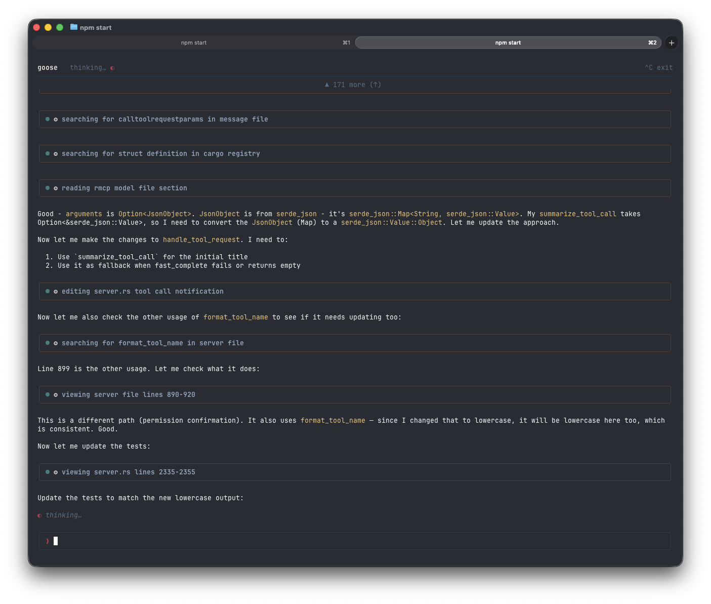

# goose 2.0 beta：新架构与客户端


goose 从终端起步。最早的版本是一个 Python CLI，在进程内运行智能体——你输入一条消息，模型回应，工具执行，一切都发生在单个循环里。那种简单是一种优势：任何有终端的人都可以立刻开始使用 goose，不用安装应用，也不用运行服务器。

随着 goose 成长，人们想使用它的方式也在增加。我们发布了 Electron 桌面应用，突然就有了两个客户端、两条完全不同的集成路径。Rust CLI 在进程内直接与智能体对话，而桌面应用则经过 `goosed`，一个自定义的 REST + SSE 服务器。每一项新功能——会话管理、扩展加载、流式传输——都必须在两个地方接上。

<!--truncate-->

第三方开发者一直无法轻松构建自己的客户端，因为他们根本没有标准的连接方式。

我们需要一个单一协议，让任何客户端都能用它到达同一个智能体核心。为此，我们选择了 [ACP](https://agentclientprotocol.com/)，即 Agent Client Protocol，作为 goose 新的默认接口。

## 底层：ACP

在幕后，我们正在通过 **ACP（Agent Client Protocol）** 统一每个客户端如何连接到 goose。ACP 给我们一个协议、一个 goose 服务器，服务每一个客户端——终端、桌面、IDE 插件，以及你想构建的任何东西。这将使不同 goose 客户端的生态成为可能。我们也有一份关于 ACP 新 HTTP/WS 传输的 [RFD](https://github.com/agentclientprotocol/agent-client-protocol/pull/721)，欢迎对设计提出反馈。

目前的进展：

| 阶段 | 内容 | 状态 |
|-------|------|--------|
| **1 — 稳定 ACP 服务器** | 具备会话持久化、扩展、流式传输的生产级服务器 | ✅ 完成 |
| **2 — TypeScript TUI beta** | 基于 ACP 客户端构建的功能完整终端 UI | 🚧 进行中 |
| **3 — 桌面重写为 Tauri** | Electron 应用将被基于 ACP 的 Tauri 桌面客户端取代 | 🚧 进行中 |
| **4 — 整合** | 移除 `goosed` 和旧的 Rust CLI；单一统一架构 | 计划中 |

工作跟踪在 [#6642](https://github.com/aaif-goose/goose/issues/6642)。

## 新的 goose TUI

有了这个基础，我们现在正在发布建立在它之上的第一批官方客户端：一个今天就可以试用的全新 TypeScript TUI，以及一个将取代 Electron 桌面应用的基于 Tauri 的桌面应用。对你来说，这意味着终端和桌面上都有更快、更轻的体验——社区也有一条清晰的路径，可以构建新的客户端和集成，而不必反向工程内部实现。

下面是正在发生的事，以及如何开始。

## 现在就试用新 TUI

新的基于 TypeScript 的 TUI 处于 beta。它已经支持消息、工具调用、语法高亮的代码和渲染后的 markdown。来试试：

```bash
npx @aaif/goose
```

就这样——一条命令，无需安装。它会拉取最新 beta 并开始一个交互会话。



### TUI 接下来会有什么

- 提供商和模型管理
- 会话列表、恢复和导出
- MCP 功能和 skills 管理的 UI

我们很想听到你的反馈——试试看，告诉我们什么好用、什么不好用。

## 桌面正在迁到 Tauri

我们也在把桌面应用从 Electron 重写为 [Tauri](https://tauri.app/)。Tauri 重写带来更好的性能和焕然一新的 UI，新应用会与 ACP 对话，这样两个官方客户端将共享同一协议和服务器。

桌面准备好进行 beta 测试时，我们会再发一篇跟进文章。

## 参与进来

这一切都在公开进行。跟随进展，或直接加入：

- **跟踪 issue：** [#6642](https://github.com/aaif-goose/goose/issues/6642)
- **试用 TUI：** `npx @aaif/goose`
- **Discord：** 在 [#goose-2-dev](https://discord.gg/n8R5VaWDAn) 跟随进展并给出反馈。
- **有反馈？** 开一个 issue，或在 #6642 上留言——我们很想听到你的声音。

<head>
  <meta property="og:title" content="goose 2.0 beta：新架构与客户端" />
  <meta property="og:type" content="article" />
  <meta property="og:url" content="https://goose-docs.ai/blog/2026/04/08/goose-acp-and-new-tui" />
  <meta property="og:description" content="我们正在发布新的 TUI，用 Tauri 重写桌面应用，并把一切统一到 ACP 之下。" />
  <meta name="twitter:card" content="summary_large_image" />
  <meta property="twitter:domain" content="https://goose-docs.ai" />
  <meta name="twitter:title" content="goose 2.0 beta：新架构与客户端" />
  <meta name="twitter:description" content="我们正在发布新的 TUI，用 Tauri 重写桌面应用，并把一切统一到 ACP 之下。" />
  <meta property="og:image" content="https://goose-docs.ai/assets/images/goose-2-blog-cover-aaee1526bc905939e34f5766d377a793.jpg" />
  <meta name="twitter:image" content="https://goose-docs.ai/assets/images/goose-2-blog-cover-aaee1526bc905939e34f5766d377a793.jpg" />
</head>
