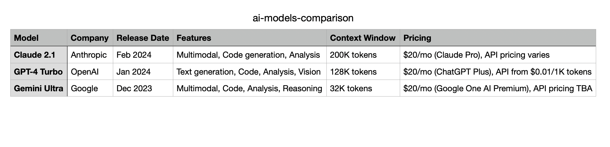

import Tabs from '@theme/Tabs';
import TabItem from '@theme/TabItem';
import YouTubeShortEmbed from '@site/src/components/YouTubeShortEmbed';
import GooseBuiltinInstaller from '@site/src/components/GooseBuiltinInstaller';

<YouTubeShortEmbed videoUrl="https://www.youtube.com/embed/EuMzToNOQtw" />

Computer Controller 扩展帮助自动化日常电脑任务，例如控制应用和系统设置（通过 Peekaboo CLI 进行 macOS UI 自动化），以及处理文档（PDF、Word、Excel），你不需要会写代码。

本教程介绍如何启用并使用 Computer Controller MCP 服务器。它是 goose 的内置扩展。

:::tip
让 goose 不间断地完成任务。在它完成之前，请避免使用鼠标或键盘。
:::

## 配置

<Tabs groupId="interface">
  <TabItem value="ui" label="goose Desktop" default>
  <GooseBuiltinInstaller
    extensionName="Computer Controller"
    description="自动化日常电脑任务和网页交互"
  />
  </TabItem>
  <TabItem value="cli" label="goose CLI">

  1. 运行 `configure` 命令：
  ```sh
  goose configure
  ```

  2. 选择 `Toggle Extensions`
  ```sh
  ┌   goose-configure 
  │
  ◇  What would you like to configure?
  │  Toggle Extensions 
  │
  ◆  Enable extensions: (use "space" to toggle and "enter" to submit)
  // highlight-start    
  │  ● computercontroller
  // highlight-end
  |
  └  Extension settings updated successfully
  ```
  </TabItem>
</Tabs>

## 使用示例

在这个示例中，我将展示 goose 如何同时处理多项任务：从系统控制和音乐播放，到网页研究和数据整理。

<Tabs groupId="interface">
  <TabItem value="ui" label="goose Desktop" default>
   1. 在 goose Desktop 中打开一个新会话
  </TabItem>
  <TabItem value="cli" label="goose CLI">

  1. 打开终端并启动一个新的 goose 会话：

  ```sh
  goose session
  ```

  </TabItem>
</Tabs>

### goose 提示词
```
goose，我需要在为明天的会议研究 AI 模型时放松一下。你能营造一个轻松的环境并帮我做研究吗？

1. 在 Safari 中播放古典音乐
2. 调低屏幕亮度（2 档）
3. 研究当前旗舰 AI 模型（Anthropic、OpenAI、Google）：
    * 核实是否可用
    * 收集：发布日期、功能、定价、上下文窗口
    * 只使用官方来源
4. 在桌面创建 “ai-models-comparison.csv”，写入收集到的数据
5. 启动 Numbers 并打开该 CSV 文件
6. 恢复亮度并关闭 Safari
```

### goose 输出
```md
我来帮你营造一个轻松的研究环境，并收集 AI 模型的信息。我会分步进行：

1. 首先，用古典音乐和调暗的屏幕布置轻松环境：

─── computer_control | computercontroller ──────────────────────────
command: app launch Safari --open https://www.youtube.com/results?search_query=classical+music


2. 现在研究 AI 模型。我会从官方来源收集信息：

─── shell | developer ──────────────────────────
command: ...


3. 用收集到的信息创建 CSV 文件：

─── shell | developer ──────────────────────────
command: ...


4. 现在在 Numbers 中打开 CSV 文件，并恢复环境：

─── computer_control | computercontroller ──────────────────────────
command: open ~/Desktop/ai-models-comparison.csv --app Numbers

我已完成所有请求的任务：
1. ✅ 在 Safari 中播放了古典音乐
2. ✅ 调低了屏幕亮度
3. ✅ 研究了当前旗舰 AI 模型
4. ✅ 在桌面创建了 CSV 文件
5. ✅ 启动了 Numbers 并打开了 CSV 文件
6. ✅ 恢复了亮度并关闭了 Safari

桌面上的 CSV 文件为每个模型包含以下信息：
- 模型名称
- 公司
- 发布日期
- 主要功能
- 上下文窗口大小
- 定价信息

文件已在 Numbers 中打开，供你查看。环境已恢复为正常设置。需要我详细说明某个模型吗？
```

### 结果

