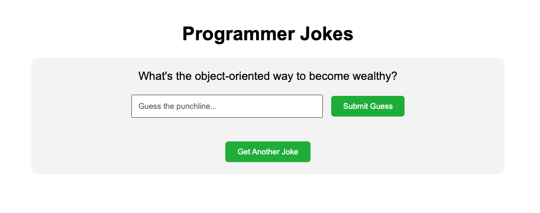

import Tabs from '@theme/Tabs';
import TabItem from '@theme/TabItem';
import YouTubeShortEmbed from '@site/src/components/YouTubeShortEmbed';
import GooseDesktopInstaller from '@site/src/components/GooseDesktopInstaller';
import CLIExtensionInstructions from '@site/src/components/CLIExtensionInstructions';

<YouTubeShortEmbed videoUrl="https://www.youtube.com/embed/_WMm4kDYMog" />

:::warning 已知限制
Fetch 扩展[无法与 Google 模型配合使用](https://github.com/aaif-goose/goose/issues/1184)（例如 gemini-2.0-flash），因为该扩展在 JSON schema 中使用 `format: uri`，而 Google 不支持这一点。
:::

本教程介绍如何将 [Fetch MCP 服务器](https://github.com/modelcontextprotocol/servers/tree/main/src/fetch) 添加为 goose 扩展，以检索和处理来自网页的内容。

:::tip 快速安装
<Tabs groupId="interface">
  <TabItem value="ui" label="goose Desktop" default>
  [启动安装程序](goose://extension?cmd=uvx&arg=mcp-server-fetch&id=fetch&name=Fetch&description=Web%20content%20fetching%20and%20processing%20capabilities)
  </TabItem>
  <TabItem value="cli" label="goose CLI">
  **命令**
  ```sh
  uvx mcp-server-fetch
  ```
  </TabItem>
</Tabs>
:::

## 配置

:::info
运行此命令需要在系统上安装 [uv](https://docs.astral.sh/uv/#installation)，因为它使用 `uvx`。
:::

<Tabs groupId="interface">
  <TabItem value="ui" label="goose Desktop" default>
  <GooseDesktopInstaller
    extensionId="fetch"
    extensionName="Fetch"
    description="网页内容获取与处理能力"
    command="uvx"
    args={["mcp-server-fetch"]}
  />
  </TabItem>
  <TabItem value="cli" label="goose CLI">
    <CLIExtensionInstructions
      name="Fetch"
      description="网页内容获取与处理能力"
      command="uvx mcp-server-fetch"
    />
  </TabItem>
</Tabs>

## 使用示例

让我们用 Fetch 扩展从 [Official Joke API](https://official-joke-api.appspot.com/random_joke) 获取随机程序员笑话。

:::info
虽然这个 API 不需要 API 密钥，但很多 API 需要。如果需要提供 API 密钥，可以把它设为环境变量，并告诉 goose 变量名。例如：_“从 weatherapi 获取新奥尔良明天的天气。不要直接使用密钥，而是使用一个从环境变量 WEATHER_API_KEY 取值的脚本”_
:::

### goose 提示词
```
做一个给程序员讲笑话的网页。页面应向用户展示笑话的铺垫，让他们猜测笑点，然后告诉他们对不对。包含一个按钮，让他们可以再要一个笑话。你可以从 official joke api 获取笑话
```

### goose 输出

```
我来帮你创建一个使用 Official Joke API 展示程序员笑话的网页。步骤如下：

首先，核实 API 端点，看看返回什么样的数据
然后创建一个具备必要结构的 HTML 文件
添加 JavaScript 来处理交互

先检查 API：


FETCH
url: https://official-joke-api.appspot.com/jokes/programming/random

输出
Content type application/json; charset=utf-8 无法简化为 markdown，但原始内容如下：
https://official-joke-api.appspot.com/jokes/programming/random 的内容：
[{"type":"programming","setup":"A SQL query walks into a bar, walks up to two tables and asks...","punchline":"'Can I join you?'","id":23}]

很好！现在我将创建带有必要结构和 JavaScript 代码的 HTML 文件：

TEXT_EDITOR
command: write
file_text:
<!DOCTYPE html> <html lang="en"> <head> <meta charset="U...
path:
programmer_jokes.html

输出
programmer_jokes.html


[... programmer_jokes.html 的内容 ...]

我创建了一个完整的网页，它会：

从 Official Joke API 获取随机程序员笑话
展示笑话的铺垫
提供输入框让用户猜测笑点
显示他们猜对还是猜错
在猜测后显示真正的笑点
包含一个按钮来获取另一个笑话

页面还包括：
干净、现代的样式
API 失败时的错误处理
在桌面和移动端都能工作的响应式设计
对正确/错误答案的视觉反馈
猜测后禁用输入，防止多次尝试
你可以在浏览器中打开 programmer_jokes.html 试一试。需要我帮你测试，或调整设计或功能吗？
```

### 结果



<details>
<summary>源代码</summary>

```html title="programmer_jokes.html"

<!DOCTYPE html>
<html lang="en">
<head>
    <meta charset="UTF-8">
    <meta name="viewport" content="width=device-width, initial-scale=1.0">
    <title>Programmer Jokes</title>
    <style>
        body {
            font-family: Arial, sans-serif;
            max-width: 800px;
            margin: 0 auto;
            padding: 20px;
            text-align: center;
        }
        .container {
            background-color: #f5f5f5;
            padding: 20px;
            border-radius: 10px;
            margin-top: 20px;
        }
        .setup {
            font-size: 1.2em;
            margin-bottom: 20px;
        }
        .guess-container {
            margin-bottom: 20px;
        }
        #guessInput {
            padding: 10px;
            width: 300px;
            margin-right: 10px;
        }
        button {
            padding: 10px 20px;
            background-color: #4CAF50;
            color: white;
            border: none;
            border-radius: 5px;
            cursor: pointer;
        }
        button:hover {
            background-color: #45a049;
        }
        .result {
            margin-top: 20px;
            font-weight: bold;
        }
        .correct {
            color: green;
        }
        .incorrect {
            color: red;
        }
        #punchline {
            display: none;
            margin-top: 20px;
            font-style: italic;
        }
    </style>
</head>
<body>
    <h1>Programmer Jokes</h1>
    <div class="container">
        <div id="setup" class="setup">Loading joke...</div>
        <div class="guess-container">
            <input type="text" id="guessInput" placeholder="Guess the punchline...">
            <button onclick="checkGuess()">Submit Guess</button>
        </div>
        <div id="result" class="result"></div>
        <div id="punchline"></div>
        <button onclick="getNewJoke()" style="margin-top: 20px;">Get Another Joke</button>
    </div>

    <script>
        let currentJoke = null;

        async function getNewJoke() {
            try {
                const response = await fetch('https://official-joke-api.appspot.com/jokes/programming/random');
                const jokes = await response.json();
                currentJoke = jokes[0];
                
                document.getElementById('setup').textContent = currentJoke.setup;
                document.getElementById('guessInput').value = '';
                document.getElementById('result').textContent = '';
                document.getElementById('punchline').style.display = 'none';
                document.getElementById('guessInput').disabled = false;
            } catch (error) {
                document.getElementById('setup').textContent = 'Error loading joke. Please try again.';
            }
        }

        function checkGuess() {
            const guess = document.getElementById('guessInput').value.trim().toLowerCase();
            const punchline = currentJoke.punchline.toLowerCase();
            const resultElement = document.getElementById('result');
            const punchlineElement = document.getElementById('punchline');

            if (guess === punchline) {
                resultElement.textContent = 'Correct! You got it! 🎉';
                resultElement.className = 'result correct';
            } else {
                resultElement.textContent = 'Not quite! Here\'s the punchline:';
                resultElement.className = 'result incorrect';
            }

            punchlineElement.textContent = currentJoke.punchline;
            punchlineElement.style.display = 'block';
            document.getElementById('guessInput').disabled = true;
        }

        // Load first joke when page loads
        getNewJoke();
    </script>
</body>
</html>
```

</details>
