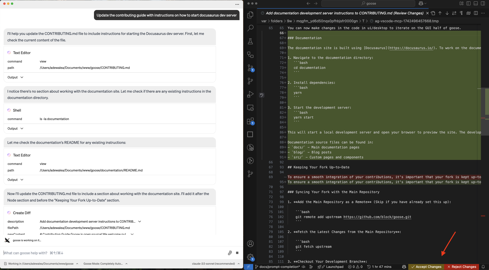

import Tabs from '@theme/Tabs';
import TabItem from '@theme/TabItem';
import YouTubeShortEmbed from '@site/src/components/YouTubeShortEmbed';

<YouTubeShortEmbed videoUrl="https://www.youtube.com/embed/gddEgvCLrgU" />

本教程介绍如何把 [VS Code MCP 服务器](https://github.com/block/vscode-mcp) 添加为 goose 扩展，以实现 VS Code 集成、文件操作和开发工作流管理。

:::tip 快速安装

**命令**
```sh
npx vscode-mcp-server
```

**必要设置**

从 Visual Studio Marketplace 安装 [VS Code MCP 扩展](https://marketplace.visualstudio.com/items?itemName=block.vscode-mcp-extension)。
:::

## 配置

:::info
运行此命令需要系统已安装 [Node.js](https://nodejs.org/)，因为会用到 `npx`。
:::

1. 把 [VS Code MCP 扩展](https://marketplace.visualstudio.com/items?itemName=block.vscode-mcp-extension) 加到 VS Code。VS Code 里不需要额外设置。

<Tabs groupId="interface">
  <TabItem value="cli" label="goose CLI" default>
  1. 运行 `configure` 命令：
  ```sh
  goose configure
  ```

  2. 选择添加 `Command-line Extension`
  ```sh
    ┌   goose-configure 
    │
    ◇  What would you like to configure?
    │  Add Extension 
    │
    ◆  What type of extension would you like to add?
    │  ○ Built-in Extension 
    // highlight-start    
    │  ● Command-line Extension (Run a local command or script)
    // highlight-end    
    │  ○ Remote Extension 
    └ 
  ```

  3. 为扩展命名
  ```sh
    ┌   goose-configure 
    │
    ◇  What would you like to configure?
    │  Add Extension 
    │
    ◇  What type of extension would you like to add?
    │  Command-line Extension 
    │
    // highlight-start
    ◆  What would you like to call this extension?
    │  vscode-mcp
    // highlight-end
    └ 
  ```

  4. 输入命令
  ```sh
    ┌   goose-configure 
    │
    ◇  What would you like to configure?
    │  Add Extension 
    │
    ◇  What type of extension would you like to add?
    │  Command-line Extension 
    │
    ◇  What would you like to call this extension?
    │  vscode-mcp
    │
    // highlight-start
    ◆  What command should be run?
    │  npx vscode-mcp-server
    // highlight-end
    └ 
  ```  

  5. 输入超时时间（建议使用默认的 300 秒）
    ```sh
    ┌   goose-configure 
    │
    ◇  What would you like to configure?
    │  Add Extension 
    │
    ◇  What type of extension would you like to add?
    │  Command-line Extension 
    │
    ◇  What would you like to call this extension?
    │  vscode-mcp
    │
    ◇  What command should be run?
    │  npx vscode-mcp-server install
    │
    // highlight-start
    ◆  Please set the timeout for this tool (in secs):
    │  300
    // highlight-end
    │
    └ 
  ``` 
  
  6. 基本配置不需要额外的环境变量
  
  </TabItem>
  <TabItem value="ui" label="goose Desktop">
  1. [启动安装程序](goose://extension?cmd=npx&arg=-y&arg=vscode-mcp-server&id=vscode-mcp&name=VS%20Code%20MCP&description=VS%20Code%20integration%20and%20file%20operations)
  2. 按 `Yes` 确认安装
  3. 点击 `Save Configuration`
  4. 点击左上角的 `Exit`
  </TabItem>
</Tabs>


## 使用示例

VS Code MCP 扩展让 goose 与你的 VS Code 环境交互，管理文件、项目和开发工作流。

VS Code MCP 服务器的关键能力是：

- 在修改前显示 diff
- 把文件操作集成进 VS Code 界面
- 管理工作区
- 在编辑器里立即给出视觉反馈


:::note
每次在启用 VS Code MCP 服务器的情况下启动 goose 会话时，它都会检查 VS Code 里是否打开了匹配的项目。如果没有，它会提示你先打开项目再继续。
:::

### goose 提示词

```
更新贡献指南，加上如何启动 docusaurus 开发服务器的说明
```

## 结果


