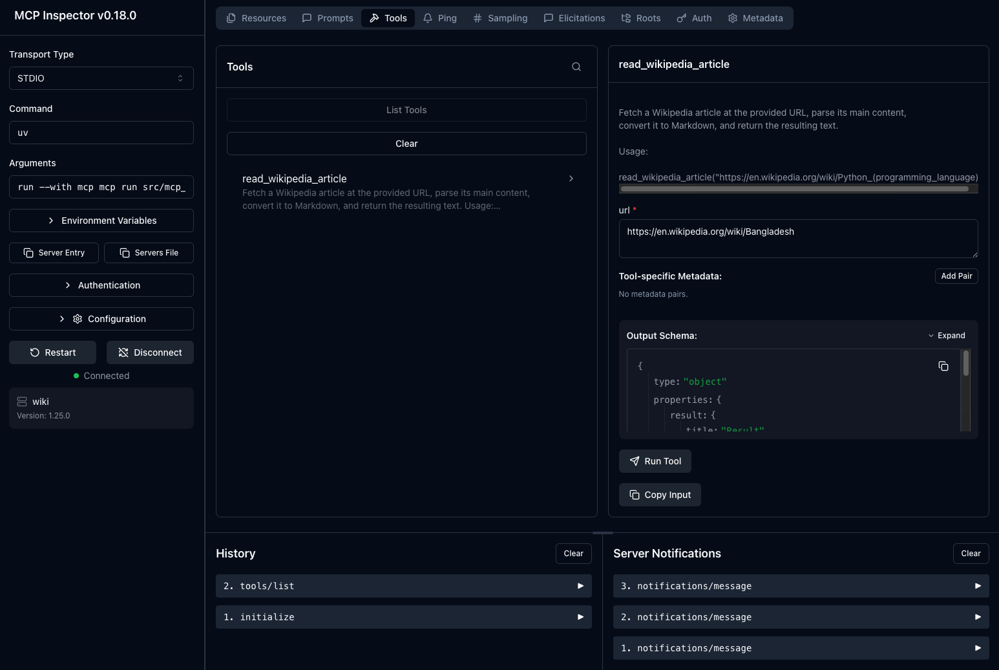
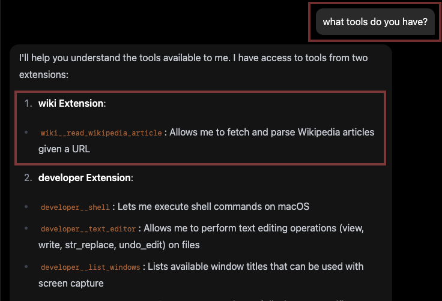
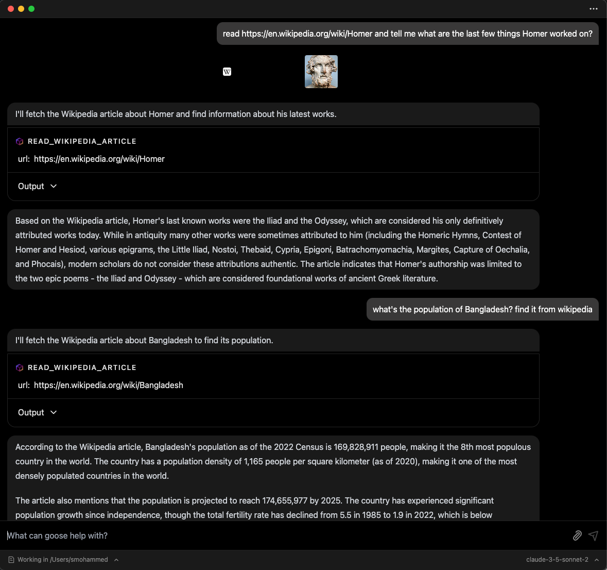

import { PanelLeft } from 'lucide-react';
import Tabs from '@theme/Tabs';
import TabItem from '@theme/TabItem';

# 用 goose 构建自定义扩展

goose 允许你通过创建自己的自定义扩展来扩展功能，这些扩展构建为 MCP 服务器。这些扩展与 goose 兼容，因为它遵循[模型上下文协议（MCP）][mcp-docs]。MCP 是一项开放协议，标准化了应用如何向大语言模型提供上下文。它提供了一种一致的方式，把大语言模型连接到各种数据源和工具，因此非常适合以结构化和可互操作的方式扩展功能。

在本指南中，我们使用 [MCP 的 Python SDK][mcp-python] 构建一个 MCP 服务器。我们将演示如何创建一个读取维基百科文章并转换为 Markdown 的 MCP 服务器，并把它集成为 goose 中的扩展。你可以遵循类似流程，为 goose 开发自己的自定义扩展。

你可以在 [MCP 服务器仓库][mcp-servers]中查看其他示例服务器。MCP SDK 也提供其他常见语言，例如 [TypeScript][mcp-typescript] 和 [Kotlin][mcp-kotlin]。

:::info
goose 支持来自[模型上下文协议](https://modelcontextprotocol.io/)的 Tools、Resources 和 Prompts。支持的协议版本和客户端能力见 [`mcp_client.rs`](https://github.com/aaif-goose/goose/blob/main/crates/goose/src/agents/mcp_client.rs)。
:::

---

## 前提条件

开始之前，请确保系统上已安装以下内容：

- **Python 3.13 或更高版本** - MCP 服务器所需
- **[uv](https://docs.astral.sh/uv/)** - 本教程使用的 Python 包管理器
- **Node.js 和 npm** - 仅当你想在[步骤 4](#step-4-test-your-mcp-server)中使用 MCP Inspector 开发工具时需要。

---

## 步骤 1：初始化项目

第一步是使用 [uv][uv-docs] 创建一个新项目。我们将把项目命名为 `mcp-wiki`。

在终端中运行以下命令，为 MCP 服务器搭建基本结构：

```bash
uv init --lib mcp-wiki
cd mcp-wiki

mkdir -p src/mcp_wiki
touch src/mcp_wiki/server.py
touch src/mcp_wiki/__main__.py
```

你的项目目录结构应该如下：

```plaintext
.
├── README.md
├── pyproject.toml
└── src
    └── mcp_wiki
        ├── __init__.py   # Primary CLI entry point
        ├── __main__.py   # To enable running as a Python module
        ├── py.typed      # Indicates the package supports type hints
        └── server.py     # Your MCP server code (tool, resources, prompts)
```

---

## 步骤 2：编写 MCP 服务器代码

在这一步，我们将实现 MCP 服务器的核心功能。关键组件如下：

1. **`server.py`**：此文件包含主要的 MCP 服务器代码。在本示例中，我们定义一个读取维基百科文章的工具。你可以在这里添加自己的自定义工具、资源和提示。
2. **`__init__.py`**：这是 MCP 服务器的主要 CLI 入口。
3. **`__main__.py`**：此文件让 MCP 服务器可以作为 Python 模块执行。

下面是维基百科 MCP 服务器的示例实现：

### `server.py`

```python
import requests
from requests.exceptions import RequestException
from bs4 import BeautifulSoup
from html2text import html2text
from urllib.parse import urlparse

from mcp.server.fastmcp import FastMCP
from mcp.shared.exceptions import McpError
from mcp.types import ErrorData, INTERNAL_ERROR, INVALID_PARAMS

mcp = FastMCP("wiki")

@mcp.tool()
def read_wikipedia_article(url: str) -> str:
    """
    Fetch a Wikipedia article at the provided URL, parse its main content,
    convert it to Markdown, and return the resulting text.

    Usage:
        read_wikipedia_article("https://en.wikipedia.org/wiki/Python_(programming_language)")
    """
    try:
        # Validate input
        if not url.startswith("http"):
            raise ValueError("URL must start with http or https.")

        # SSRF protection: only allow Wikipedia domains
        parsed = urlparse(url)
        hostname = parsed.netloc.lower()

        # Allow wikipedia.org or *.wikipedia.org subdomains only
        if hostname != 'wikipedia.org' and not hostname.endswith('.wikipedia.org'):
            raise ValueError(f"Only Wikipedia URLs are allowed. Got: {parsed.netloc}")

        # Add User-Agent header to avoid 403 from Wikipedia
        headers = {
            'User-Agent': 'MCP-Wiki/1.0 (Educational purposes; Python requests)'
        }
        response = requests.get(url, headers=headers, timeout=10)
        if response.status_code != 200:
            raise McpError(
                ErrorData(
                    code=INTERNAL_ERROR,
                    message=f"Failed to retrieve the article. HTTP status code: {response.status_code}"
                )
            )

        soup = BeautifulSoup(response.text, "html.parser")
        content_div = soup.find("div", {"id": "mw-content-text"})
        if not content_div:
            raise McpError(
                ErrorData(
                    code=INVALID_PARAMS,
                    message="Could not find the main content on the provided Wikipedia URL."
                )
            )

        # Convert to Markdown
        markdown_text = html2text(str(content_div))
        return markdown_text

    except ValueError as e:
        raise McpError(ErrorData(code=INVALID_PARAMS, message=str(e))) from e
    except RequestException as e:
        raise McpError(ErrorData(code=INTERNAL_ERROR, message=f"Request error: {str(e)}")) from e
    except Exception as e:
        raise McpError(ErrorData(code=INTERNAL_ERROR, message=f"Unexpected error: {str(e)}")) from e
```

### `__init__.py`

```python
import argparse
from .server import mcp

def main():
    """MCP Wiki: Read Wikipedia articles and convert them to Markdown."""
    parser = argparse.ArgumentParser(
        description="Gives you the ability to read Wikipedia articles and convert them to Markdown."
    )
    parser.parse_args()
    mcp.run()

if __name__ == "__main__":
    main()
```

### `__main__.py`

```python
from mcp_wiki import main

main()
```

---

## 步骤 3：定义项目配置

使用 `pyproject.toml` 配置项目。此配置定义 CLI 脚本，使 mcp-wiki 命令可作为二进制文件使用。下面是一个示例配置：

```toml
[project]
name = "mcp-wiki"
version = "0.1.0"
description = "MCP Server for Wikipedia"
readme = "README.md"
requires-python = ">=3.13"
dependencies = [
    "beautifulsoup4>=4.14.0",
    "html2text>=2025.4.15",
    "mcp[cli]>=1.25.0",
    "requests>=2.32.3",
]

[project.scripts]
mcp-wiki = "mcp_wiki:main"

[build-system]
requires = ["hatchling"]
build-backend = "hatchling.build"
```

---

## 步骤 4：测试你的 MCP 服务器 {#step-4-test-your-mcp-server}

验证你的 MCP 服务器正在 MCP Inspector（基于浏览器的开发工具）或服务器 CLI 中运行。

<Tabs>
  <TabItem value="ui" label="在 MCP Inspector 中" default>
:::info
MCP Inspector 需要电脑上已安装 Node.js 和 npm。
:::

1. 设置项目环境：

   ```bash
   uv sync
   ```

2. 激活虚拟环境：

   ```bash
   source .venv/bin/activate
   ```

3. 以开发模式运行服务器：

   ```bash
   mcp dev src/mcp_wiki/server.py
   ```

   MCP Inspector 应该会在浏览器中自动打开。第一次运行时，会提示你安装 `@modelcontextprotocol/inspector`。

4. 测试工具：
   1. 点击 `Connect` 初始化 MCP 服务器
   2. 在 `Tools` 标签页中，点击 `List Tools`，然后点击 `read_wikipedia_article` 工具
   3. 在 URL 中输入 `https://en.wikipedia.org/wiki/Bangladesh`，然后点击 `Run Tool`

[](../assets/guides/custom-extension-mcp-inspector.png)

  </TabItem>
  <TabItem value="cli" label="在 CLI 中">
1. 设置项目环境：

```bash
uv sync
```

2. 激活虚拟环境：

   ```bash
   source .venv/bin/activate
   ```

3. 在本地安装项目：

   ```bash
   uv pip install .
   ```

4. 验证 CLI：

   ```bash
   mcp-wiki --help
   ```

   你应该看到类似这样的输出：

   ```plaintext
   ❯ mcp-wiki --help
   usage: mcp-wiki [-h]

   Gives you the ability to read Wikipedia articles and convert them to Markdown.

   options:
     -h, --help  show this help message and exit
   ```

  </TabItem>
</Tabs>

---

## 步骤 5：与 goose 集成

要把 MCP 服务器添加为 goose 中的扩展：

1. 构建扩展二进制文件：

   ```bash
   uv pip install .
   ```

2. 打开 goose 桌面版，点击左上角的 <PanelLeft className="inline" size={16} /> 按钮打开侧边栏
3. 在侧边栏中点击 `Extensions`
4. 把 `Type` 设为 `STDIO`
5. 为扩展提供名称和描述
6. 在 `Command` 字段中提供可执行文件的绝对路径：

   ```plaintext
   uv run /full/path/to/mcp-wiki/.venv/bin/mcp-wiki
   ```

   例如：

   ```plaintext
   uv run /Users/smohammed/Development/mcp/mcp-wiki/.venv/bin/mcp-wiki
   ```

:::tip 更改后重新构建二进制文件
与 goose 集成后，要看到你对 MCP 服务器代码所做的任何更改，请重新运行 `uv pip install .`，然后重启 goose 桌面版。
:::

就本指南而言，我们将运行本地版本。你也可以把包发布到 PyPI。发布后，可以使用 `uvx` 直接运行服务器。例如：

```
uvx mcp-wiki
```

---

## 步骤 6：在 goose 中使用你的扩展

集成之后，就可以在 goose 中使用你的扩展。打开 goose 聊天界面，按需调用你的工具。

你可以问它 “what tools do you have?”，以验证 goose 已经从自定义扩展中获取了工具。



然后，你可以试着提出需要使用所添加扩展的问题。



🎉 **恭喜！** 你已经成功构建自定义 MCP 服务器并与 goose 集成。

---

## MCP 应用：交互式扩展

**[MCP 应用](/docs/tutorials/building-mcp-apps)** 提供丰富的交互式用户界面，而不是只有文本回复。

**主要好处：**

- 从 MCP 服务器工具返回交互式 UI 组件
- 组件在 goose 桌面版的隔离沙箱中安全渲染
- 实时用户交互会触发对服务器的回调

**用例：** 交互式表单、数据可视化、预订界面、配置向导

**了解更多：** [构建 MCP 应用教程](/docs/tutorials/building-mcp-apps)

[mcp-docs]: https://modelcontextprotocol.io/
[mcp-python]: https://github.com/modelcontextprotocol/python-sdk
[mcp-typescript]: https://github.com/modelcontextprotocol/typescript-sdk
[mcp-kotlin]: https://github.com/modelcontextprotocol/kotlin-sdk
[mcp-servers]: https://github.com/modelcontextprotocol/servers
[uv-docs]: https://docs.astral.sh/uv/getting-started/
