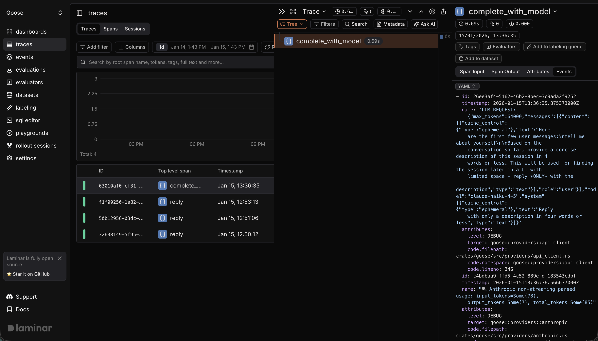

# 使用 Laminar 做可观测性

本教程介绍如何将 goose 与 Laminar 集成，从而追踪 goose 会话，并了解智能体的表现。

## 什么是 Laminar

[Laminar](https://laminar.sh/) 是一个专为 AI 智能体打造的开源可观测性平台。它追踪大语言模型调用、工具执行和自定义函数，便于你调试、评估并改进智能体行为。

## 为什么 goose 适合用 Laminar

- 为大语言模型调用、工具和子智能体提供高信号追踪。
- 在 Playground 中重放任意 span，比较提示词和模型。
- 从生产追踪构建数据集并运行评估。
- 用自然语言查询和仪表板分析追踪模式。

## 设置 Laminar

在 [laminar.sh](https://laminar.sh) 注册 Laminar Cloud，或从[开源仓库](https://github.com/lmnr-ai/lmnr)自行托管 Laminar。获取你的项目 API 密钥。

## 配置 goose 将 OTLP 导出到 Laminar

goose 通过 OTLP/HTTP 导出 OpenTelemetry 数据。把导出器指向 Laminar，并在授权头中提供 API 密钥。

### Laminar Cloud

```bash
export LMNR_PROJECT_API_KEY=lmnr_proj_...
export OTEL_EXPORTER_OTLP_ENDPOINT="https://api.lmnr.ai"
export OTEL_EXPORTER_OTLP_HEADERS="authorization=Bearer ${LMNR_PROJECT_API_KEY}"
export OTEL_EXPORTER_OTLP_TIMEOUT=10000
```

### 自行托管的 Laminar

```bash
export LMNR_PROJECT_API_KEY=lmnr_proj_...
export OTEL_EXPORTER_OTLP_ENDPOINT="http://localhost:8000"
export OTEL_EXPORTER_OTLP_HEADERS="authorization=Bearer ${LMNR_PROJECT_API_KEY}"
```

如果自行托管的实例不需要认证，可以省略 `OTEL_EXPORTER_OTLP_HEADERS`。

:::tip
如果看不到追踪，试着把端点设为明确的 OTLP 路径，例如 `https://api.lmnr.ai/v1/traces` 或 `http://localhost:8000/v1/traces`。
:::

## 在启用 Laminar 的情况下运行 goose

正常启动 goose。设置好 OTLP 环境变量后，Laminar 会捕获 goose 会话和工具执行的追踪。

_[Laminar 中的示例追踪（公开）](https://laminar.sh/shared/traces/63010af0-cf31-b8b6-0d77-fc9924bcaa4c)_


