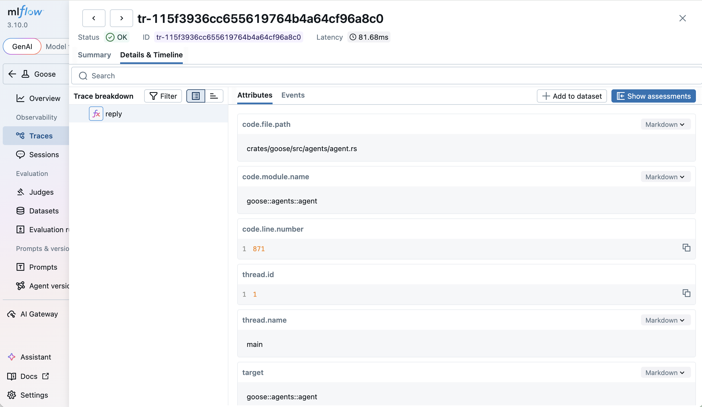

# 使用 MLflow 做可观测性

本教程介绍如何将 goose 与 MLflow 集成，从而追踪 goose 会话，并了解智能体的表现。

## 什么是 MLflow

[MLflow](https://mlflow.org/) 是一个[开源](https://github.com/mlflow/mlflow)平台，用于管理机器学习和 AI 的端到端生命周期。MLflow Tracing 为 AI 智能体执行提供详细的可观测性，通过丰富的可视化界面捕获大语言模型调用、工具使用和智能体决策。

## 为什么 goose 适合用 MLflow

- **详细的追踪可视化**：在分层追踪视图中检查每一次大语言模型调用、工具执行和智能体决策。
- **Token 用量跟踪**：跨会话监控输入/输出 token 数量和费用。
- **评估框架**：使用内置的大语言模型评判器和自定义评分器评估智能体输出。
- **提示词管理**：对 AI 应用中使用的提示词进行版本管理。
- **开源**：完全开源，无供应商锁定，可在任何地方自行托管。

## 设置 MLflow

安装 MLflow 并启动跟踪服务器：

```bash
pip install mlflow
mlflow server --port 5000
```

MLflow 界面将在 `http://localhost:5000` 可用。

:::tip
生产使用时，请配置 SQL 后端存储（PostgreSQL、MySQL），而不是默认的 SQLite。详情见 [MLflow 文档](https://mlflow.org/docs/latest/self-hosting/architecture/backend-store.html)。
:::

## 配置 goose 将 OTLP 导出到 MLflow

goose 通过 OTLP/HTTP 导出 OpenTelemetry 数据。把导出器指向 MLflow 的 OTLP 端点：

```bash
export OTEL_EXPORTER_OTLP_ENDPOINT="http://localhost:5000"
export OTEL_EXPORTER_OTLP_HEADERS="x-mlflow-experiment-id=0"
```

`x-mlflow-experiment-id` 头指定把追踪记录到哪个 MLflow 实验。使用 `0` 表示默认实验，或创建一个专用实验：

```bash
pip install mlflow
mlflow experiments create --experiment-name "goose-traces"
# Use the returned experiment ID in the header
```

若只导出追踪（禁用指标和日志导出）：

```bash
export OTEL_TRACES_EXPORTER=otlp
export OTEL_METRICS_EXPORTER=none
export OTEL_LOGS_EXPORTER=none
```

要在追踪中包含模型消息以及工具参数/结果，请显式启用 GenAI 消息内容捕获：

```bash
export OTEL_INSTRUMENTATION_GENAI_CAPTURE_MESSAGE_CONTENT=true
```

:::warning
消息内容可能包含敏感数据，并产生很大的追踪。除非遥测存储适合这类数据，否则请保持此设置关闭。
:::

## 在启用 MLflow 的情况下运行 goose

正常启动 goose。设置好 OTLP 环境变量后，goose 会自动把追踪导出到 MLflow：

```bash
goose session
```

打开 `http://localhost:5000` 的 MLflow 界面，进入 **Traces** 标签页，查看 goose 会话的详细追踪，包括大语言模型调用、工具执行和 token 用量。



## 了解更多

- [MLflow Tracing 文档](https://mlflow.org/docs/latest/genai/tracing/)
- [MLflow OpenTelemetry 集成](https://mlflow.org/docs/latest/genai/tracing/app-instrumentation/opentelemetry.html)
- [MLflow goose 集成指南](https://mlflow.org/docs/latest/genai/tracing/integrations/listing/goose.html)
